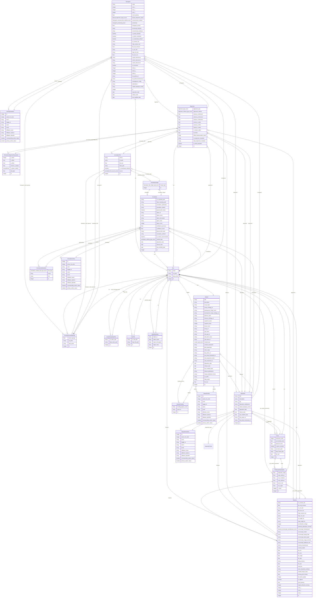

```mermaid
erDiagram
Tomogram {
    string name
    integer size_x
    integer size_y
    integer size_z
    float voxel_spacing
    fiducial_alignment_status_enum fiducial_alignment_status
    tomogram_reconstruction_method_enum reconstruction_method
    tomogram_processing_enum processing
    float tomogram_version
    string processing_software
    string reconstruction_software
    boolean is_portal_standard
    boolean is_author_submitted
    boolean is_visualization_default
    string s3_omezarr_dir
    string https_omezarr_dir
    float file_size_omezarr
    string s3_mrc_file
    string https_mrc_file
    float file_size_mrc
    string scale0_dimensions
    string scale1_dimensions
    string scale2_dimensions
    boolean ctf_corrected
    integer offset_x
    integer offset_y
    integer offset_z
    string key_photo_url
    string key_photo_thumbnail_url
    string neuroglancer_config
    string publications
    string related_database_entries
    integer id
    date deposition_date
    date release_date
    date last_modified_date
}
TomogramVoxelSpacing {
    float voxel_spacing
    string s3_prefix
    string https_prefix
    integer id
}
TomogramAuthor {
    integer id
    integer author_list_order
    string orcid
    string kaggle_id
    string name
    string email
    string affiliation_name
    string affiliation_address
    string affiliation_identifier
    boolean corresponding_author_status
    boolean primary_author_status
}
PerSectionParameters {
    float astigmatic_angle
    float major_defocus
    float max_resolution
    float minor_defocus
    float phase_shift
    float raw_angle
    integer z_index
    integer id
}
Tiltseries {
    string s3_omezarr_dir
    float file_size_omezarr
    string s3_mrc_file
    float file_size_mrc
    string https_omezarr_dir
    string https_mrc_file
    string s3_angle_list
    string https_angle_list
    integer acceleration_voltage
    float spherical_aberration_constant
    tiltseries_microscope_manufacturer_enum microscope_manufacturer
    string microscope_model
    string microscope_energy_filter
    string microscope_phase_plate
    string microscope_image_corrector
    string microscope_additional_info
    string camera_manufacturer
    string camera_model
    float tilt_min
    float tilt_max
    float tilt_range
    float tilt_step
    string tilting_scheme
    float tilt_axis
    float total_flux
    string data_acquisition_software
    string related_empiar_entry
    float binning_from_frames
    integer tilt_series_quality
    boolean is_aligned
    float pixel_spacing
    integer aligned_tiltseries_binning
    integer size_x
    integer size_y
    integer size_z
    integer id
}
Run {
    string name
    string s3_prefix
    string https_prefix
    integer id
}
FrameAcquisitionFile {
    string s3_mdoc_path
    string https_mdoc_path
    integer id
}
GainFile {
    string s3_file_path
    string https_file_path
    integer id
}
AnnotationMethodLink {
    annotation_method_link_type_enum link_type
    string name
    string link
    integer id
}
PerSectionAlignmentParameters {
    integer z_index
    float x_offset
    float y_offset
    float volume_x_rotation
    Array2dFloat in_plane_rotation
    float tilt_angle
    integer id
}
IdentifiedObject {
    string object_id
    string object_name
    string object_description
    string object_state
    integer id
}
Frame {
    integer acquisition_order
    float accumulated_dose
    float exposure_dose
    boolean is_gain_corrected
    string s3_frame_path
    string https_frame_path
    float file_size
    integer id
}
Deposition {
    string title
    string description
    string tag
    string deposition_publications
    string related_database_entries
    date deposition_date
    date release_date
    date last_modified_date
    string key_photo_url
    string key_photo_thumbnail_url
    integer id
}
DepositionAuthor {
    integer id
    integer author_list_order
    string orcid
    string kaggle_id
    string name
    string email
    string affiliation_name
    string affiliation_address
    string affiliation_identifier
    boolean corresponding_author_status
    boolean primary_author_status
}
Dataset {
    string title
    string description
    string assay_label
    string assay_ontology_id
    string development_stage_name
    string development_stage_ontology_id
    string disease_name
    string disease_ontology_id
    string organism_name
    integer organism_taxid
    string tissue_name
    string tissue_id
    string cell_name
    string cell_type_id
    string cell_strain_name
    string cell_strain_id
    sample_type_enum sample_type
    string sample_preparation
    string grid_preparation
    string other_setup
    string key_photo_url
    string key_photo_thumbnail_url
    string cell_component_name
    string cell_component_id
    date deposition_date
    date release_date
    date last_modified_date
    string dataset_publications
    string related_database_entries
    string s3_prefix
    string https_prefix
    float file_size
    integer id
}
DatasetFunding {
    string funding_agency_name
    string grant_id
    integer id
}
DatasetAuthor {
    integer id
    integer author_list_order
    string orcid
    string kaggle_id
    string name
    string email
    string affiliation_name
    string affiliation_address
    string affiliation_identifier
    boolean corresponding_author_status
    boolean primary_author_status
}
Annotation {
    string s3_metadata_path
    string https_metadata_path
    string annotation_publication
    string annotation_method
    boolean ground_truth_status
    string object_id
    string object_name
    string object_description
    string object_state
    integer object_count
    float confidence_precision
    float confidence_recall
    string ground_truth_used
    string annotation_software
    boolean is_curator_recommended
    annotation_method_type_enum method_type
    date deposition_date
    date release_date
    date last_modified_date
    integer id
}
AnnotationShape {
    annotation_file_shape_type_enum shape_type
    integer id
}
AnnotationFile {
    string format
    string s3_path
    float file_size
    string https_path
    boolean is_visualization_default
    annotation_file_source_enum source
    integer id
}
AnnotationAuthor {
    integer id
    integer author_list_order
    string orcid
    string kaggle_id
    string name
    string email
    string affiliation_name
    string affiliation_address
    string affiliation_identifier
    boolean corresponding_author_status
    boolean primary_author_status
}
Alignment {
    alignment_type_enum alignment_type
    alignment_method_type_enum alignment_method
    float volume_x_dimension
    float volume_y_dimension
    float volume_z_dimension
    float volume_x_offset
    float volume_y_offset
    float volume_z_offset
    float x_rotation_offset
    float tilt_offset
    string affine_transformation_matrix
    string s3_alignment_metadata
    string https_alignment_metadata
    boolean is_portal_standard
    integer id
}

Tomogram ||--|o Alignment : "alignment"
Tomogram ||--}o TomogramAuthor : "authors"
Tomogram ||--|| Deposition : "deposition"
Tomogram ||--|o Run : "run"
Tomogram ||--|o TomogramVoxelSpacing : "tomogram_voxel_spacing"
TomogramVoxelSpacing ||--}o AnnotationFile : "annotation_files"
TomogramVoxelSpacing ||--|o Run : "run"
TomogramVoxelSpacing ||--}o Tomogram : "tomograms"
TomogramAuthor ||--|o Tomogram : "tomogram"
PerSectionParameters ||--|| Frame : "frame"
PerSectionParameters ||--|| Run : "run"
PerSectionParameters ||--|| Tiltseries : "tiltseries"
Tiltseries ||--}o Alignment : "alignments"
Tiltseries ||--|| Run : "run"
Tiltseries ||--|o Deposition : "deposition"
Tiltseries ||--}o PerSectionParameters : "per_section_parameters"
Run ||--}o Alignment : "alignments"
Run ||--}o Annotation : "annotations"
Run ||--|| Dataset : "dataset"
Run ||--}o Frame : "frames"
Run ||--}o GainFile : "gain_files"
Run ||--}o IdentifiedObject : "identified_objects"
Run ||--}o FrameAcquisitionFile : "frame_acquisition_files"
Run ||--}o PerSectionParameters : "per_section_parameters"
Run ||--}o Tiltseries : "tiltseries"
Run ||--}o TomogramVoxelSpacing : "tomogram_voxel_spacings"
Run ||--}o Tomogram : "tomograms"
FrameAcquisitionFile ||--|o Run : "run"
GainFile ||--|| Run : "run"
AnnotationMethodLink ||--|o Annotation : "annotation"
PerSectionAlignmentParameters ||--|| Alignment : "alignment"
IdentifiedObject ||--|o Run : "run"
Frame ||--|| Deposition : "deposition"
Frame ||--|| Run : "run"
Frame ||--}o PerSectionParameters : "per_section_parameters"
Deposition ||--}o DepositionAuthor : "authors"
Deposition ||--}o Alignment : "alignments"
Deposition ||--}o Annotation : "annotations"
Deposition ||--}o Dataset : "datasets"
Deposition ||--}o Frame : "frames"
Deposition ||--}o Tiltseries : "tiltseries"
Deposition ||--}o Tomogram : "tomograms"
Deposition ||--}o DepositionType : "deposition_types"
DepositionAuthor ||--|| Deposition : "deposition"
Dataset ||--|| Deposition : "deposition"
Dataset ||--}o DatasetFunding : "funding_sources"
Dataset ||--}o DatasetAuthor : "authors"
Dataset ||--}o Run : "runs"
DatasetFunding ||--|o Dataset : "dataset"
DatasetAuthor ||--|o Dataset : "dataset"
Annotation ||--|o Run : "run"
Annotation ||--}o AnnotationShape : "annotation_shapes"
Annotation ||--}o AnnotationMethodLink : "method_links"
Annotation ||--}o AnnotationAuthor : "authors"
Annotation ||--|o Deposition : "deposition"
AnnotationShape ||--|o Annotation : "annotation"
AnnotationShape ||--}o AnnotationFile : "annotation_files"
AnnotationFile ||--|o Alignment : "alignment"
AnnotationFile ||--|o AnnotationShape : "annotation_shape"
AnnotationFile ||--|o TomogramVoxelSpacing : "tomogram_voxel_spacing"
AnnotationAuthor ||--|o Annotation : "annotation"
Alignment ||--}o AnnotationFile : "annotation_files"
Alignment ||--}o PerSectionAlignmentParameters : "per_section_alignments"
Alignment ||--|o Deposition : "deposition"
Alignment ||--|o Tiltseries : "tiltseries"
Alignment ||--}o Tomogram : "tomograms"
Alignment ||--|o Run : "run"

```
