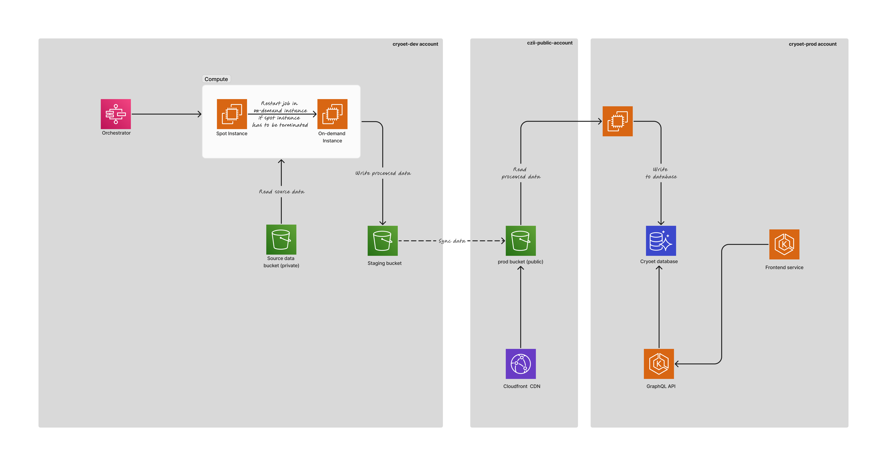

# Architecture

This document provides an overview of the architecture for cryoET applications. The backend stacks supports the data ingestion, and the maintenance of the graphQL API.

## Account Setup

The backend of the cryoET is distributed across three different AWS accounts, each for different purposes:

### dev account
 - It hosts all the source data
 - All the data standardization happens in this account.
 - It includes the dev and staging environments.
### public account
- It hosts the publicly accessible s3 bucket and the standardized production data.
### prod account
- It hosts the production environment for the frontend and the graphql API

## Architecture diagram

Please find the link to the architecture diagram [here](https://www.figma.com/board/detNDlCcfgIWldTIbNU74X/CryoET-Architecture-Diagram-V1.0?node-id=0-1&t=Z9gE7KA8ouCu2blp-1).

## Components

### Batch Job Orchestrator

This component is responsible for orchestrating the batch jobs that are used for executing workflow. This is done using [swipe](https://github.com/chanzuckerberg/swipe). The orchestration is done using the following AWS managed services:

#### AWS Batch

This is used for executing the workflow jobs. You can read more about AWS Batch [here](https://aws.amazon.com/batch/).

#### AWS Step Functions

This is used for orchestrating the workflow execution. Swipe tries to execute the job on a spot instances, and if the instance is terminated by AWS, retries that job with an on-demand instance. You can read more about AWS Step Functions [here](https://aws.amazon.com/step-functions/).

### Data Storage - AWS S3
S3 is used for storing the source data from data generators, processed data from ingestion, and the production data that is used for sharing the data with the public. You can read more about AWS S3 [here](https://aws.amazon.com/s3/).

In the dev account, the source data is stored in a private bucket.

The standardized data can be of two types.
1. Data that is ready for public access, these are stored in the staging bucket in the dev account. This bucket allows limited access to public.
2. Data that needs to be embargoed from public access, these are stored in a private bucket in the dev account until they are ready for public access.

The production data is stored in a publicly accessible `cryoet-data-portal-public` bucket.

### Database - AWS Aurora
The metadata for the data is stored in a Postgres database. AWS Aurora is used for running the managed database. You can read more about AWS Aurora [here](https://aws.amazon.com/rds/Aurora).

### Compute - Elastic Kubernetes Service (EKS)
The servers for running the graphql API and frontend applications are managed through AWS Elastic Kubernetes Service (EKS). You can read more about AWS EKS [here](https://aws.amazon.com/eks/).

### Content Delivery Network (CDN) - AWS CloudFront
CloudFront is used for surfacing the data that is stored in the S3 bucket over http. It is also used as a proxy to the API servers. You can read more about AWS CloudFront [here](https://aws.amazon.com/cloudfront/).
