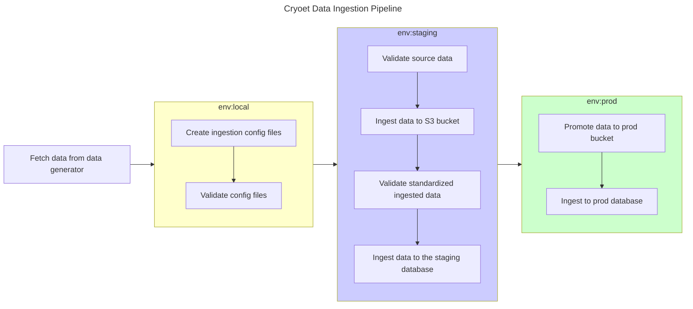

# Data Ingestion

## Overview
The data ingestion process involves transforming input data from various sources into a standardized output format.


### Steps
1. The first step of this is usually bringing the raw data into an AWS environment that is accessible to our ingestion workflows.
2. Once the data is available, create an ingestion **config.yaml** to include the metadata and file paths for data.
3. Validate the **config.yaml** file to ensure that it is in the correct format, and the source data is accessible and valid.
4. The source data needs to be transformed into a standardized format that is uniform across its different datasets.
5. The transformed data is validated against a set of rules to ensure that it is in the correct format.
6. The validated data is then ingested into the database, to be surfaced by the GraphQL API.
7. Sync the data to the production environment.
8. Update the database in the production environment.





## Fetching Source Data

Data can originate from various researchers/data generators who share the data with the platform. Each source may have its own format and structure.

### The data is deposited in the S3 bucket by the data creator.

The data creator works with the team, and is provided with the necessary permissions to deposit the data in the S3 bucket.

### The data is fetched from EMPIAR

To be expanded.

## Creating Ingestion Config

The ingestions config is used to locate and provide additional metadata on the data being ingested. It is a yaml file
that following the schema defined [here](../schema/ingestion_config/latest/codegen/ingestion_config_models.schema.json). You can setup intellisense for the config file in your IDE. You can learn more about how to do this [here](../ingestion_tools/docs/dataset_configs_intellisense.md).
Once the config is created it is stored in the [ingestion_tools/dataset_configs](../ingestion_tools/dataset_configs) directory.
The config file is then validated against the schema to ensure that it is in the correct format. Here is the command to validate the config file:
```bash
make validate-configs-with-network -C ../ingestion_tools
```

## Ingesting Data into S3

The data is fetched from the source and transformed into a standardized format. This data is then deposited into the staging s3 bucket.

There are several transformations that are applied during this process. You can learn more about how to run this ingestion workflow in [here](../ingestion_tools/docs/running_data_ingestion.md#running-the-s3-ingestion).


## Validating the Ingested Data

The data that is ingested into the staging bucket is validated against a set of rules. The source code for these validations can be found [here](../ingestion_tools/scripts/data_validation).
ou can learn more about how to run this workflow in [here](../ingestion_tools/docs/running_data_ingestion.md#Running validation tests).


## Ingesting Data into the Database

The validated data needs to ingested into the database, for it to be surfaced by the GraphQL API. This process involves reading all the metadata files created during the ingestion process, and writing them to the database.

Currently, we are maintaining two versions of the API, and hence the data needs to be ingested into both the databases. You can learn more about how to run this workflow in [here](../ingestion_tools/docs/running_data_ingestion.md#running-the-db-ingestion).

### V1 Database Ingestion
The V1 API is powered by Hasura. The source code for these validations can be found [here](../ingestion_tools/scripts/importers/db_import.py).


### V2 Database Ingestion
The V1 API is powered by Platformics. You can find the source code for this [here](../apiv2/db_import/).


## Update the data in production environment
Once the data has been validated, it can be copied from the staging bucket to the production bucket. This is done, to optimize for the processing of the data, and to ensure that the production environment only has validated data.

You can learn more about how to run this workflow in [here](../ingestion_tools/docs/enqueue_runs.md#s3-file-sync-sync-subcommand).
