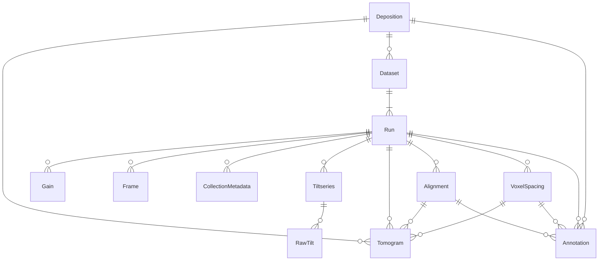

# Data Ingestion Process

---

## What is S3 Ingestion?

S3 ingestion is the process by which data deposited by researchers to CryoET platform is ingested, transformed, and stored in a standardized format.

The ingestion process can start when the deposited data is available in an s3 bucket that is either,
- Owned by CZI.
- A third-party bucket that grants **read access** to CZI's ingestion process.

### Configuration File

A YAML configuration file is used to define the specifics of the data transformation process. This file provides the following for each of the entities in the deposition:
- **Metadata**: Information from data depositors on experimental conditions, and methods used in generating this data. It also provides the type of data for some entities, to help the ingestion process handle it accordingly.
- **Source**: Location of individual assets within the source bucket.

This configuration ensures that the data is ingested and transformed correctly for each deposition. These configs are stored in the [dataset_config folder](./../dataset_configs).

---

## Why Standardize the Data?

Researchers often organize their data in unique ways and may use different formats. However, to provide a **consistent and seamless experience** for users on the CryoET platform, it is essential to standardize the data.

### Reasons for Standardization:
- **Data Organization**: Researchers have different strategies for organizing and naming their data files.
- **Format Diversity**: Researchers may submit data in a variety of formats, which need to be standardized for compatibility.

By transforming the data into **consistent formats** and **structured folder layouts**, we ensure that users can easily navigate and utilize the data on the CryoET platform. This structured approach guarantees that researchers' raw data can be ingested, transformed, and presented in a unified manner for consistent use within the CryoET platform.

---
## Data Inputs

Data deposition from contributors can fall into two categories:

1. Data created by running experiments and generating new image data.
2. Data created by building on the data surfaced on the portal.

The data ingestion process handles both types seamlessly.

### 1. Adding a Completely New Dataset

This scenario occurs when a deposition introduces an entirely new dataset. In this case, the ingestion process will:

- Create all necessary assets for the dataset in the destination from scratch.
- Assume no pre-existing assets in the destination for the dataset.
- Ingest all asset blocks defined in the configuration file, creating corresponding new assets in the destination.

### 2. Adding New Assets to an Existing Dataset

In this case, the deposition adds new assets (e.g., annotations, tomograms) to an already existing dataset. The process works as follows:

- The dataset and related assets must already exist in the destination.
- The configuration spec will reference the existing dataset in the configuration, and expect them in the destination.
- Only new entities that are not a reference to existing items in the destination will be added.

----

## Data Outputs
The ingestion process is modular, and each entity produces one or both of the following in the destination bucket:
1. Standardized entity
2. Metadata file

### 1. Standardized Entity
A standardized entity refers to the transformed version of the original entity from the source. The transformation process ensures that the entity adheres to a standardized format suitable for further use.

**Example**: A tomogram in the source may be in the MRC format. The standardized output would include both MRC and Zarr formats, with standardized headers.

- **Multiple Outputs**: Some entities may produce multiple standardized outputs (e.g., different file formats), while others may only produce a single output.
- **No Standardized Output**: Certain entities do not undergo standardization, as they serve primarily as containers for grouping other data. These entities do not have a transformed output, but are crucial for the organization of the data. Examples of such entities include: `Deposition`, `Dataset`, and `Run`

### 2. Metadata File
The metadata file is a **JSON** file that contains information about the entity. Not all entities will have an associated metadata file

#### Content:
The metadata file combines two sources of information:
- Information provided by the data contributor in the configuration file.
- Information extracted from the ingested asset itself during the ingestion process.

#### Purpose:
The metadata file is essential for maintaining context and additional details about the entity, which can be useful during the ingestion of other entities, or for other workflows.

---

## How are the different entities related?

This graph organizes the different assets relationships at a high level, making it easy to understand the dependencies.

The mermaid diagram here represents the relationship between different assets that can be deposited by the researchers. To learn more about each of these entities, refer to the [python client documentation](https://chanzuckerberg.github.io/cryoet-data-portal/cryoet_data_portal_docsite_data.html#data-organization).

**Note:** This diagram does not include components generated by the ingestion process like images, visualization assets.

------

## Ingestion Workflow

This section outlines some of the key concepts in the ingestion process.

### 1. Hierarchical Processing
The script processes entities from the root level (deposition) to the leaf level (frames, tiltseries, tomograms, annotations, etc.) (ie) It starts from the **deposition**, moves to the **dataset**, then to the **run**, and finally processes individual assets.
This process remains consistent whether you're adding a completely new dataset or augmenting an existing one.

**The order of the ingestion of the entities is very important as they are dependencies.**

### 2. Execution Flow of Entities:
When processing an entity, the script follows a standard sequence of steps:
1. Create standardized output (if the entity supports that).
2. Process child entities (if the entity has children).
3. Write metadata file (if the entity supports metadata).

### 3. Finders

The finders are responsible for locating the source files for an entity, you can learn more about the finders in the [finders documentation](./../scripts/common/finders.md).

### 4. Importers
- The importers are responsible for transforming the data from the source to the destination and generating the metadata.
- Each entity has its own importer.

The two primary methods of the importers are:
1. `import_item`: Creates the standardized output for the entity.
2. `import_metadata`: Creates the metadata file for the entity.

You can find the definition of the importers in the [scripts.importers directory](./../scripts/importers).

### Additional Notes
- The process is modular, allowing for easy updates or additions to the workflow.
- The script is designed to handle processing of all or a specified subset of entities.

---

## Implementation

The implementation of the ingestion process can be found in the [standardize_dirs.py](./../scripts/standardize_dirs.py) script.

### Running the script

**Note:** You can learn more about out how to run this script in [standardize_dirs documentation](./standardize_dirs.md).

---

## Output directory structure

Metadata file and directory layout specs:

<pre>
.
├── [dataset_id]/
│   ├── [run_name]/
│   │   ├── Alignments/
│   │   │   └── [alignment_id]/
│   │   │       ├── alignment_metadata.json
│   │   │       └── [name_in_source].(aln|xf|tlt|json|xtilt|com)
│   │   ├── Frames/
│   │   │   ├── [name_in_source].(tiff|eer|mrc)
│   │   │   ├── [name_in_source].mdoc
│   │   │   └── frames_metadata.json
│   │   ├── Gains/
│   │   │   └── [name_in_source]_gain.(mrc|gain|dm4)
│   │   ├── Reconstructions/
│   │   │   └── VoxelSpacingXX.XXX/
│   │   │       ├── Annotations/
│   │   │       │   └── [annotation_id]/
│   │   │       │       ├── annotation_files
│   │   │       │       └── <annotation_key>.json (metadata file)
│   │   │       ├── Images/
│   │   │       │   └── [tomogram_id]/
│   │   │       │       ├── key-photo-expanded.png
│   │   │       │       ├── key-photo-original.png
│   │   │       │       ├── key-photo-thumbnail.png
│   │   │       │       └── key-photo-snapshot.png
│   │   │       ├── NeuroglancerPrecompute/
│   │   │       │   ├── [annotation_id]-shape_precompute
│   │   │       │   └── [tomogram_id]-neuroglancer-config.json
│   │   │       └── Tomograms/
│   │   │           └── [tomogram_id]/
│   │   │               ├── tomogram-metadata.json
│   │   │               ├── [run_name].zarr/
│   │   │               │   └── subdirectories according to <a href="https://ngff.openmicroscopy.org/latest/">OME-NGFF spec</a> at 100%, 50% and 25% scale
│   │   │               └── [run_name].mrc
│   │   ├── TiltSeries/
│   │   │   └── [tiltseries_id]/
│   │   │       ├── [run_name].mrc
│   │   │       ├── [run_name].zarr/
│   │   │       │   └── subdirectories according to <a href="https://ngff.openmicroscopy.org/latest/">OME-NGFF spec</a> at 100%, 50% and 25% scale
│   │   │       ├── tiltseries_metadata.json
│   │   │       └── [name_in_source].rawtlt
│   │   └── run_metadata.json
│   ├── Images/
│   │   ├── snapshot.png
│   │   └── thumbnail.png
│   └── dataset_metadata.json
└── DepositionMetadata/
    └── [deposition-id]/
        ├── deposition_metadata.json
        └── Images/
            ├── snapshot.png
            └── thumbnail.png
</pre>
