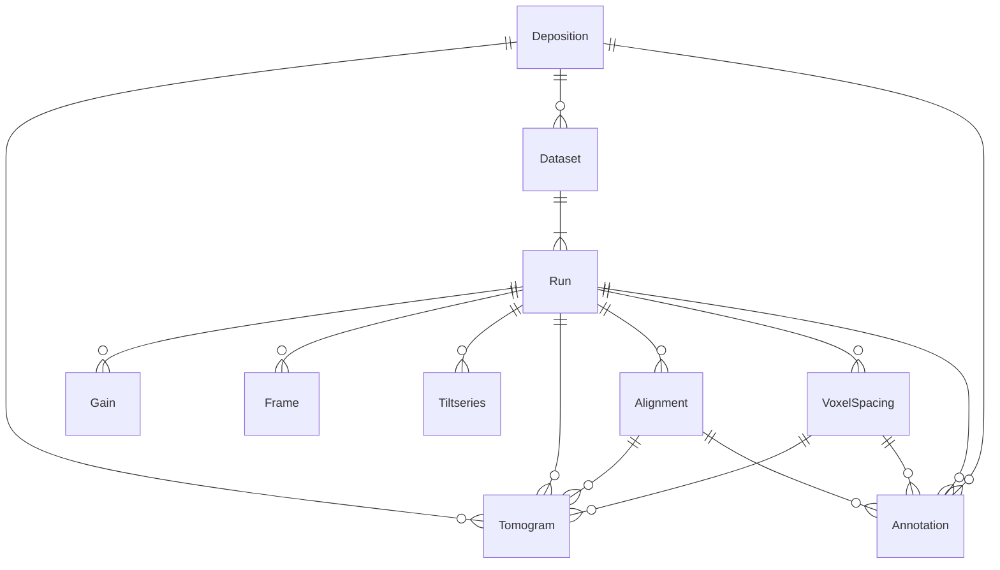

# Data Ingestion Process

---

## What is S3 Ingestion?

S3 ingestion is the process by which data deposited by researchers to CryoET platform is ingested, transformed, and stored in a standardized format.

The ingestion process can start when the deposited data is available in an s3 bucket that is either,
  - Owned by CZI.
  - A third-party bucket that grants **read access** to CZI's ingestion process.

### Configuration File

A YAML configuration file is used to define the specifics of the data transformation process. This file provides the following for each of the entities in the deposition:
- **Metadata**: Information from data depositors on experimental conditions, and methods used in generating this data. It also provides the type of data for some entities, to help the ingestion process handle it accordingly.
- **Source**: Location of individual assets within the source bucket.

This configuration ensures that the data is ingested and transformed correctly for each deposition. These configs are stored in the [dataset_config folder](../dataset_config/).

---

## Why Standardize the Data?

Researchers often organize their data in unique ways and may use different formats. However, to provide a **consistent and seamless experience** for users on the CryoET platform, it is essential to standardize the data.

### Reasons for Standardization:
- **Data Organization**: Researchers have different strategies for organizing and naming their data files.
- **Format Diversity**: Researchers may submit data in a variety of formats, which need to be standardized for compatibility.

By transforming the data into **consistent formats** and **structured folder layouts**, we ensure that users can easily navigate and utilize the data on the CryoET platform. This structured approach guarantees that researchers' raw data can be ingested, transformed, and presented in a unified manner for consistent use within the CryoET platform.

---

## CryoET Data Portal directory structure

Metadata file and directory layout specs:

<pre>
.
├── [dataset_id]/
│   ├── [run_name]/
│   │   ├── Alignments/
│   │   │   └── [alignment_id]/
│   │   │       ├── alignment_metadata.json
│   │   │       └── [name_in_source].(aln|xf|tlt|json|xtilt|com)
│   │   ├── Frames/
│   │   │   ├── [name_in_source].(tiff|eer|mrc)
│   │   │   ├── [name_in_source].mdoc
│   │   │   └── frames_metadata.json
│   │   ├── Gains/
│   │   │   └── [name_in_source]_gain.(mrc|gain|dm4)
│   │   ├── Reconstructions/
│   │   │   └── VoxelSpacingXX.XXX/
│   │   │       ├── Annotations/
│   │   │       │   └── [annotation_id]/
│   │   │       │       ├── annotation_files
│   │   │       │       └── <annotation_key>.json (metadata file)
│   │   │       ├── Images/
│   │   │       │   └── [tomogram_id]/
│   │   │       │       ├── key-photo-expanded.png
│   │   │       │       ├── key-photo-original.png
│   │   │       │       ├── key-photo-thumbnail.png
│   │   │       │       └── key-photo-snapshot.png
│   │   │       ├── NeuroglancerPrecompute/
│   │   │       │   ├── [annotation_id]-shape_precompute
│   │   │       │   └── [tomogram_id]-neuroglancer-config.json
│   │   │       └── Tomograms/
│   │   │           └── [tomogram_id]/
│   │   │               ├── tomogram-metadata.json
│   │   │               ├── [run_name].zarr/
│   │   │               │   └── subdirectories according to <a href="https://ngff.openmicroscopy.org/latest/">OME-NGFF spec</a> at 100%, 50% and 25% scale
│   │   │               └── [run_name].mrc
│   │   ├── TiltSeries/
│   │   │   └── [tiltseries_id]/
│   │   │       ├── [run_name].mrc
│   │   │       ├── [run_name].zarr/
│   │   │       │   └── subdirectories according to <a href="https://ngff.openmicroscopy.org/latest/">OME-NGFF spec</a> at 100%, 50% and 25% scale
│   │   │       ├── tiltseries_metadata.json
│   │   │       └── [name_in_source].rawtlt
│   │   └── run_metadata.json
│   ├── Images/
│   │   ├── snapshot.png
│   │   └── thumbnail.png
│   └── dataset_metadata.json
└── DepositionMetadata/
    └── [deposition-id]/
        ├── deposition_metadata.json
        └── Images/
            ├── snapshot.png
            └── thumbnail.png
</pre>

## How are the different entities related?

The mermaid diagram here represents the dependency relationship between different assets. To learn more about each of these entities, refer to the [python client documentation](https://chanzuckerberg.github.io/cryoet-data-portal/cryoet_data_portal_docsite_data.html#data-organization).

## Implementation

The implementation of this can be found in the `scripts/standardize_dirs.py`.
