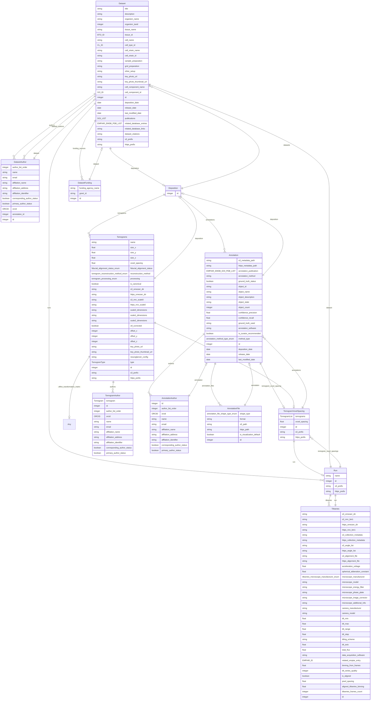

```mermaid
erDiagram
Dataset {
    string title
    string description
    string organism_name
    integer organism_taxid
    string tissue_name
    BTO_ID tissue_id
    string cell_name
    CL_ID cell_type_id
    string cell_strain_name
    string cell_strain_id
    string sample_preparation
    string grid_preparation
    string other_setup
    string key_photo_url
    string key_photo_thumbnail_url
    string cell_component_name
    GO_ID cell_component_id
    integer id
    date deposition_date
    date release_date
    date last_modified_date
    DOI_LIST publications
    EMPIAR_EMDB_PDB_LIST related_database_entries
    string related_database_links
    string dataset_citations
    string s3_prefix
    string https_prefix
}
DatasetAuthor {
    integer author_list_order
    string name
    string email
    string affiliation_name
    string affiliation_address
    string affiliation_identifier
    boolean corresponding_author_status
    boolean primary_author_status
    ORCID orcid
    integer annotation_id
    integer id
}
Run {
    string name
    integer id
    string s3_prefix
    string https_prefix
}
TomogramVoxelSpacing {
    TomogramList tomograms
    float voxel_spacing
    integer id
    string s3_prefix
    string https_prefix
}
Annotation {
    string s3_metadata_path
    string https_metadata_path
    EMPIAR_EMDB_DOI_PDB_LIST annotation_publication
    string annotation_method
    boolean ground_truth_status
    string object_id
    string object_name
    string object_description
    string object_state
    integer object_count
    float confidence_precision
    float confidence_recall
    string ground_truth_used
    string annotation_software
    boolean is_curator_recommended
    annotation_method_type_enum method_type
    integer id
    date deposition_date
    date release_date
    date last_modified_date
}
Deposition {
    integer id
}
Tomograms {
    string name
    float size_x
    float size_y
    float size_z
    float voxel_spacing
    fiducial_alignment_status_enum fiducial_alignment_status
    tomogrom_reconstruction_method_enum reconstruction_method
    tomogram_processing_enum processing
    boolean is_canonical
    string s3_omezarr_dir
    string https_omezarr_dir
    string s3_mrc_scale0
    string https_mrc_scale0
    string scale0_dimensions
    string scale1_dimensions
    string scale2_dimensions
    boolean ctf_corrected
    integer offset_x
    integer offset_y
    integer offset_z
    string key_photo_url
    string key_photo_thumbnail_url
    string neuroglancer_config
    TomogramType type
    integer id
    string s3_prefix
    string https_prefix
}
Any {

}
TomogramAuthor {
    Tomogram tomogram
    integer id
    integer author_list_order
    ORCID orcid
    string name
    string email
    string affiliation_name
    string affiliation_address
    string affiliation_identifier
    boolean corresponding_author_status
    boolean primary_author_status
}
AnnotationAuthor {
    integer id
    integer author_list_order
    ORCID orcid
    string name
    string email
    string affiliation_name
    string affiliation_address
    string affiliation_identifier
    boolean corresponding_author_status
    boolean primary_author_status
}
AnnotationFile {
    annotation_file_shape_type_enum shape_type
    string format
    string s3_path
    string https_path
    boolean is_visualization_default
    integer id
}
Tiltseries {
    string s3_omezarr_dir
    string s3_mrc_bin1
    string https_omezarr_dir
    string https_mrc_bin1
    string s3_collection_metadata
    string https_collection_metadata
    string s3_angle_list
    string https_angle_list
    string s3_alignment_file
    string https_alignment_file
    float acceleration_voltage
    float spherical_abberation_constant
    tiltseries_microscope_manufacturer_enum microscope_manufacturer
    string microscope_model
    string microscope_energy_filter
    string microscope_phase_plate
    string microscope_image_corrector
    string microscope_additional_info
    string camera_manufacturer
    string camera_model
    float tilt_min
    float tilt_max
    float tilt_range
    float tilt_step
    string tilting_scheme
    float tilt_axis
    float total_flux
    string data_acquisition_software
    EMPIAR_ID related_empiar_entry
    float binning_from_frames
    integer tilt_series_quality
    boolean is_aligned
    float pixel_spacing
    float aligned_tiltseries_binning
    integer tiltseries_frames_count
    integer id
}
DatasetFunding {
    string funding_agency_name
    string grant_id
    integer id
}

Dataset ||--|o Deposition : "deposition"
Dataset ||--}o DatasetFunding : "funding_sources"
Dataset ||--}o DatasetAuthor : "authors"
Dataset ||--}o Run : "runs"
Dataset ||--}o DatasetAuthor : "dataset_authors"
DatasetAuthor ||--|o Dataset : "dataset"
Run ||--|| Dataset : "dataset"
Run ||--}o Tiltseries : "tiltseries"
Run ||--}o TomogramVoxelSpacing : "tomogram_voxel_spacings"
TomogramVoxelSpacing ||--|o Run : "run"
TomogramVoxelSpacing ||--}o Annotation : "annotations"
Annotation ||--|o TomogramVoxelSpacing : "tomogram_voxel_spacing"
Annotation ||--}o AnnotationFile : "annotation_files"
Annotation ||--}o AnnotationAuthor : "authors"
Annotation ||--|o Deposition : "deposition"
Deposition ||--}o Dataset : "datasets"
Deposition ||--}o Annotation : "annotations"
Deposition ||--}o Tomograms : "tomograms"
Tomograms ||--|o Deposition : "deposition"
Tomograms ||--|o TomogramVoxelSpacing : "tomogram_voxel_spacing"
Tomograms ||--}o TomogramAuthor : "authors"
Tomograms ||--|o Any : "affine_transformation_matrix"
AnnotationAuthor ||--|o Annotation : "annotation"
AnnotationFile ||--|o Annotation : "annotation"
Tiltseries ||--|| Run : "run"
DatasetFunding ||--|o Dataset : "dataset"

```
