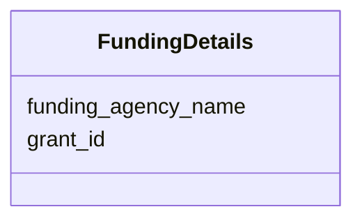

# Class: FundingDetails


_A funding source for a scientific data entity (base for JSON and DB representation)._


URI: [cdp-meta:FundingDetails](metadataFundingDetails)





<!-- no inheritance hierarchy -->


## Slots

| Name | Cardinality and Range | Description | Inheritance |
| ---  | --- | --- | --- |
| [funding_agency_name](funding_agency_name.md) | 0..1 _recommended_ <br/> [String](String.md) | The name of the funding source | direct |
| [grant_id](grant_id.md) | 0..1 _recommended_ <br/> [String](String.md) | Grant identifier provided by the funding agency | direct |


## Usages

| used by | used in | type | used |
| ---  | --- | --- | --- |
| [FundedEntity](FundedEntity.md) | [funding](funding.md) | range | [FundingDetails](FundingDetails.md) |
| [Dataset](Dataset.md) | [funding](funding.md) | range | [FundingDetails](FundingDetails.md) |


## Identifier and Mapping Information


### Schema Source


* from schema: metadata


## Mappings

| Mapping Type | Mapped Value |
| ---  | ---  |
| self | cdp-meta:FundingDetails |
| native | cdp-meta:FundingDetails |


## LinkML Source

<!-- TODO: investigate https://stackoverflow.com/questions/37606292/how-to-create-tabbed-code-blocks-in-mkdocs-or-sphinx -->

### Direct

<details>
```yaml
name: FundingDetails
description: A funding source for a scientific data entity (base for JSON and DB representation).
from_schema: metadata
attributes:
  funding_agency_name:
    name: funding_agency_name
    description: The name of the funding source.
    from_schema: metadata
    exact_mappings:
    - cdp-common:funding_agency_name
    rank: 1000
    alias: funding_agency_name
    owner: FundingDetails
    domain_of:
    - FundingDetails
    range: string
    recommended: true
    inlined: true
    inlined_as_list: true
  grant_id:
    name: grant_id
    description: Grant identifier provided by the funding agency
    from_schema: metadata
    exact_mappings:
    - cdp-common:funding_grant_id
    rank: 1000
    alias: grant_id
    owner: FundingDetails
    domain_of:
    - FundingDetails
    range: string
    recommended: true
    inlined: true
    inlined_as_list: true

```
</details>

### Induced

<details>
```yaml
name: FundingDetails
description: A funding source for a scientific data entity (base for JSON and DB representation).
from_schema: metadata
attributes:
  funding_agency_name:
    name: funding_agency_name
    description: The name of the funding source.
    from_schema: metadata
    exact_mappings:
    - cdp-common:funding_agency_name
    rank: 1000
    alias: funding_agency_name
    owner: FundingDetails
    domain_of:
    - FundingDetails
    range: string
    recommended: true
    inlined: true
    inlined_as_list: true
  grant_id:
    name: grant_id
    description: Grant identifier provided by the funding agency
    from_schema: metadata
    exact_mappings:
    - cdp-common:funding_grant_id
    rank: 1000
    alias: grant_id
    owner: FundingDetails
    domain_of:
    - FundingDetails
    range: string
    recommended: true
    inlined: true
    inlined_as_list: true

```
</details>
