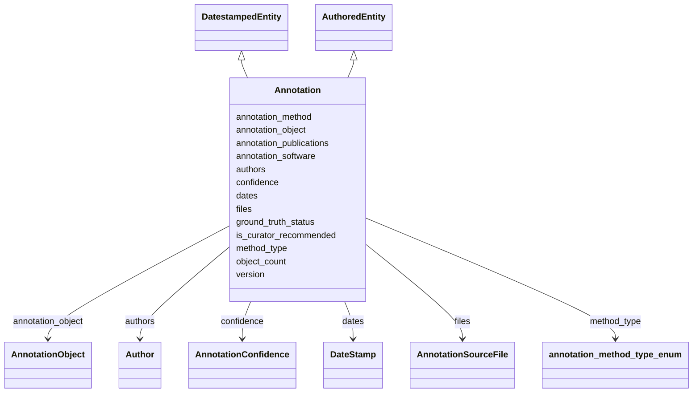

# Class: Annotation


_Metadata describing an annotation._


URI: [cdp-meta:Annotation](metadataAnnotation)





## Inheritance
* **Annotation** [ [DatestampedEntity](DatestampedEntity.md) [AuthoredEntity](AuthoredEntity.md)]


## Slots

| Name | Cardinality and Range | Description | Inheritance |
| ---  | --- | --- | --- |
| [annotation_method](annotation_method.md) | 1..1 <br/> [String](String.md) | Describe how the annotation is made (e | direct |
| [annotation_object](annotation_object.md) | 1..1 <br/> [AnnotationObject](AnnotationObject.md) | Metadata describing the object being annotated | direct |
| [annotation_publications](annotation_publications.md) | 0..1 <br/> [String](String.md) | DOIs for publications that describe the dataset | direct |
| [annotation_software](annotation_software.md) | 0..1 _recommended_ <br/> [String](String.md) | Software used for generating this annotation | direct |
| [confidence](confidence.md) | 0..1 <br/> [AnnotationConfidence](AnnotationConfidence.md) | Metadata describing the confidence of an annotation | direct |
| [files](files.md) | 0..* <br/> [AnnotationSourceFile](AnnotationSourceFile.md) | File and sourcing data for an annotation | direct |
| [ground_truth_status](ground_truth_status.md) | 0..1 _recommended_ <br/> [Boolean](Boolean.md) | Whether an annotation is considered ground truth, as determined by the annota... | direct |
| [is_curator_recommended](is_curator_recommended.md) | 0..1 <br/> [Boolean](Boolean.md) | This annotation is recommended by the curator to be preferred for this object... | direct |
| [method_type](method_type.md) | 1..1 <br/> [AnnotationMethodTypeEnum](AnnotationMethodTypeEnum.md) | Classification of the annotation method based on supervision | direct |
| [object_count](object_count.md) | 0..1 <br/> [Integer](Integer.md) | Number of objects identified | direct |
| [version](version.md) | 0..1 <br/> [VersionString](VersionString.md) | Version of annotation | direct |
| [dates](dates.md) | 1..1 <br/> [DateStamp](DateStamp.md) | A set of dates at which a data item was deposited, published and last modifie... | direct |
| [authors](authors.md) | 1..* <br/> [Author](Author.md) | Author of a scientific data entity | direct |


## Identifier and Mapping Information


### Schema Source


* from schema: metadata


## Mappings

| Mapping Type | Mapped Value |
| ---  | ---  |
| self | cdp-meta:Annotation |
| native | cdp-meta:Annotation |


## LinkML Source

<!-- TODO: investigate https://stackoverflow.com/questions/37606292/how-to-create-tabbed-code-blocks-in-mkdocs-or-sphinx -->

### Direct

<details>
```yaml
name: Annotation
description: Metadata describing an annotation.
from_schema: metadata
mixins:
- DatestampedEntity
- AuthoredEntity
attributes:
  annotation_method:
    name: annotation_method
    description: Describe how the annotation is made (e.g. Manual, crYoLO, Positive
      Unlabeled Learning, template matching)
    from_schema: metadata
    exact_mappings:
    - cdp-common:annotation_method
    rank: 1000
    alias: annotation_method
    owner: Annotation
    domain_of:
    - Annotation
    range: string
    required: true
    inlined: true
    inlined_as_list: true
  annotation_object:
    name: annotation_object
    description: Metadata describing the object being annotated.
    from_schema: metadata
    rank: 1000
    alias: annotation_object
    owner: Annotation
    domain_of:
    - Annotation
    range: AnnotationObject
    required: true
    inlined: true
    inlined_as_list: true
  annotation_publications:
    name: annotation_publications
    description: DOIs for publications that describe the dataset. Use a comma to separate
      multiple DOIs.
    from_schema: metadata
    exact_mappings:
    - cdp-common:annotation_publication
    rank: 1000
    alias: annotation_publications
    owner: Annotation
    domain_of:
    - Annotation
    range: string
    inlined: true
    inlined_as_list: true
  annotation_software:
    name: annotation_software
    description: Software used for generating this annotation
    from_schema: metadata
    exact_mappings:
    - cdp-common:annotation_software
    rank: 1000
    alias: annotation_software
    owner: Annotation
    domain_of:
    - Annotation
    range: string
    recommended: true
    inlined: true
    inlined_as_list: true
  confidence:
    name: confidence
    description: Metadata describing the confidence of an annotation.
    from_schema: metadata
    rank: 1000
    alias: confidence
    owner: Annotation
    domain_of:
    - Annotation
    range: AnnotationConfidence
    inlined: true
    inlined_as_list: true
  files:
    name: files
    description: File and sourcing data for an annotation. Represents an entry in
      annotation.sources.
    from_schema: metadata
    rank: 1000
    multivalued: true
    list_elements_ordered: true
    alias: files
    owner: Annotation
    domain_of:
    - Annotation
    range: AnnotationSourceFile
    inlined: true
    inlined_as_list: true
  ground_truth_status:
    name: ground_truth_status
    description: Whether an annotation is considered ground truth, as determined by
      the annotator.
    from_schema: metadata
    exact_mappings:
    - cdp-common:annotation_ground_truth_status
    rank: 1000
    ifabsent: 'False'
    alias: ground_truth_status
    owner: Annotation
    domain_of:
    - Annotation
    range: boolean
    recommended: true
    inlined: true
    inlined_as_list: true
  is_curator_recommended:
    name: is_curator_recommended
    description: This annotation is recommended by the curator to be preferred for
      this object type.
    from_schema: metadata
    exact_mappings:
    - cdp-common:annotation_is_curator_recommended
    rank: 1000
    ifabsent: 'False'
    alias: is_curator_recommended
    owner: Annotation
    domain_of:
    - Annotation
    range: boolean
    inlined: true
    inlined_as_list: true
  method_type:
    name: method_type
    description: Classification of the annotation method based on supervision.
    from_schema: metadata
    exact_mappings:
    - cdp-common:annotation_method_type
    rank: 1000
    alias: method_type
    owner: Annotation
    domain_of:
    - Annotation
    range: annotation_method_type_enum
    required: true
    inlined: true
    inlined_as_list: true
  object_count:
    name: object_count
    description: Number of objects identified
    from_schema: metadata
    exact_mappings:
    - cdp-common:annotation_object_count
    rank: 1000
    alias: object_count
    owner: Annotation
    domain_of:
    - Annotation
    range: integer
    inlined: true
    inlined_as_list: true
  version:
    name: version
    description: Version of annotation.
    from_schema: metadata
    exact_mappings:
    - cdp-common:annotation_version
    rank: 1000
    alias: version
    owner: Annotation
    domain_of:
    - Annotation
    range: VersionString
    inlined: true
    inlined_as_list: true
  dates:
    name: dates
    description: A set of dates at which a data item was deposited, published and
      last modified.
    from_schema: metadata
    alias: dates
    owner: Annotation
    domain_of:
    - DatestampedEntity
    - Dataset
    - Annotation
    range: DateStamp
    required: true
    inlined: true
    inlined_as_list: true
  authors:
    name: authors
    description: Author of a scientific data entity.
    from_schema: metadata
    multivalued: true
    list_elements_ordered: true
    alias: authors
    owner: Annotation
    domain_of:
    - AuthoredEntity
    - Dataset
    - Tomogram
    - Annotation
    range: Author
    required: true
    inlined: true
    inlined_as_list: true

```
</details>

### Induced

<details>
```yaml
name: Annotation
description: Metadata describing an annotation.
from_schema: metadata
mixins:
- DatestampedEntity
- AuthoredEntity
attributes:
  annotation_method:
    name: annotation_method
    description: Describe how the annotation is made (e.g. Manual, crYoLO, Positive
      Unlabeled Learning, template matching)
    from_schema: metadata
    exact_mappings:
    - cdp-common:annotation_method
    rank: 1000
    alias: annotation_method
    owner: Annotation
    domain_of:
    - Annotation
    range: string
    required: true
    inlined: true
    inlined_as_list: true
  annotation_object:
    name: annotation_object
    description: Metadata describing the object being annotated.
    from_schema: metadata
    rank: 1000
    alias: annotation_object
    owner: Annotation
    domain_of:
    - Annotation
    range: AnnotationObject
    required: true
    inlined: true
    inlined_as_list: true
  annotation_publications:
    name: annotation_publications
    description: DOIs for publications that describe the dataset. Use a comma to separate
      multiple DOIs.
    from_schema: metadata
    exact_mappings:
    - cdp-common:annotation_publication
    rank: 1000
    alias: annotation_publications
    owner: Annotation
    domain_of:
    - Annotation
    range: string
    inlined: true
    inlined_as_list: true
  annotation_software:
    name: annotation_software
    description: Software used for generating this annotation
    from_schema: metadata
    exact_mappings:
    - cdp-common:annotation_software
    rank: 1000
    alias: annotation_software
    owner: Annotation
    domain_of:
    - Annotation
    range: string
    recommended: true
    inlined: true
    inlined_as_list: true
  confidence:
    name: confidence
    description: Metadata describing the confidence of an annotation.
    from_schema: metadata
    rank: 1000
    alias: confidence
    owner: Annotation
    domain_of:
    - Annotation
    range: AnnotationConfidence
    inlined: true
    inlined_as_list: true
  files:
    name: files
    description: File and sourcing data for an annotation. Represents an entry in
      annotation.sources.
    from_schema: metadata
    rank: 1000
    multivalued: true
    list_elements_ordered: true
    alias: files
    owner: Annotation
    domain_of:
    - Annotation
    range: AnnotationSourceFile
    inlined: true
    inlined_as_list: true
  ground_truth_status:
    name: ground_truth_status
    description: Whether an annotation is considered ground truth, as determined by
      the annotator.
    from_schema: metadata
    exact_mappings:
    - cdp-common:annotation_ground_truth_status
    rank: 1000
    ifabsent: 'False'
    alias: ground_truth_status
    owner: Annotation
    domain_of:
    - Annotation
    range: boolean
    recommended: true
    inlined: true
    inlined_as_list: true
  is_curator_recommended:
    name: is_curator_recommended
    description: This annotation is recommended by the curator to be preferred for
      this object type.
    from_schema: metadata
    exact_mappings:
    - cdp-common:annotation_is_curator_recommended
    rank: 1000
    ifabsent: 'False'
    alias: is_curator_recommended
    owner: Annotation
    domain_of:
    - Annotation
    range: boolean
    inlined: true
    inlined_as_list: true
  method_type:
    name: method_type
    description: Classification of the annotation method based on supervision.
    from_schema: metadata
    exact_mappings:
    - cdp-common:annotation_method_type
    rank: 1000
    alias: method_type
    owner: Annotation
    domain_of:
    - Annotation
    range: annotation_method_type_enum
    required: true
    inlined: true
    inlined_as_list: true
  object_count:
    name: object_count
    description: Number of objects identified
    from_schema: metadata
    exact_mappings:
    - cdp-common:annotation_object_count
    rank: 1000
    alias: object_count
    owner: Annotation
    domain_of:
    - Annotation
    range: integer
    inlined: true
    inlined_as_list: true
  version:
    name: version
    description: Version of annotation.
    from_schema: metadata
    exact_mappings:
    - cdp-common:annotation_version
    rank: 1000
    alias: version
    owner: Annotation
    domain_of:
    - Annotation
    range: VersionString
    inlined: true
    inlined_as_list: true
  dates:
    name: dates
    description: A set of dates at which a data item was deposited, published and
      last modified.
    from_schema: metadata
    alias: dates
    owner: Annotation
    domain_of:
    - DatestampedEntity
    - Dataset
    - Annotation
    range: DateStamp
    required: true
    inlined: true
    inlined_as_list: true
  authors:
    name: authors
    description: Author of a scientific data entity.
    from_schema: metadata
    multivalued: true
    list_elements_ordered: true
    alias: authors
    owner: Annotation
    domain_of:
    - AuthoredEntity
    - Dataset
    - Tomogram
    - Annotation
    range: Author
    required: true
    inlined: true
    inlined_as_list: true

```
</details>
