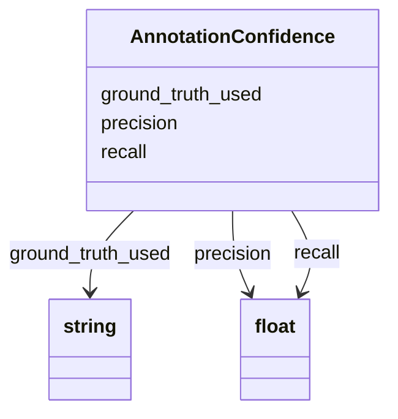

# Class: AnnotationConfidence


_Metadata describing the confidence of an annotation._


URI: [cdp-meta:AnnotationConfidence](metadataAnnotationConfidence)





<!-- no inheritance hierarchy -->


## Slots

| Name | Cardinality and Range | Description | Inheritance |
| ---  | --- | --- | --- |
| [precision](precision.md) | 0..1 <br/> [xsd:float](http://www.w3.org/2001/XMLSchema#float) | Describe the confidence level of the annotation | direct |
| [recall](recall.md) | 0..1 <br/> [xsd:float](http://www.w3.org/2001/XMLSchema#float) | Describe the confidence level of the annotation | direct |
| [ground_truth_used](ground_truth_used.md) | 0..1 <br/> [xsd:string](http://www.w3.org/2001/XMLSchema#string) | Annotation filename used as ground truth for precision and recall | direct |


## Usages

| used by | used in | type | used |
| ---  | --- | --- | --- |
| [Annotation](Annotation.md) | [confidence](confidence.md) | range | [AnnotationConfidence](AnnotationConfidence.md) |


## Identifier and Mapping Information


### Schema Source


* from schema: metadata


## Mappings

| Mapping Type | Mapped Value |
| ---  | ---  |
| self | cdp-meta:AnnotationConfidence |
| native | cdp-meta:AnnotationConfidence |


## LinkML Source

<!-- TODO: investigate https://stackoverflow.com/questions/37606292/how-to-create-tabbed-code-blocks-in-mkdocs-or-sphinx -->

### Direct

<details>
```yaml
name: AnnotationConfidence
description: Metadata describing the confidence of an annotation.
from_schema: metadata
attributes:
  precision:
    name: precision
    description: Describe the confidence level of the annotation. Precision is defined
      as the % of annotation objects being true positive
    from_schema: metadata
    exact_mappings:
    - cdp-common:annotation_confidence_precision
    rank: 1000
    alias: precision
    owner: AnnotationConfidence
    domain_of:
    - AnnotationConfidence
    range: float
    inlined: true
    inlined_as_list: true
  recall:
    name: recall
    description: Describe the confidence level of the annotation. Recall is defined
      as the % of true positives being annotated correctly
    from_schema: metadata
    exact_mappings:
    - cdp-common:annotation_confidence_recall
    rank: 1000
    alias: recall
    owner: AnnotationConfidence
    domain_of:
    - AnnotationConfidence
    range: float
    inlined: true
    inlined_as_list: true
  ground_truth_used:
    name: ground_truth_used
    description: Annotation filename used as ground truth for precision and recall
    from_schema: metadata
    exact_mappings:
    - cdp-common:annotation_ground_truth_used
    rank: 1000
    alias: ground_truth_used
    owner: AnnotationConfidence
    domain_of:
    - AnnotationConfidence
    range: string
    inlined: true
    inlined_as_list: true

```
</details>

### Induced

<details>
```yaml
name: AnnotationConfidence
description: Metadata describing the confidence of an annotation.
from_schema: metadata
attributes:
  precision:
    name: precision
    description: Describe the confidence level of the annotation. Precision is defined
      as the % of annotation objects being true positive
    from_schema: metadata
    exact_mappings:
    - cdp-common:annotation_confidence_precision
    rank: 1000
    alias: precision
    owner: AnnotationConfidence
    domain_of:
    - AnnotationConfidence
    range: float
    inlined: true
    inlined_as_list: true
  recall:
    name: recall
    description: Describe the confidence level of the annotation. Recall is defined
      as the % of true positives being annotated correctly
    from_schema: metadata
    exact_mappings:
    - cdp-common:annotation_confidence_recall
    rank: 1000
    alias: recall
    owner: AnnotationConfidence
    domain_of:
    - AnnotationConfidence
    range: float
    inlined: true
    inlined_as_list: true
  ground_truth_used:
    name: ground_truth_used
    description: Annotation filename used as ground truth for precision and recall
    from_schema: metadata
    exact_mappings:
    - cdp-common:annotation_ground_truth_used
    rank: 1000
    alias: ground_truth_used
    owner: AnnotationConfidence
    domain_of:
    - AnnotationConfidence
    range: string
    inlined: true
    inlined_as_list: true

```
</details>
