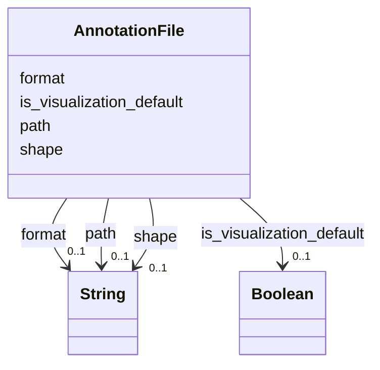

# Class: AnnotationFile


_Metadata describing a file containing an annotation._


URI: [cdp-meta:AnnotationFile](metadataAnnotationFile)





<!-- no inheritance hierarchy -->


## Slots

| Name | Cardinality and Range | Description | Inheritance |
| ---  | --- | --- | --- |
| [format](format.md) | 0..1 <br/> [xsd:string](http://www.w3.org/2001/XMLSchema#string) | File format for this file | direct |
| [shape](shape.md) | 0..1 <br/> [xsd:string](http://www.w3.org/2001/XMLSchema#string) | Describe whether this is a Point, OrientedPoint, or SegmentationMask file | direct |
| [path](path.md) | 0..1 <br/> [xsd:string](http://www.w3.org/2001/XMLSchema#string) | Path to the annotation file relative to the dataset root | direct |
| [is_visualization_default](is_visualization_default.md) | 0..1 <br/> [xsd:boolean](http://www.w3.org/2001/XMLSchema#boolean) | This annotation will be rendered in neuroglancer by default | direct |


## Usages

| used by | used in | type | used |
| ---  | --- | --- | --- |
| [Annotation](Annotation.md) | [files](files.md) | range | [AnnotationFile](AnnotationFile.md) |


## Identifier and Mapping Information


### Schema Source


* from schema: metadata


## Mappings

| Mapping Type | Mapped Value |
| ---  | ---  |
| self | cdp-meta:AnnotationFile |
| native | cdp-meta:AnnotationFile |


## LinkML Source

<!-- TODO: investigate https://stackoverflow.com/questions/37606292/how-to-create-tabbed-code-blocks-in-mkdocs-or-sphinx -->

### Direct

<details>
```yaml
name: AnnotationFile
description: Metadata describing a file containing an annotation.
from_schema: metadata
attributes:
  format:
    name: format
    description: File format for this file
    from_schema: metadata
    exact_mappings:
    - cdp-common:annotation_file_format
    rank: 1000
    alias: format
    owner: AnnotationFile
    domain_of:
    - AnnotationFile
    range: string
    inlined: true
    inlined_as_list: true
  shape:
    name: shape
    description: Describe whether this is a Point, OrientedPoint, or SegmentationMask
      file
    from_schema: metadata
    exact_mappings:
    - cdp-common:annotation_file_shape_type
    rank: 1000
    alias: shape
    owner: AnnotationFile
    domain_of:
    - AnnotationFile
    range: string
    inlined: true
    inlined_as_list: true
  path:
    name: path
    description: Path to the annotation file relative to the dataset root.
    from_schema: metadata
    exact_mappings:
    - cdp-common:annotation_file_path
    rank: 1000
    alias: path
    owner: AnnotationFile
    domain_of:
    - AnnotationFile
    range: string
    inlined: true
    inlined_as_list: true
  is_visualization_default:
    name: is_visualization_default
    description: This annotation will be rendered in neuroglancer by default.
    from_schema: metadata
    exact_mappings:
    - cdp-common:annotation_file_is_visualization_default
    rank: 1000
    alias: is_visualization_default
    owner: AnnotationFile
    domain_of:
    - AnnotationFile
    range: boolean
    inlined: true
    inlined_as_list: true

```
</details>

### Induced

<details>
```yaml
name: AnnotationFile
description: Metadata describing a file containing an annotation.
from_schema: metadata
attributes:
  format:
    name: format
    description: File format for this file
    from_schema: metadata
    exact_mappings:
    - cdp-common:annotation_file_format
    rank: 1000
    alias: format
    owner: AnnotationFile
    domain_of:
    - AnnotationFile
    range: string
    inlined: true
    inlined_as_list: true
  shape:
    name: shape
    description: Describe whether this is a Point, OrientedPoint, or SegmentationMask
      file
    from_schema: metadata
    exact_mappings:
    - cdp-common:annotation_file_shape_type
    rank: 1000
    alias: shape
    owner: AnnotationFile
    domain_of:
    - AnnotationFile
    range: string
    inlined: true
    inlined_as_list: true
  path:
    name: path
    description: Path to the annotation file relative to the dataset root.
    from_schema: metadata
    exact_mappings:
    - cdp-common:annotation_file_path
    rank: 1000
    alias: path
    owner: AnnotationFile
    domain_of:
    - AnnotationFile
    range: string
    inlined: true
    inlined_as_list: true
  is_visualization_default:
    name: is_visualization_default
    description: This annotation will be rendered in neuroglancer by default.
    from_schema: metadata
    exact_mappings:
    - cdp-common:annotation_file_is_visualization_default
    rank: 1000
    alias: is_visualization_default
    owner: AnnotationFile
    domain_of:
    - AnnotationFile
    range: boolean
    inlined: true
    inlined_as_list: true

```
</details>