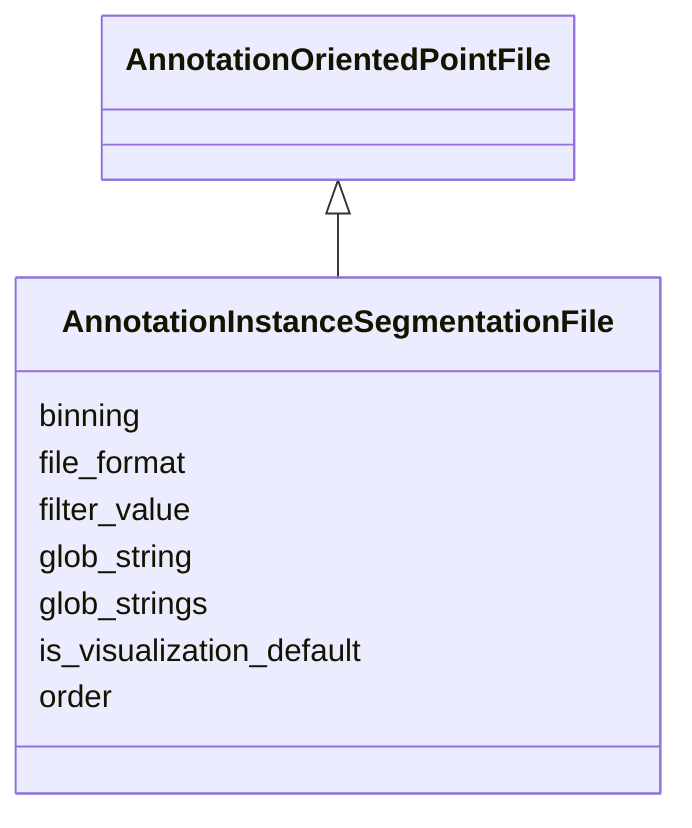

# Class: AnnotationInstanceSegmentationFile


_File and sourcing data for an instance segmentation annotation. Annotation that identifies individual instances of object shapes._


URI: [cdp-meta:AnnotationInstanceSegmentationFile](metadataAnnotationInstanceSegmentationFile)





## Inheritance
* [AnnotationSourceFile](AnnotationSourceFile.md)
    * [AnnotationOrientedPointFile](AnnotationOrientedPointFile.md)
        * **AnnotationInstanceSegmentationFile**


## Slots

| Name | Cardinality and Range | Description | Inheritance |
| ---  | --- | --- | --- |
| [binning](binning.md) | 0..1 <br/> [Float](Float.md) | The binning factor for a point / oriented point / instance segmentation annot... | direct |
| [filter_value](filter_value.md) | 0..1 <br/> [String](String.md) | The filter value for an oriented point / instance segmentation annotation fil... | direct |
| [order](order.md) | 0..1 <br/> [String](String.md) | The order of axes for an oriented point / instance segmentation annotation fi... | direct |
| [file_format](file_format.md) | 1..1 <br/> [String](String.md) | File format for this file | direct |
| [glob_string](glob_string.md) | 0..1 <br/> [String](String.md) | Glob string to match annotation files in the dataset | direct |
| [glob_strings](glob_strings.md) | 0..* <br/> [String](String.md) | Glob strings to match annotation files in the dataset | direct |
| [is_visualization_default](is_visualization_default.md) | 0..1 <br/> [Boolean](Boolean.md) | This annotation will be rendered in neuroglancer by default | direct |


## Aliases


* InstanceSegmentation


## Identifier and Mapping Information


### Schema Source


* from schema: metadata


## Mappings

| Mapping Type | Mapped Value |
| ---  | ---  |
| self | cdp-meta:AnnotationInstanceSegmentationFile |
| native | cdp-meta:AnnotationInstanceSegmentationFile |


## LinkML Source

<!-- TODO: investigate https://stackoverflow.com/questions/37606292/how-to-create-tabbed-code-blocks-in-mkdocs-or-sphinx -->

### Direct

<details>
```yaml
name: AnnotationInstanceSegmentationFile
description: File and sourcing data for an instance segmentation annotation. Annotation
  that identifies individual instances of object shapes.
from_schema: metadata
aliases:
- InstanceSegmentation
is_a: AnnotationOrientedPointFile
attributes:
  binning:
    name: binning
    description: The binning factor for a point / oriented point / instance segmentation
      annotation file.
    from_schema: metadata
    exact_mappings:
    - cdp-common:annotation_source_file_binning
    ifabsent: float(1)
    alias: binning
    owner: AnnotationInstanceSegmentationFile
    domain_of:
    - AnnotationOrientedPointFile
    - AnnotationPointFile
    - AnnotationInstanceSegmentationFile
    range: float
    inlined: true
    inlined_as_list: true
    minimum_value: 0
  filter_value:
    name: filter_value
    description: The filter value for an oriented point / instance segmentation annotation
      file.
    from_schema: metadata
    exact_mappings:
    - cdp-common:annotation_source_file_filter_value
    alias: filter_value
    owner: AnnotationInstanceSegmentationFile
    domain_of:
    - AnnotationOrientedPointFile
    - AnnotationInstanceSegmentationFile
    range: string
    inlined: true
    inlined_as_list: true
  order:
    name: order
    description: The order of axes for an oriented point / instance segmentation annotation
      file.
    from_schema: metadata
    exact_mappings:
    - cdp-common:annotation_source_file_order
    ifabsent: string(xyz)
    alias: order
    owner: AnnotationInstanceSegmentationFile
    domain_of:
    - AnnotationOrientedPointFile
    - AnnotationInstanceSegmentationFile
    range: string
    inlined: true
    inlined_as_list: true
  file_format:
    name: file_format
    description: File format for this file
    from_schema: metadata
    exact_mappings:
    - cdp-common:annotation_source_file_format
    alias: file_format
    owner: AnnotationInstanceSegmentationFile
    domain_of:
    - AnnotationSourceFile
    - AnnotationOrientedPointFile
    - AnnotationInstanceSegmentationFile
    - AnnotationPointFile
    - AnnotationSegmentationMaskFile
    - AnnotationSemanticSegmentationMaskFile
    range: string
    required: true
    inlined: true
    inlined_as_list: true
  glob_string:
    name: glob_string
    description: Glob string to match annotation files in the dataset. Required if
      annotation_source_file_glob_strings is not provided.
    from_schema: metadata
    exact_mappings:
    - cdp-common:annotation_source_file_glob_string
    alias: glob_string
    owner: AnnotationInstanceSegmentationFile
    domain_of:
    - AnnotationSourceFile
    - AnnotationOrientedPointFile
    - AnnotationInstanceSegmentationFile
    - AnnotationPointFile
    - AnnotationSegmentationMaskFile
    - AnnotationSemanticSegmentationMaskFile
    range: string
    required: false
    inlined: true
    inlined_as_list: true
  glob_strings:
    name: glob_strings
    description: Glob strings to match annotation files in the dataset. Required if
      annotation_source_file_glob_string is not provided.
    from_schema: metadata
    exact_mappings:
    - cdp-common:annotation_source_file_glob_strings
    multivalued: true
    alias: glob_strings
    owner: AnnotationInstanceSegmentationFile
    domain_of:
    - AnnotationSourceFile
    - AnnotationOrientedPointFile
    - AnnotationInstanceSegmentationFile
    - AnnotationPointFile
    - AnnotationSegmentationMaskFile
    - AnnotationSemanticSegmentationMaskFile
    range: string
    required: false
    inlined: true
    inlined_as_list: true
  is_visualization_default:
    name: is_visualization_default
    description: This annotation will be rendered in neuroglancer by default.
    from_schema: metadata
    exact_mappings:
    - cdp-common:annotation_source_file_is_visualization_default
    ifabsent: 'False'
    alias: is_visualization_default
    owner: AnnotationInstanceSegmentationFile
    domain_of:
    - AnnotationSourceFile
    - AnnotationOrientedPointFile
    - AnnotationInstanceSegmentationFile
    - AnnotationPointFile
    - AnnotationSegmentationMaskFile
    - AnnotationSemanticSegmentationMaskFile
    range: boolean
    inlined: true
    inlined_as_list: true

```
</details>

### Induced

<details>
```yaml
name: AnnotationInstanceSegmentationFile
description: File and sourcing data for an instance segmentation annotation. Annotation
  that identifies individual instances of object shapes.
from_schema: metadata
aliases:
- InstanceSegmentation
is_a: AnnotationOrientedPointFile
attributes:
  binning:
    name: binning
    description: The binning factor for a point / oriented point / instance segmentation
      annotation file.
    from_schema: metadata
    exact_mappings:
    - cdp-common:annotation_source_file_binning
    ifabsent: float(1)
    alias: binning
    owner: AnnotationInstanceSegmentationFile
    domain_of:
    - AnnotationOrientedPointFile
    - AnnotationPointFile
    - AnnotationInstanceSegmentationFile
    range: float
    inlined: true
    inlined_as_list: true
    minimum_value: 0
  filter_value:
    name: filter_value
    description: The filter value for an oriented point / instance segmentation annotation
      file.
    from_schema: metadata
    exact_mappings:
    - cdp-common:annotation_source_file_filter_value
    alias: filter_value
    owner: AnnotationInstanceSegmentationFile
    domain_of:
    - AnnotationOrientedPointFile
    - AnnotationInstanceSegmentationFile
    range: string
    inlined: true
    inlined_as_list: true
  order:
    name: order
    description: The order of axes for an oriented point / instance segmentation annotation
      file.
    from_schema: metadata
    exact_mappings:
    - cdp-common:annotation_source_file_order
    ifabsent: string(xyz)
    alias: order
    owner: AnnotationInstanceSegmentationFile
    domain_of:
    - AnnotationOrientedPointFile
    - AnnotationInstanceSegmentationFile
    range: string
    inlined: true
    inlined_as_list: true
  file_format:
    name: file_format
    description: File format for this file
    from_schema: metadata
    exact_mappings:
    - cdp-common:annotation_source_file_format
    alias: file_format
    owner: AnnotationInstanceSegmentationFile
    domain_of:
    - AnnotationSourceFile
    - AnnotationOrientedPointFile
    - AnnotationInstanceSegmentationFile
    - AnnotationPointFile
    - AnnotationSegmentationMaskFile
    - AnnotationSemanticSegmentationMaskFile
    range: string
    required: true
    inlined: true
    inlined_as_list: true
  glob_string:
    name: glob_string
    description: Glob string to match annotation files in the dataset. Required if
      annotation_source_file_glob_strings is not provided.
    from_schema: metadata
    exact_mappings:
    - cdp-common:annotation_source_file_glob_string
    alias: glob_string
    owner: AnnotationInstanceSegmentationFile
    domain_of:
    - AnnotationSourceFile
    - AnnotationOrientedPointFile
    - AnnotationInstanceSegmentationFile
    - AnnotationPointFile
    - AnnotationSegmentationMaskFile
    - AnnotationSemanticSegmentationMaskFile
    range: string
    required: false
    inlined: true
    inlined_as_list: true
  glob_strings:
    name: glob_strings
    description: Glob strings to match annotation files in the dataset. Required if
      annotation_source_file_glob_string is not provided.
    from_schema: metadata
    exact_mappings:
    - cdp-common:annotation_source_file_glob_strings
    multivalued: true
    alias: glob_strings
    owner: AnnotationInstanceSegmentationFile
    domain_of:
    - AnnotationSourceFile
    - AnnotationOrientedPointFile
    - AnnotationInstanceSegmentationFile
    - AnnotationPointFile
    - AnnotationSegmentationMaskFile
    - AnnotationSemanticSegmentationMaskFile
    range: string
    required: false
    inlined: true
    inlined_as_list: true
  is_visualization_default:
    name: is_visualization_default
    description: This annotation will be rendered in neuroglancer by default.
    from_schema: metadata
    exact_mappings:
    - cdp-common:annotation_source_file_is_visualization_default
    ifabsent: 'False'
    alias: is_visualization_default
    owner: AnnotationInstanceSegmentationFile
    domain_of:
    - AnnotationSourceFile
    - AnnotationOrientedPointFile
    - AnnotationInstanceSegmentationFile
    - AnnotationPointFile
    - AnnotationSegmentationMaskFile
    - AnnotationSemanticSegmentationMaskFile
    range: boolean
    inlined: true
    inlined_as_list: true

```
</details>