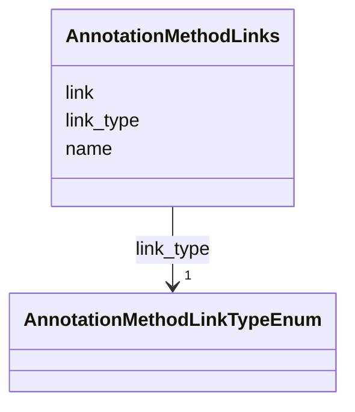

# Class: AnnotationMethodLinks


_A set of links to models, sourcecode, documentation, etc referenced by annotation the method_


URI: [cdp-meta:AnnotationMethodLinks](metadataAnnotationMethodLinks)





<!-- no inheritance hierarchy -->


## Slots

| Name | Cardinality and Range | Description | Inheritance |
| ---  | --- | --- | --- |
| [link](link.md) | 1 <br/> [String](String.md) | URL to the resource | direct |
| [link_type](link_type.md) | 1 <br/> [AnnotationMethodLinkTypeEnum](AnnotationMethodLinkTypeEnum.md) | Type of link (e | direct |
| [name](name.md) | 0..1 _recommended_ <br/> [String](String.md) | user readable name of the resource | direct |


## Identifier and Mapping Information


### Schema Source


* from schema: metadata


## Mappings

| Mapping Type | Mapped Value |
| ---  | ---  |
| self | cdp-meta:AnnotationMethodLinks |
| native | cdp-meta:AnnotationMethodLinks |


## LinkML Source

<!-- TODO: investigate https://stackoverflow.com/questions/37606292/how-to-create-tabbed-code-blocks-in-mkdocs-or-sphinx -->

### Direct

<details>
```yaml
name: AnnotationMethodLinks
description: A set of links to models, sourcecode, documentation, etc referenced by
  annotation the method
from_schema: metadata
attributes:
  link:
    name: link
    description: URL to the resource
    from_schema: metadata
    rank: 1000
    alias: link
    owner: AnnotationMethodLinks
    domain_of:
    - AnnotationMethodLinks
    range: string
    required: true
    inlined: true
    inlined_as_list: true
  link_type:
    name: link_type
    description: Type of link (e.g. model, sourcecode, documentation)
    from_schema: metadata
    rank: 1000
    alias: link_type
    owner: AnnotationMethodLinks
    domain_of:
    - AnnotationMethodLinks
    range: annotation_method_link_type_enum
    required: true
    inlined: true
    inlined_as_list: true
    pattern: (^documentation$)|(^models_weights$)|(^other$)|(^source_code$)|(^website$)
  name:
    name: name
    description: user readable name of the resource
    from_schema: metadata
    alias: name
    owner: AnnotationMethodLinks
    domain_of:
    - AuthorMixin
    - AnnotationMethodLinks
    - OrganismDetails
    - TissueDetails
    - CellType
    - CellStrain
    - CellComponent
    - AnnotationObject
    - Author
    range: string
    recommended: true
    inlined: true
    inlined_as_list: true

```
</details>

### Induced

<details>
```yaml
name: AnnotationMethodLinks
description: A set of links to models, sourcecode, documentation, etc referenced by
  annotation the method
from_schema: metadata
attributes:
  link:
    name: link
    description: URL to the resource
    from_schema: metadata
    rank: 1000
    alias: link
    owner: AnnotationMethodLinks
    domain_of:
    - AnnotationMethodLinks
    range: string
    required: true
    inlined: true
    inlined_as_list: true
  link_type:
    name: link_type
    description: Type of link (e.g. model, sourcecode, documentation)
    from_schema: metadata
    rank: 1000
    alias: link_type
    owner: AnnotationMethodLinks
    domain_of:
    - AnnotationMethodLinks
    range: annotation_method_link_type_enum
    required: true
    inlined: true
    inlined_as_list: true
    pattern: (^documentation$)|(^models_weights$)|(^other$)|(^source_code$)|(^website$)
  name:
    name: name
    description: user readable name of the resource
    from_schema: metadata
    alias: name
    owner: AnnotationMethodLinks
    domain_of:
    - AuthorMixin
    - AnnotationMethodLinks
    - OrganismDetails
    - TissueDetails
    - CellType
    - CellStrain
    - CellComponent
    - AnnotationObject
    - Author
    range: string
    recommended: true
    inlined: true
    inlined_as_list: true

```
</details>
