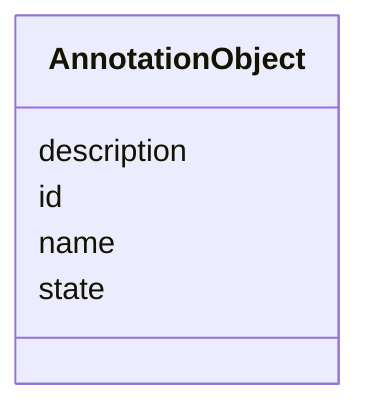

# Class: AnnotationObject


_Metadata describing the object being annotated._


URI: [cdp-meta:AnnotationObject](metadataAnnotationObject)





<!-- no inheritance hierarchy -->


## Slots

| Name | Cardinality and Range | Description | Inheritance |
| ---  | --- | --- | --- |
| [id](id.md) | 0..1 <br/> [String](String.md) |  | direct |
| [name](name.md) | 0..1 <br/> [String](String.md) |  | direct |
| [description](description.md) | 0..1 <br/> [String](String.md) | A textual description of the annotation object, can be a longer description t... | direct |
| [state](state.md) | 0..1 <br/> [String](String.md) | Molecule state annotated (e | direct |


## Usages

| used by | used in | type | used |
| ---  | --- | --- | --- |
| [Annotation](Annotation.md) | [annotation_object](annotation_object.md) | range | [AnnotationObject](AnnotationObject.md) |


## Identifier and Mapping Information


### Schema Source


* from schema: metadata


## Mappings

| Mapping Type | Mapped Value |
| ---  | ---  |
| self | cdp-meta:AnnotationObject |
| native | cdp-meta:AnnotationObject |


## LinkML Source

<!-- TODO: investigate https://stackoverflow.com/questions/37606292/how-to-create-tabbed-code-blocks-in-mkdocs-or-sphinx -->

### Direct

<details>
```yaml
name: AnnotationObject
description: Metadata describing the object being annotated.
from_schema: metadata
attributes:
  id:
    name: id
    from_schema: metadata
    exact_mappings:
    - cdp-common:annotation_object_id
    alias: id
    owner: AnnotationObject
    domain_of:
    - Tissue
    - CellType
    - CellStrain
    - CellComponent
    - AnnotationObject
    range: string
    inlined: true
    inlined_as_list: true
  name:
    name: name
    from_schema: metadata
    exact_mappings:
    - cdp-common:annotation_object_name
    alias: name
    owner: AnnotationObject
    domain_of:
    - Author
    - Annotator
    - Organism
    - Tissue
    - CellType
    - CellStrain
    - CellComponent
    - AnnotationObject
    range: string
    inlined: true
    inlined_as_list: true
  description:
    name: description
    description: A textual description of the annotation object, can be a longer description
      to include additional information not covered by the Annotation object name
      and state.
    from_schema: metadata
    exact_mappings:
    - cdp-common:annotation_object_description
    rank: 1000
    alias: description
    owner: AnnotationObject
    domain_of:
    - AnnotationObject
    range: string
    inlined: true
    inlined_as_list: true
  state:
    name: state
    description: Molecule state annotated (e.g. open, closed)
    from_schema: metadata
    exact_mappings:
    - cdp-common:annotation_object_state
    rank: 1000
    alias: state
    owner: AnnotationObject
    domain_of:
    - AnnotationObject
    range: string
    inlined: true
    inlined_as_list: true

```
</details>

### Induced

<details>
```yaml
name: AnnotationObject
description: Metadata describing the object being annotated.
from_schema: metadata
attributes:
  id:
    name: id
    from_schema: metadata
    exact_mappings:
    - cdp-common:annotation_object_id
    alias: id
    owner: AnnotationObject
    domain_of:
    - Tissue
    - CellType
    - CellStrain
    - CellComponent
    - AnnotationObject
    range: string
    inlined: true
    inlined_as_list: true
  name:
    name: name
    from_schema: metadata
    exact_mappings:
    - cdp-common:annotation_object_name
    alias: name
    owner: AnnotationObject
    domain_of:
    - Author
    - Annotator
    - Organism
    - Tissue
    - CellType
    - CellStrain
    - CellComponent
    - AnnotationObject
    range: string
    inlined: true
    inlined_as_list: true
  description:
    name: description
    description: A textual description of the annotation object, can be a longer description
      to include additional information not covered by the Annotation object name
      and state.
    from_schema: metadata
    exact_mappings:
    - cdp-common:annotation_object_description
    rank: 1000
    alias: description
    owner: AnnotationObject
    domain_of:
    - AnnotationObject
    range: string
    inlined: true
    inlined_as_list: true
  state:
    name: state
    description: Molecule state annotated (e.g. open, closed)
    from_schema: metadata
    exact_mappings:
    - cdp-common:annotation_object_state
    rank: 1000
    alias: state
    owner: AnnotationObject
    domain_of:
    - AnnotationObject
    range: string
    inlined: true
    inlined_as_list: true

```
</details>