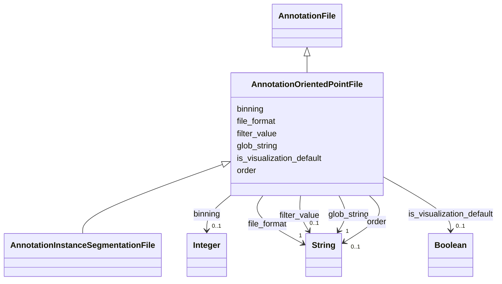

# Class: AnnotationOrientedPointFile


_File and sourcing data for an oriented point annotation._


URI: [cdp-meta:AnnotationOrientedPointFile](metadataAnnotationOrientedPointFile)





## Inheritance
* [AnnotationFile](AnnotationFile.md)
    * **AnnotationOrientedPointFile**
        * [AnnotationInstanceSegmentationFile](AnnotationInstanceSegmentationFile.md)


## Slots

| Name | Cardinality and Range | Description | Inheritance |
| ---  | --- | --- | --- |
| [binning](binning.md) | 0..1 <br/> [xsd:integer](http://www.w3.org/2001/XMLSchema#integer) | The binning factor for a oriented point annotation file | direct |
| [filter_value](filter_value.md) | 0..1 <br/> [xsd:string](http://www.w3.org/2001/XMLSchema#string) | The filter value for a oriented point annotation file | direct |
| [order](order.md) | 0..1 <br/> [xsd:string](http://www.w3.org/2001/XMLSchema#string) | The order of axes for a oriented point annotation file | direct |
| [file_format](file_format.md) | 1 <br/> [xsd:string](http://www.w3.org/2001/XMLSchema#string) |  | direct |
| [glob_string](glob_string.md) | 1 <br/> [xsd:string](http://www.w3.org/2001/XMLSchema#string) |  | direct |
| [is_visualization_default](is_visualization_default.md) | 0..1 <br/> [xsd:boolean](http://www.w3.org/2001/XMLSchema#boolean) |  | direct |


## Aliases


* OrientedPoint


## Identifier and Mapping Information


### Schema Source


* from schema: metadata


## Mappings

| Mapping Type | Mapped Value |
| ---  | ---  |
| self | cdp-meta:AnnotationOrientedPointFile |
| native | cdp-meta:AnnotationOrientedPointFile |


## LinkML Source

<!-- TODO: investigate https://stackoverflow.com/questions/37606292/how-to-create-tabbed-code-blocks-in-mkdocs-or-sphinx -->

### Direct

<details>
```yaml
name: AnnotationOrientedPointFile
description: File and sourcing data for an oriented point annotation.
from_schema: metadata
aliases:
- OrientedPoint
is_a: AnnotationFile
attributes:
  binning:
    name: binning
    description: The binning factor for a oriented point annotation file.
    from_schema: metadata
    exact_mappings:
    - cdp-common:annotation_file_oriented_point_binning
    rank: 1000
    alias: binning
    owner: AnnotationOrientedPointFile
    domain_of:
    - AnnotationOrientedPointFile
    - AnnotationPointFile
    - AnnotationInstanceSegmentationFile
    range: integer
    inlined: true
    inlined_as_list: true
  filter_value:
    name: filter_value
    description: The filter value for a oriented point annotation file.
    from_schema: metadata
    exact_mappings:
    - cdp-common:annotation_file_oriented_point_filter_value
    rank: 1000
    alias: filter_value
    owner: AnnotationOrientedPointFile
    domain_of:
    - AnnotationOrientedPointFile
    - AnnotationInstanceSegmentationFile
    range: string
    inlined: true
    inlined_as_list: true
  order:
    name: order
    description: The order of axes for a oriented point annotation file.
    from_schema: metadata
    exact_mappings:
    - cdp-common:annotation_file_oriented_point_order
    rank: 1000
    alias: order
    owner: AnnotationOrientedPointFile
    domain_of:
    - AnnotationOrientedPointFile
    - AnnotationInstanceSegmentationFile
    range: string
    inlined: true
    inlined_as_list: true
  file_format:
    name: file_format
    from_schema: metadata
    exact_mappings:
    - cdp-common:annotation_file_format
    alias: file_format
    owner: AnnotationOrientedPointFile
    domain_of:
    - AnnotationFile
    - AnnotationOrientedPointFile
    - AnnotationInstanceSegmentationFile
    - AnnotationPointFile
    - AnnotationSegmentationMaskFile
    - AnnotationSemanticSegmentationMaskFile
    range: string
    required: true
    inlined: true
    inlined_as_list: true
  glob_string:
    name: glob_string
    from_schema: metadata
    exact_mappings:
    - cdp-common:annotation_file_glob_string
    alias: glob_string
    owner: AnnotationOrientedPointFile
    domain_of:
    - AnnotationFile
    - AnnotationOrientedPointFile
    - AnnotationInstanceSegmentationFile
    - AnnotationPointFile
    - AnnotationSegmentationMaskFile
    - AnnotationSemanticSegmentationMaskFile
    range: string
    required: true
    inlined: true
    inlined_as_list: true
  is_visualization_default:
    name: is_visualization_default
    from_schema: metadata
    exact_mappings:
    - cdp-common:annotation_file_is_visualization_default
    alias: is_visualization_default
    owner: AnnotationOrientedPointFile
    domain_of:
    - AnnotationFile
    - AnnotationOrientedPointFile
    - AnnotationInstanceSegmentationFile
    - AnnotationPointFile
    - AnnotationSegmentationMaskFile
    - AnnotationSemanticSegmentationMaskFile
    range: boolean
    inlined: true
    inlined_as_list: true

```
</details>

### Induced

<details>
```yaml
name: AnnotationOrientedPointFile
description: File and sourcing data for an oriented point annotation.
from_schema: metadata
aliases:
- OrientedPoint
is_a: AnnotationFile
attributes:
  binning:
    name: binning
    description: The binning factor for a oriented point annotation file.
    from_schema: metadata
    exact_mappings:
    - cdp-common:annotation_file_oriented_point_binning
    rank: 1000
    alias: binning
    owner: AnnotationOrientedPointFile
    domain_of:
    - AnnotationOrientedPointFile
    - AnnotationPointFile
    - AnnotationInstanceSegmentationFile
    range: integer
    inlined: true
    inlined_as_list: true
  filter_value:
    name: filter_value
    description: The filter value for a oriented point annotation file.
    from_schema: metadata
    exact_mappings:
    - cdp-common:annotation_file_oriented_point_filter_value
    rank: 1000
    alias: filter_value
    owner: AnnotationOrientedPointFile
    domain_of:
    - AnnotationOrientedPointFile
    - AnnotationInstanceSegmentationFile
    range: string
    inlined: true
    inlined_as_list: true
  order:
    name: order
    description: The order of axes for a oriented point annotation file.
    from_schema: metadata
    exact_mappings:
    - cdp-common:annotation_file_oriented_point_order
    rank: 1000
    alias: order
    owner: AnnotationOrientedPointFile
    domain_of:
    - AnnotationOrientedPointFile
    - AnnotationInstanceSegmentationFile
    range: string
    inlined: true
    inlined_as_list: true
  file_format:
    name: file_format
    from_schema: metadata
    exact_mappings:
    - cdp-common:annotation_file_format
    alias: file_format
    owner: AnnotationOrientedPointFile
    domain_of:
    - AnnotationFile
    - AnnotationOrientedPointFile
    - AnnotationInstanceSegmentationFile
    - AnnotationPointFile
    - AnnotationSegmentationMaskFile
    - AnnotationSemanticSegmentationMaskFile
    range: string
    required: true
    inlined: true
    inlined_as_list: true
  glob_string:
    name: glob_string
    from_schema: metadata
    exact_mappings:
    - cdp-common:annotation_file_glob_string
    alias: glob_string
    owner: AnnotationOrientedPointFile
    domain_of:
    - AnnotationFile
    - AnnotationOrientedPointFile
    - AnnotationInstanceSegmentationFile
    - AnnotationPointFile
    - AnnotationSegmentationMaskFile
    - AnnotationSemanticSegmentationMaskFile
    range: string
    required: true
    inlined: true
    inlined_as_list: true
  is_visualization_default:
    name: is_visualization_default
    from_schema: metadata
    exact_mappings:
    - cdp-common:annotation_file_is_visualization_default
    alias: is_visualization_default
    owner: AnnotationOrientedPointFile
    domain_of:
    - AnnotationFile
    - AnnotationOrientedPointFile
    - AnnotationInstanceSegmentationFile
    - AnnotationPointFile
    - AnnotationSegmentationMaskFile
    - AnnotationSemanticSegmentationMaskFile
    range: boolean
    inlined: true
    inlined_as_list: true

```
</details>