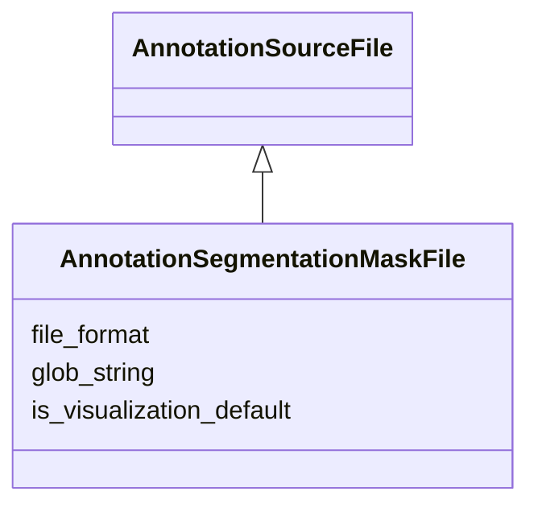

# Class: AnnotationSegmentationMaskFile


_File and sourcing data for a segmentation mask annotation._


URI: [cdp-meta:AnnotationSegmentationMaskFile](metadataAnnotationSegmentationMaskFile)





## Inheritance
* [AnnotationSourceFile](AnnotationSourceFile.md)
    * **AnnotationSegmentationMaskFile**


## Slots

| Name | Cardinality and Range | Description | Inheritance |
| ---  | --- | --- | --- |
| [file_format](file_format.md) | 1 <br/> [String](String.md) |  | direct |
| [glob_string](glob_string.md) | 1 <br/> [String](String.md) |  | direct |
| [is_visualization_default](is_visualization_default.md) | 0..1 <br/> [Boolean](Boolean.md) |  | direct |


## Aliases


* SegmentationMask


## Identifier and Mapping Information


### Schema Source


* from schema: metadata


## Mappings

| Mapping Type | Mapped Value |
| ---  | ---  |
| self | cdp-meta:AnnotationSegmentationMaskFile |
| native | cdp-meta:AnnotationSegmentationMaskFile |


## LinkML Source

<!-- TODO: investigate https://stackoverflow.com/questions/37606292/how-to-create-tabbed-code-blocks-in-mkdocs-or-sphinx -->

### Direct

<details>
```yaml
name: AnnotationSegmentationMaskFile
description: File and sourcing data for a segmentation mask annotation.
from_schema: metadata
aliases:
- SegmentationMask
is_a: AnnotationSourceFile
attributes:
  file_format:
    name: file_format
    from_schema: metadata
    exact_mappings:
    - cdp-common:annotation_source_file_format
    alias: file_format
    owner: AnnotationSegmentationMaskFile
    domain_of:
    - AnnotationSourceFile
    - AnnotationOrientedPointFile
    - AnnotationInstanceSegmentationFile
    - AnnotationPointFile
    - AnnotationSegmentationMaskFile
    - AnnotationSemanticSegmentationMaskFile
    range: string
    required: true
    inlined: true
    inlined_as_list: true
  glob_string:
    name: glob_string
    from_schema: metadata
    exact_mappings:
    - cdp-common:annotation_source_file_glob_string
    alias: glob_string
    owner: AnnotationSegmentationMaskFile
    domain_of:
    - AnnotationSourceFile
    - AnnotationOrientedPointFile
    - AnnotationInstanceSegmentationFile
    - AnnotationPointFile
    - AnnotationSegmentationMaskFile
    - AnnotationSemanticSegmentationMaskFile
    range: string
    required: true
    inlined: true
    inlined_as_list: true
  is_visualization_default:
    name: is_visualization_default
    from_schema: metadata
    exact_mappings:
    - cdp-common:annotation_source_file_is_visualization_default
    alias: is_visualization_default
    owner: AnnotationSegmentationMaskFile
    domain_of:
    - AnnotationSourceFile
    - AnnotationOrientedPointFile
    - AnnotationInstanceSegmentationFile
    - AnnotationPointFile
    - AnnotationSegmentationMaskFile
    - AnnotationSemanticSegmentationMaskFile
    range: boolean
    inlined: true
    inlined_as_list: true

```
</details>

### Induced

<details>
```yaml
name: AnnotationSegmentationMaskFile
description: File and sourcing data for a segmentation mask annotation.
from_schema: metadata
aliases:
- SegmentationMask
is_a: AnnotationSourceFile
attributes:
  file_format:
    name: file_format
    from_schema: metadata
    exact_mappings:
    - cdp-common:annotation_source_file_format
    alias: file_format
    owner: AnnotationSegmentationMaskFile
    domain_of:
    - AnnotationSourceFile
    - AnnotationOrientedPointFile
    - AnnotationInstanceSegmentationFile
    - AnnotationPointFile
    - AnnotationSegmentationMaskFile
    - AnnotationSemanticSegmentationMaskFile
    range: string
    required: true
    inlined: true
    inlined_as_list: true
  glob_string:
    name: glob_string
    from_schema: metadata
    exact_mappings:
    - cdp-common:annotation_source_file_glob_string
    alias: glob_string
    owner: AnnotationSegmentationMaskFile
    domain_of:
    - AnnotationSourceFile
    - AnnotationOrientedPointFile
    - AnnotationInstanceSegmentationFile
    - AnnotationPointFile
    - AnnotationSegmentationMaskFile
    - AnnotationSemanticSegmentationMaskFile
    range: string
    required: true
    inlined: true
    inlined_as_list: true
  is_visualization_default:
    name: is_visualization_default
    from_schema: metadata
    exact_mappings:
    - cdp-common:annotation_source_file_is_visualization_default
    alias: is_visualization_default
    owner: AnnotationSegmentationMaskFile
    domain_of:
    - AnnotationSourceFile
    - AnnotationOrientedPointFile
    - AnnotationInstanceSegmentationFile
    - AnnotationPointFile
    - AnnotationSegmentationMaskFile
    - AnnotationSemanticSegmentationMaskFile
    range: boolean
    inlined: true
    inlined_as_list: true

```
</details>