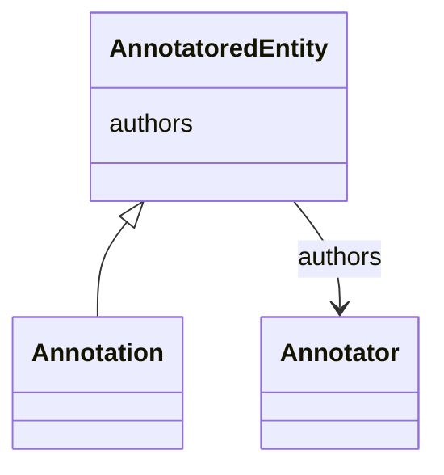

# Class: AnnotatoredEntity


_An entity with associated annotation authors._


* __NOTE__: this is an abstract class and should not be instantiated directly


URI: [cdp-meta:AnnotatoredEntity](https://cryoetdataportal.czscience.com/schema/metadata/AnnotatoredEntity)





<!-- no inheritance hierarchy -->


## Slots

| Name | Cardinality and Range | Description | Inheritance |
| ---  | --- | --- | --- |
| [authors](authors.md) | 1..* <br/> [Annotator](Annotator.md) | Annotator of a scientific data entity | direct |


## Identifier and Mapping Information


### Schema Source


* from schema: https://cryoetdataportal.czscience.com/schema-docs/metadata


## Mappings

| Mapping Type | Mapped Value |
| ---  | ---  |
| self | cdp-meta:AnnotatoredEntity |
| native | cdp-meta:AnnotatoredEntity |


## LinkML Source

<!-- TODO: investigate https://stackoverflow.com/questions/37606292/how-to-create-tabbed-code-blocks-in-mkdocs-or-sphinx -->

### Direct

<details>
```yaml
name: AnnotatoredEntity
description: An entity with associated annotation authors.
from_schema: https://cryoetdataportal.czscience.com/schema-docs/metadata
abstract: true
attributes:
  authors:
    name: authors
    description: Annotator of a scientific data entity.
    from_schema: https://cryoetdataportal.czscience.com/schema-docs/metadata
    multivalued: true
    list_elements_ordered: true
    alias: authors
    owner: AnnotatoredEntity
    domain_of:
    - AuthoredEntity
    - AnnotatoredEntity
    - Dataset
    - Tomogram
    - Annotation
    range: Annotator
    required: true
    inlined: true
    inlined_as_list: true

```
</details>

### Induced

<details>
```yaml
name: AnnotatoredEntity
description: An entity with associated annotation authors.
from_schema: https://cryoetdataportal.czscience.com/schema-docs/metadata
abstract: true
attributes:
  authors:
    name: authors
    description: Annotator of a scientific data entity.
    from_schema: https://cryoetdataportal.czscience.com/schema-docs/metadata
    multivalued: true
    list_elements_ordered: true
    alias: authors
    owner: AnnotatoredEntity
    domain_of:
    - AuthoredEntity
    - AnnotatoredEntity
    - Dataset
    - Tomogram
    - Annotation
    range: Annotator
    required: true
    inlined: true
    inlined_as_list: true

```
</details>