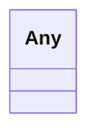

# Class: Any


URI: [linkml:Any](https://w3id.org/linkml/Any)





<!-- no inheritance hierarchy -->


## Slots

| Name | Cardinality and Range | Description | Inheritance |
| ---  | --- | --- | --- |


## Usages

| used by | used in | type | used |
| ---  | --- | --- | --- |
| [CellStrain](CellStrain.md) | [id](id.md) | range | [Any](Any.md) |
| [CameraDetails](CameraDetails.md) | [acquire_mode](acquire_mode.md) | range | [Any](Any.md) |
| [MicroscopeDetails](MicroscopeDetails.md) | [manufacturer](manufacturer.md) | range | [Any](Any.md) |
| [TiltRange](TiltRange.md) | [min](min.md) | range | [Any](Any.md) |
| [TiltRange](TiltRange.md) | [max](max.md) | range | [Any](Any.md) |
| [TiltSeries](TiltSeries.md) | [aligned_tiltseries_binning](aligned_tiltseries_binning.md) | range | [Any](Any.md) |
| [TiltSeries](TiltSeries.md) | [binning_from_frames](binning_from_frames.md) | range | [Any](Any.md) |
| [TiltSeries](TiltSeries.md) | [spherical_aberration_constant](spherical_aberration_constant.md) | range | [Any](Any.md) |
| [TiltSeries](TiltSeries.md) | [tilt_axis](tilt_axis.md) | range | [Any](Any.md) |
| [TiltSeries](TiltSeries.md) | [tilt_series_quality](tilt_series_quality.md) | range | [Any](Any.md) |
| [TiltSeries](TiltSeries.md) | [tilt_step](tilt_step.md) | range | [Any](Any.md) |
| [TiltSeries](TiltSeries.md) | [total_flux](total_flux.md) | range | [Any](Any.md) |
| [TiltSeries](TiltSeries.md) | [pixel_spacing](pixel_spacing.md) | range | [Any](Any.md) |
| [Tomogram](Tomogram.md) | [voxel_spacing](voxel_spacing.md) | range | [Any](Any.md) |
| [Tomogram](Tomogram.md) | [fiducial_alignment_status](fiducial_alignment_status.md) | range | [Any](Any.md) |
| [Tomogram](Tomogram.md) | [reconstruction_method](reconstruction_method.md) | range | [Any](Any.md) |


## Identifier and Mapping Information


### Schema Source


* from schema: metadata


## Mappings

| Mapping Type | Mapped Value |
| ---  | ---  |
| self | linkml:Any |
| native | cdp-meta:Any |


## LinkML Source

<!-- TODO: investigate https://stackoverflow.com/questions/37606292/how-to-create-tabbed-code-blocks-in-mkdocs-or-sphinx -->

### Direct

<details>
```yaml
name: Any
from_schema: metadata
class_uri: linkml:Any

```
</details>

### Induced

<details>
```yaml
name: Any
from_schema: metadata
class_uri: linkml:Any

```
</details>
