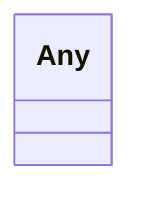

# Class: Any


_A placeholder for any type of data._


URI: [linkml:Any](https://w3id.org/linkml/Any)





<!-- no inheritance hierarchy -->


## Slots

| Name | Cardinality and Range | Description | Inheritance |
| ---  | --- | --- | --- |


## Usages

| used by | used in | type | used |
| ---  | --- | --- | --- |
| [PicturePath](PicturePath.md) | [snapshot](snapshot.md) | range | [Any](Any.md) |
| [PicturePath](PicturePath.md) | [thumbnail](thumbnail.md) | range | [Any](Any.md) |
| [Tomogram](Tomogram.md) | [affine_transformation_matrix](affine_transformation_matrix.md) | range | [Any](Any.md) |


## Identifier and Mapping Information


### Schema Source


* from schema: metadata


## Mappings

| Mapping Type | Mapped Value |
| ---  | ---  |
| self | linkml:Any |
| native | cdp-meta:Any |


## LinkML Source

<!-- TODO: investigate https://stackoverflow.com/questions/37606292/how-to-create-tabbed-code-blocks-in-mkdocs-or-sphinx -->

### Direct

<details>
```yaml
name: Any
description: A placeholder for any type of data.
from_schema: metadata
class_uri: linkml:Any

```
</details>

### Induced

<details>
```yaml
name: Any
description: A placeholder for any type of data.
from_schema: metadata
class_uri: linkml:Any

```
</details>
