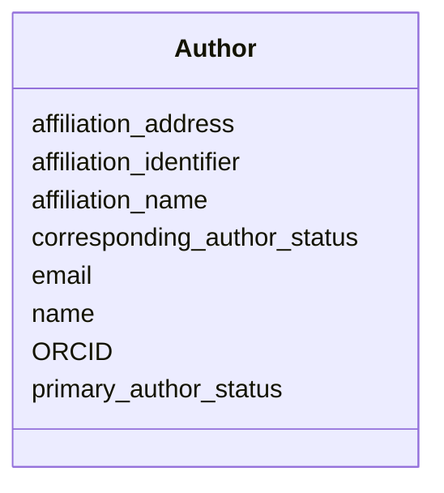

# Class: Author


_Author of a scientific data entity._


URI: [cdp-meta:Author](metadataAuthor)





<!-- no inheritance hierarchy -->


## Slots

| Name | Cardinality and Range | Description | Inheritance |
| ---  | --- | --- | --- |
| [name](name.md) | 1 <br/> [String](String.md) | The full name of the author | direct |
| [email](email.md) | 0..1 <br/> [String](String.md) | The email address of the author | direct |
| [affiliation_name](affiliation_name.md) | 0..1 <br/> [String](String.md) | The name of the author's affiliation | direct |
| [affiliation_address](affiliation_address.md) | 0..1 <br/> [String](String.md) | The address of the author's affiliation | direct |
| [affiliation_identifier](affiliation_identifier.md) | 0..1 _recommended_ <br/> [String](String.md) | A Research Organization Registry (ROR) identifier | direct |
| [corresponding_author_status](corresponding_author_status.md) | 0..1 <br/> [Boolean](Boolean.md) | Whether the author is a corresponding author | direct |
| [primary_author_status](primary_author_status.md) | 0..1 <br/> [Boolean](Boolean.md) | Whether the author is a primary author | direct |
| [ORCID](ORCID.md) | 0..1 _recommended_ <br/> [String](String.md) | A unique, persistent identifier for researchers, provided by ORCID | direct |


## Usages

| used by | used in | type | used |
| ---  | --- | --- | --- |
| [AuthoredEntity](AuthoredEntity.md) | [authors](authors.md) | range | [Author](Author.md) |
| [Dataset](Dataset.md) | [authors](authors.md) | range | [Author](Author.md) |
| [Tomogram](Tomogram.md) | [authors](authors.md) | range | [Author](Author.md) |
| [Annotation](Annotation.md) | [authors](authors.md) | range | [Author](Author.md) |


## Identifier and Mapping Information


### Schema Source


* from schema: metadata


## Mappings

| Mapping Type | Mapped Value |
| ---  | ---  |
| self | cdp-meta:Author |
| native | cdp-meta:Author |


## LinkML Source

<!-- TODO: investigate https://stackoverflow.com/questions/37606292/how-to-create-tabbed-code-blocks-in-mkdocs-or-sphinx -->

### Direct

<details>
```yaml
name: Author
description: Author of a scientific data entity.
from_schema: metadata
attributes:
  name:
    name: name
    description: The full name of the author.
    from_schema: metadata
    exact_mappings:
    - cdp-common:author_name
    rank: 1000
    alias: name
    owner: Author
    domain_of:
    - Author
    - Organism
    - Tissue
    - CellType
    - CellStrain
    - CellComponent
    - AnnotationObject
    range: string
    required: true
    inlined: true
    inlined_as_list: true
  email:
    name: email
    description: The email address of the author.
    from_schema: metadata
    exact_mappings:
    - cdp-common:author_email
    rank: 1000
    alias: email
    owner: Author
    domain_of:
    - Author
    range: string
    inlined: true
    inlined_as_list: true
  affiliation_name:
    name: affiliation_name
    description: The name of the author's affiliation.
    from_schema: metadata
    exact_mappings:
    - cdp-common:author_affiliation_name
    rank: 1000
    alias: affiliation_name
    owner: Author
    domain_of:
    - Author
    range: string
    inlined: true
    inlined_as_list: true
  affiliation_address:
    name: affiliation_address
    description: The address of the author's affiliation.
    from_schema: metadata
    exact_mappings:
    - cdp-common:author_affiliation_address
    rank: 1000
    alias: affiliation_address
    owner: Author
    domain_of:
    - Author
    range: string
    inlined: true
    inlined_as_list: true
  affiliation_identifier:
    name: affiliation_identifier
    description: A Research Organization Registry (ROR) identifier.
    from_schema: metadata
    exact_mappings:
    - cdp-common:affiliation_identifier
    rank: 1000
    alias: affiliation_identifier
    owner: Author
    domain_of:
    - Author
    range: string
    recommended: true
    inlined: true
    inlined_as_list: true
    pattern: ^0[a-hj-km-np-tv-z|0-9]{6}[0-9]{2}$
  corresponding_author_status:
    name: corresponding_author_status
    description: Whether the author is a corresponding author.
    from_schema: metadata
    exact_mappings:
    - cdp-common:author_corresponding_author_status
    rank: 1000
    ifabsent: 'False'
    alias: corresponding_author_status
    owner: Author
    domain_of:
    - Author
    range: boolean
    inlined: true
    inlined_as_list: true
  primary_author_status:
    name: primary_author_status
    description: Whether the author is a primary author.
    from_schema: metadata
    exact_mappings:
    - cdp-common:author_primary_author_status
    rank: 1000
    ifabsent: 'False'
    alias: primary_author_status
    owner: Author
    domain_of:
    - Author
    range: boolean
    inlined: true
    inlined_as_list: true
  ORCID:
    name: ORCID
    description: A unique, persistent identifier for researchers, provided by ORCID.
    from_schema: metadata
    exact_mappings:
    - cdp-common:orcid
    rank: 1000
    alias: ORCID
    owner: Author
    domain_of:
    - Author
    range: string
    recommended: true
    inlined: true
    inlined_as_list: true
    pattern: '[0-9]{4}-[0-9]{4}-[0-9]{4}-[0-9]{3}[0-9X]$'

```
</details>

### Induced

<details>
```yaml
name: Author
description: Author of a scientific data entity.
from_schema: metadata
attributes:
  name:
    name: name
    description: The full name of the author.
    from_schema: metadata
    exact_mappings:
    - cdp-common:author_name
    rank: 1000
    alias: name
    owner: Author
    domain_of:
    - Author
    - Organism
    - Tissue
    - CellType
    - CellStrain
    - CellComponent
    - AnnotationObject
    range: string
    required: true
    inlined: true
    inlined_as_list: true
  email:
    name: email
    description: The email address of the author.
    from_schema: metadata
    exact_mappings:
    - cdp-common:author_email
    rank: 1000
    alias: email
    owner: Author
    domain_of:
    - Author
    range: string
    inlined: true
    inlined_as_list: true
  affiliation_name:
    name: affiliation_name
    description: The name of the author's affiliation.
    from_schema: metadata
    exact_mappings:
    - cdp-common:author_affiliation_name
    rank: 1000
    alias: affiliation_name
    owner: Author
    domain_of:
    - Author
    range: string
    inlined: true
    inlined_as_list: true
  affiliation_address:
    name: affiliation_address
    description: The address of the author's affiliation.
    from_schema: metadata
    exact_mappings:
    - cdp-common:author_affiliation_address
    rank: 1000
    alias: affiliation_address
    owner: Author
    domain_of:
    - Author
    range: string
    inlined: true
    inlined_as_list: true
  affiliation_identifier:
    name: affiliation_identifier
    description: A Research Organization Registry (ROR) identifier.
    from_schema: metadata
    exact_mappings:
    - cdp-common:affiliation_identifier
    rank: 1000
    alias: affiliation_identifier
    owner: Author
    domain_of:
    - Author
    range: string
    recommended: true
    inlined: true
    inlined_as_list: true
    pattern: ^0[a-hj-km-np-tv-z|0-9]{6}[0-9]{2}$
  corresponding_author_status:
    name: corresponding_author_status
    description: Whether the author is a corresponding author.
    from_schema: metadata
    exact_mappings:
    - cdp-common:author_corresponding_author_status
    rank: 1000
    ifabsent: 'False'
    alias: corresponding_author_status
    owner: Author
    domain_of:
    - Author
    range: boolean
    inlined: true
    inlined_as_list: true
  primary_author_status:
    name: primary_author_status
    description: Whether the author is a primary author.
    from_schema: metadata
    exact_mappings:
    - cdp-common:author_primary_author_status
    rank: 1000
    ifabsent: 'False'
    alias: primary_author_status
    owner: Author
    domain_of:
    - Author
    range: boolean
    inlined: true
    inlined_as_list: true
  ORCID:
    name: ORCID
    description: A unique, persistent identifier for researchers, provided by ORCID.
    from_schema: metadata
    exact_mappings:
    - cdp-common:orcid
    rank: 1000
    alias: ORCID
    owner: Author
    domain_of:
    - Author
    range: string
    recommended: true
    inlined: true
    inlined_as_list: true
    pattern: '[0-9]{4}-[0-9]{4}-[0-9]{4}-[0-9]{3}[0-9X]$'

```
</details>
