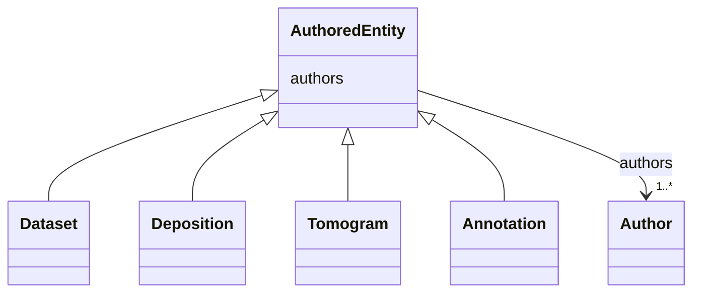

# Class: AuthoredEntity


_An entity with associated authors._


* __NOTE__: this is an abstract class and should not be instantiated directly


URI: [cdp-meta:AuthoredEntity](metadataAuthoredEntity)





<!-- no inheritance hierarchy -->


## Slots

| Name | Cardinality and Range | Description | Inheritance |
| ---  | --- | --- | --- |
| [authors](authors.md) | 1..* <br/> [Author](Author.md) | Author of a scientific data entity | direct |


## Identifier and Mapping Information


### Schema Source


* from schema: metadata


## Mappings

| Mapping Type | Mapped Value |
| ---  | ---  |
| self | cdp-meta:AuthoredEntity |
| native | cdp-meta:AuthoredEntity |


## LinkML Source

<!-- TODO: investigate https://stackoverflow.com/questions/37606292/how-to-create-tabbed-code-blocks-in-mkdocs-or-sphinx -->

### Direct

<details>
```yaml
name: AuthoredEntity
description: An entity with associated authors.
from_schema: metadata
abstract: true
attributes:
  authors:
    name: authors
    description: Author of a scientific data entity.
    from_schema: metadata
    rank: 1000
    list_elements_ordered: true
    alias: authors
    owner: AuthoredEntity
    domain_of:
    - AuthoredEntity
    - Dataset
    - Deposition
    - Tomogram
    - Annotation
    range: Author
    required: true
    multivalued: true
    inlined: true
    inlined_as_list: true
    minimum_cardinality: 1

```
</details>

### Induced

<details>
```yaml
name: AuthoredEntity
description: An entity with associated authors.
from_schema: metadata
abstract: true
attributes:
  authors:
    name: authors
    description: Author of a scientific data entity.
    from_schema: metadata
    rank: 1000
    list_elements_ordered: true
    alias: authors
    owner: AuthoredEntity
    domain_of:
    - AuthoredEntity
    - Dataset
    - Deposition
    - Tomogram
    - Annotation
    range: Author
    required: true
    multivalued: true
    inlined: true
    inlined_as_list: true
    minimum_cardinality: 1

```
</details>
