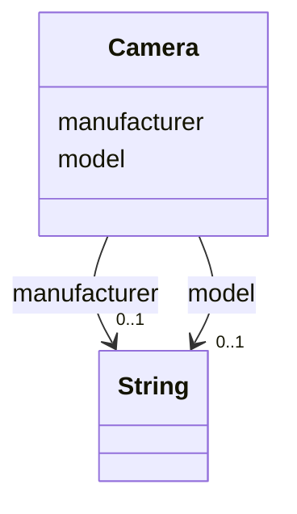

# Class: Camera


_The camera used to collect the tilt series._


URI: [cdp-meta:Camera](metadataCamera)





<!-- no inheritance hierarchy -->


## Slots

| Name | Cardinality and Range | Description | Inheritance |
| ---  | --- | --- | --- |
| [manufacturer](manufacturer.md) | 0..1 <br/> [xsd:string](http://www.w3.org/2001/XMLSchema#string) | Name of the camera manufacturer | direct |
| [model](model.md) | 0..1 <br/> [xsd:string](http://www.w3.org/2001/XMLSchema#string) | Camera model name | direct |


## Usages

| used by | used in | type | used |
| ---  | --- | --- | --- |
| [TiltSeries](TiltSeries.md) | [camera](camera.md) | range | [Camera](Camera.md) |


## Identifier and Mapping Information


### Schema Source


* from schema: metadata


## Mappings

| Mapping Type | Mapped Value |
| ---  | ---  |
| self | cdp-meta:Camera |
| native | cdp-meta:Camera |


## LinkML Source

<!-- TODO: investigate https://stackoverflow.com/questions/37606292/how-to-create-tabbed-code-blocks-in-mkdocs-or-sphinx -->

### Direct

<details>
```yaml
name: Camera
description: The camera used to collect the tilt series.
from_schema: metadata
attributes:
  manufacturer:
    name: manufacturer
    description: Name of the camera manufacturer
    from_schema: metadata
    exact_mappings:
    - cdp-common:tiltseries_camera_manufacturer
    rank: 1000
    alias: manufacturer
    owner: Camera
    domain_of:
    - Camera
    - Microscope
    range: string
    inlined: true
    inlined_as_list: true
  model:
    name: model
    description: Camera model name
    from_schema: metadata
    exact_mappings:
    - cdp-common:tiltseries_camera_model
    rank: 1000
    alias: model
    owner: Camera
    domain_of:
    - Camera
    - Microscope
    range: string
    inlined: true
    inlined_as_list: true

```
</details>

### Induced

<details>
```yaml
name: Camera
description: The camera used to collect the tilt series.
from_schema: metadata
attributes:
  manufacturer:
    name: manufacturer
    description: Name of the camera manufacturer
    from_schema: metadata
    exact_mappings:
    - cdp-common:tiltseries_camera_manufacturer
    rank: 1000
    alias: manufacturer
    owner: Camera
    domain_of:
    - Camera
    - Microscope
    range: string
    inlined: true
    inlined_as_list: true
  model:
    name: model
    description: Camera model name
    from_schema: metadata
    exact_mappings:
    - cdp-common:tiltseries_camera_model
    rank: 1000
    alias: model
    owner: Camera
    domain_of:
    - Camera
    - Microscope
    range: string
    inlined: true
    inlined_as_list: true

```
</details>