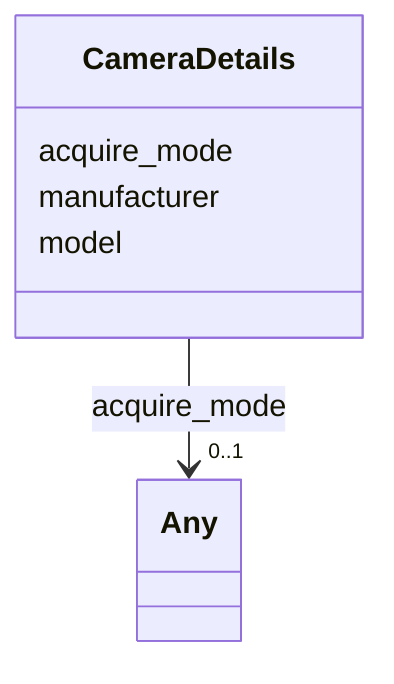

# Class: CameraDetails


_The camera used to collect the tilt series._


URI: [cdp-meta:CameraDetails](metadataCameraDetails)





<!-- no inheritance hierarchy -->


## Slots

| Name | Cardinality and Range | Description | Inheritance |
| ---  | --- | --- | --- |
| [acquire_mode](acquire_mode.md) | 0..1 <br/> [Any](Any.md)&nbsp;or&nbsp;<br />[StringFormattedString](StringFormattedString.md)&nbsp;or&nbsp;<br />[TiltseriesCameraAcquireModeEnum](TiltseriesCameraAcquireModeEnum.md) | Camera acquisition mode | direct |
| [manufacturer](manufacturer.md) | 1 <br/> [String](String.md) | Name of the camera manufacturer | direct |
| [model](model.md) | 1 <br/> [String](String.md) | Camera model name | direct |


## Usages

| used by | used in | type | used |
| ---  | --- | --- | --- |
| [TiltSeries](TiltSeries.md) | [camera](camera.md) | range | [CameraDetails](CameraDetails.md) |


## Identifier and Mapping Information


### Schema Source


* from schema: metadata


## Mappings

| Mapping Type | Mapped Value |
| ---  | ---  |
| self | cdp-meta:CameraDetails |
| native | cdp-meta:CameraDetails |


## LinkML Source

<!-- TODO: investigate https://stackoverflow.com/questions/37606292/how-to-create-tabbed-code-blocks-in-mkdocs-or-sphinx -->

### Direct

<details>
```yaml
name: CameraDetails
description: The camera used to collect the tilt series.
from_schema: metadata
attributes:
  acquire_mode:
    name: acquire_mode
    description: Camera acquisition mode
    from_schema: metadata
    exact_mappings:
    - cdp-common:tiltseries_camera_acquire_mode
    rank: 1000
    alias: acquire_mode
    owner: CameraDetails
    domain_of:
    - CameraDetails
    inlined: true
    inlined_as_list: true
    pattern: (^[ ]*\{[a-zA-Z0-9_-]+\}[ ]*$)|(^counting$)|(^superresolution$)|(^linear$)|(^cds$)
    any_of:
    - range: StringFormattedString
    - range: tiltseries_camera_acquire_mode_enum
  manufacturer:
    name: manufacturer
    description: Name of the camera manufacturer
    from_schema: metadata
    exact_mappings:
    - cdp-common:tiltseries_camera_manufacturer
    rank: 1000
    alias: manufacturer
    owner: CameraDetails
    domain_of:
    - CameraDetails
    - MicroscopeDetails
    range: string
    required: true
    inlined: true
    inlined_as_list: true
  model:
    name: model
    description: Camera model name
    from_schema: metadata
    exact_mappings:
    - cdp-common:tiltseries_camera_model
    rank: 1000
    alias: model
    owner: CameraDetails
    domain_of:
    - CameraDetails
    - MicroscopeDetails
    range: string
    required: true
    inlined: true
    inlined_as_list: true

```
</details>

### Induced

<details>
```yaml
name: CameraDetails
description: The camera used to collect the tilt series.
from_schema: metadata
attributes:
  acquire_mode:
    name: acquire_mode
    description: Camera acquisition mode
    from_schema: metadata
    exact_mappings:
    - cdp-common:tiltseries_camera_acquire_mode
    rank: 1000
    alias: acquire_mode
    owner: CameraDetails
    domain_of:
    - CameraDetails
    range: Any
    inlined: true
    inlined_as_list: true
    pattern: (^[ ]*\{[a-zA-Z0-9_-]+\}[ ]*$)|(^counting$)|(^superresolution$)|(^linear$)|(^cds$)
    any_of:
    - range: StringFormattedString
    - range: tiltseries_camera_acquire_mode_enum
  manufacturer:
    name: manufacturer
    description: Name of the camera manufacturer
    from_schema: metadata
    exact_mappings:
    - cdp-common:tiltseries_camera_manufacturer
    rank: 1000
    alias: manufacturer
    owner: CameraDetails
    domain_of:
    - CameraDetails
    - MicroscopeDetails
    range: string
    required: true
    inlined: true
    inlined_as_list: true
  model:
    name: model
    description: Camera model name
    from_schema: metadata
    exact_mappings:
    - cdp-common:tiltseries_camera_model
    rank: 1000
    alias: model
    owner: CameraDetails
    domain_of:
    - CameraDetails
    - MicroscopeDetails
    range: string
    required: true
    inlined: true
    inlined_as_list: true

```
</details>
