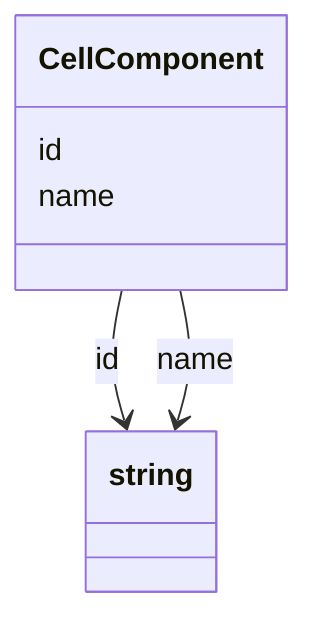

# Class: CellComponent


_The cellular component from which the sample was derived._


URI: [cdp-meta:CellComponent](metadataCellComponent)





<!-- no inheritance hierarchy -->


## Slots

| Name | Cardinality and Range | Description | Inheritance |
| ---  | --- | --- | --- |
| [name](name.md) | 0..1 <br/> [xsd:string](http://www.w3.org/2001/XMLSchema#string) |  | direct |
| [id](id.md) | 0..1 <br/> [xsd:string](http://www.w3.org/2001/XMLSchema#string) |  | direct |


## Usages

| used by | used in | type | used |
| ---  | --- | --- | --- |
| [ExperimentalMetadata](ExperimentalMetadata.md) | [cell_component](cell_component.md) | range | [CellComponent](CellComponent.md) |
| [Dataset](Dataset.md) | [cell_component](cell_component.md) | range | [CellComponent](CellComponent.md) |


## Identifier and Mapping Information


### Schema Source


* from schema: metadata


## Mappings

| Mapping Type | Mapped Value |
| ---  | ---  |
| self | cdp-meta:CellComponent |
| native | cdp-meta:CellComponent |


## LinkML Source

<!-- TODO: investigate https://stackoverflow.com/questions/37606292/how-to-create-tabbed-code-blocks-in-mkdocs-or-sphinx -->

### Direct

<details>
```yaml
name: CellComponent
description: The cellular component from which the sample was derived.
from_schema: metadata
attributes:
  name:
    name: name
    from_schema: metadata
    exact_mappings:
    - cdp-common:cell_component_name
    alias: name
    owner: CellComponent
    domain_of:
    - Author
    - Annotator
    - Organism
    - Tissue
    - CellType
    - CellStrain
    - CellComponent
    - AnnotationObject
    range: string
    inlined: true
    inlined_as_list: true
  id:
    name: id
    from_schema: metadata
    exact_mappings:
    - cdp-common:cell_component_id
    alias: id
    owner: CellComponent
    domain_of:
    - Tissue
    - CellType
    - CellStrain
    - CellComponent
    - AnnotationObject
    range: string
    inlined: true
    inlined_as_list: true

```
</details>

### Induced

<details>
```yaml
name: CellComponent
description: The cellular component from which the sample was derived.
from_schema: metadata
attributes:
  name:
    name: name
    from_schema: metadata
    exact_mappings:
    - cdp-common:cell_component_name
    alias: name
    owner: CellComponent
    domain_of:
    - Author
    - Annotator
    - Organism
    - Tissue
    - CellType
    - CellStrain
    - CellComponent
    - AnnotationObject
    range: string
    inlined: true
    inlined_as_list: true
  id:
    name: id
    from_schema: metadata
    exact_mappings:
    - cdp-common:cell_component_id
    alias: id
    owner: CellComponent
    domain_of:
    - Tissue
    - CellType
    - CellStrain
    - CellComponent
    - AnnotationObject
    range: string
    inlined: true
    inlined_as_list: true

```
</details>
