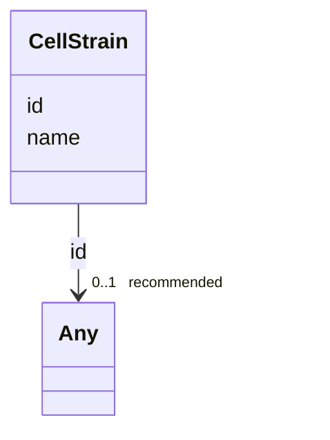

# Class: CellStrain


_The strain or cell line from which the sample was derived._


URI: [cdp-meta:CellStrain](metadataCellStrain)





<!-- no inheritance hierarchy -->


## Slots

| Name | Cardinality and Range | Description | Inheritance |
| ---  | --- | --- | --- |
| [name](name.md) | 1 <br/> [String](String.md) | Cell line or strain for the sample | direct |
| [id](id.md) | 0..1 _recommended_ <br/> [Any](Any.md)&nbsp;or&nbsp;<br />[WORMBASEID](WORMBASEID.md)&nbsp;or&nbsp;<br />[ONTOLOGYID](ONTOLOGYID.md) | Link to more information about the cell strain | direct |


## Usages

| used by | used in | type | used |
| ---  | --- | --- | --- |
| [ExperimentMetadata](ExperimentMetadata.md) | [cell_strain](cell_strain.md) | range | [CellStrain](CellStrain.md) |
| [Dataset](Dataset.md) | [cell_strain](cell_strain.md) | range | [CellStrain](CellStrain.md) |


## Identifier and Mapping Information


### Schema Source


* from schema: metadata


## Mappings

| Mapping Type | Mapped Value |
| ---  | ---  |
| self | cdp-meta:CellStrain |
| native | cdp-meta:CellStrain |


## LinkML Source

<!-- TODO: investigate https://stackoverflow.com/questions/37606292/how-to-create-tabbed-code-blocks-in-mkdocs-or-sphinx -->

### Direct

<details>
```yaml
name: CellStrain
description: The strain or cell line from which the sample was derived.
from_schema: metadata
attributes:
  name:
    name: name
    description: Cell line or strain for the sample.
    from_schema: metadata
    exact_mappings:
    - cdp-common:cell_strain_name
    alias: name
    owner: CellStrain
    domain_of:
    - OrganismDetails
    - TissueDetails
    - CellType
    - CellStrain
    - CellComponent
    - AnnotationObject
    - AuthorMixin
    - AnnotationMethodLinks
    - Author
    range: string
    required: true
    inlined: true
    inlined_as_list: true
  id:
    name: id
    description: Link to more information about the cell strain.
    from_schema: metadata
    exact_mappings:
    - cdp-common:cell_strain_id
    alias: id
    owner: CellStrain
    domain_of:
    - TissueDetails
    - CellType
    - CellStrain
    - CellComponent
    - AnnotationObject
    recommended: true
    inlined: true
    inlined_as_list: true
    pattern: (WBStrain[0-9]{8}$)|(^[a-zA-Z]+:[0-9]+$)
    any_of:
    - range: WORMBASE_ID
    - range: ONTOLOGY_ID

```
</details>

### Induced

<details>
```yaml
name: CellStrain
description: The strain or cell line from which the sample was derived.
from_schema: metadata
attributes:
  name:
    name: name
    description: Cell line or strain for the sample.
    from_schema: metadata
    exact_mappings:
    - cdp-common:cell_strain_name
    alias: name
    owner: CellStrain
    domain_of:
    - OrganismDetails
    - TissueDetails
    - CellType
    - CellStrain
    - CellComponent
    - AnnotationObject
    - AuthorMixin
    - AnnotationMethodLinks
    - Author
    range: string
    required: true
    inlined: true
    inlined_as_list: true
  id:
    name: id
    description: Link to more information about the cell strain.
    from_schema: metadata
    exact_mappings:
    - cdp-common:cell_strain_id
    alias: id
    owner: CellStrain
    domain_of:
    - TissueDetails
    - CellType
    - CellStrain
    - CellComponent
    - AnnotationObject
    range: Any
    recommended: true
    inlined: true
    inlined_as_list: true
    pattern: (WBStrain[0-9]{8}$)|(^[a-zA-Z]+:[0-9]+$)
    any_of:
    - range: WORMBASE_ID
    - range: ONTOLOGY_ID

```
</details>
