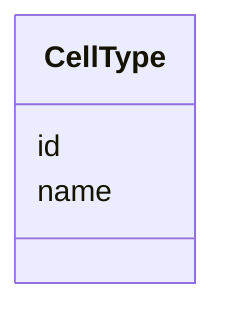

# Class: CellType


_The cell type from which the sample was derived._


URI: [cdp-meta:CellType](metadataCellType)





<!-- no inheritance hierarchy -->


## Slots

| Name | Cardinality and Range | Description | Inheritance |
| ---  | --- | --- | --- |
| [name](name.md) | 1 <br/> [String](String.md) | Name of the cell type from which a biological sample used in a CryoET study i... | direct |
| [id](id.md) | 0..1 _recommended_ <br/> [CLID](CLID.md) | Cell Ontology identifier for the cell type | direct |


## Usages

| used by | used in | type | used |
| ---  | --- | --- | --- |
| [ExperimentalMetadata](ExperimentalMetadata.md) | [cell_type](cell_type.md) | range | [CellType](CellType.md) |
| [Dataset](Dataset.md) | [cell_type](cell_type.md) | range | [CellType](CellType.md) |


## Identifier and Mapping Information


### Schema Source


* from schema: metadata


## Mappings

| Mapping Type | Mapped Value |
| ---  | ---  |
| self | cdp-meta:CellType |
| native | cdp-meta:CellType |


## LinkML Source

<!-- TODO: investigate https://stackoverflow.com/questions/37606292/how-to-create-tabbed-code-blocks-in-mkdocs-or-sphinx -->

### Direct

<details>
```yaml
name: CellType
description: The cell type from which the sample was derived.
from_schema: metadata
attributes:
  name:
    name: name
    description: Name of the cell type from which a biological sample used in a CryoET
      study is derived from.
    from_schema: metadata
    exact_mappings:
    - cdp-common:cell_name
    alias: name
    owner: CellType
    domain_of:
    - Author
    - Organism
    - Tissue
    - CellType
    - CellStrain
    - CellComponent
    - AnnotationObject
    range: string
    required: true
    inlined: true
    inlined_as_list: true
  id:
    name: id
    description: Cell Ontology identifier for the cell type
    from_schema: metadata
    exact_mappings:
    - cdp-common:cell_type_id
    alias: id
    owner: CellType
    domain_of:
    - Tissue
    - CellType
    - CellStrain
    - CellComponent
    - AnnotationObject
    range: CL_ID
    recommended: true
    inlined: true
    inlined_as_list: true

```
</details>

### Induced

<details>
```yaml
name: CellType
description: The cell type from which the sample was derived.
from_schema: metadata
attributes:
  name:
    name: name
    description: Name of the cell type from which a biological sample used in a CryoET
      study is derived from.
    from_schema: metadata
    exact_mappings:
    - cdp-common:cell_name
    alias: name
    owner: CellType
    domain_of:
    - Author
    - Organism
    - Tissue
    - CellType
    - CellStrain
    - CellComponent
    - AnnotationObject
    range: string
    required: true
    inlined: true
    inlined_as_list: true
  id:
    name: id
    description: Cell Ontology identifier for the cell type
    from_schema: metadata
    exact_mappings:
    - cdp-common:cell_type_id
    alias: id
    owner: CellType
    domain_of:
    - Tissue
    - CellType
    - CellStrain
    - CellComponent
    - AnnotationObject
    range: CL_ID
    recommended: true
    inlined: true
    inlined_as_list: true

```
</details>
