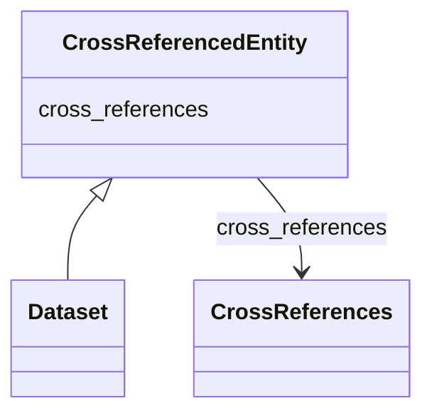

# Class: CrossReferencedEntity


_An entity with associated cross-references to other databases and publications._


* __NOTE__: this is an abstract class and should not be instantiated directly


URI: [cdp-meta:CrossReferencedEntity](https://cryoetdataportal.czscience.com/schema/metadata/CrossReferencedEntity)





<!-- no inheritance hierarchy -->


## Slots

| Name | Cardinality and Range | Description | Inheritance |
| ---  | --- | --- | --- |
| [cross_references](cross_references.md) | 0..1 <br/> [CrossReferences](CrossReferences.md) | A set of cross-references to other databases and publications | direct |


## Identifier and Mapping Information


### Schema Source


* from schema: https://cryoetdataportal.czscience.com/schema-docs/metadata


## Mappings

| Mapping Type | Mapped Value |
| ---  | ---  |
| self | cdp-meta:CrossReferencedEntity |
| native | cdp-meta:CrossReferencedEntity |


## LinkML Source

<!-- TODO: investigate https://stackoverflow.com/questions/37606292/how-to-create-tabbed-code-blocks-in-mkdocs-or-sphinx -->

### Direct

<details>
```yaml
name: CrossReferencedEntity
description: An entity with associated cross-references to other databases and publications.
from_schema: https://cryoetdataportal.czscience.com/schema-docs/metadata
abstract: true
attributes:
  cross_references:
    name: cross_references
    description: A set of cross-references to other databases and publications.
    from_schema: https://cryoetdataportal.czscience.com/schema-docs/metadata
    rank: 1000
    alias: cross_references
    owner: CrossReferencedEntity
    domain_of:
    - CrossReferencedEntity
    - Dataset
    range: CrossReferences
    inlined: true
    inlined_as_list: true

```
</details>

### Induced

<details>
```yaml
name: CrossReferencedEntity
description: An entity with associated cross-references to other databases and publications.
from_schema: https://cryoetdataportal.czscience.com/schema-docs/metadata
abstract: true
attributes:
  cross_references:
    name: cross_references
    description: A set of cross-references to other databases and publications.
    from_schema: https://cryoetdataportal.czscience.com/schema-docs/metadata
    rank: 1000
    alias: cross_references
    owner: CrossReferencedEntity
    domain_of:
    - CrossReferencedEntity
    - Dataset
    range: CrossReferences
    inlined: true
    inlined_as_list: true

```
</details>