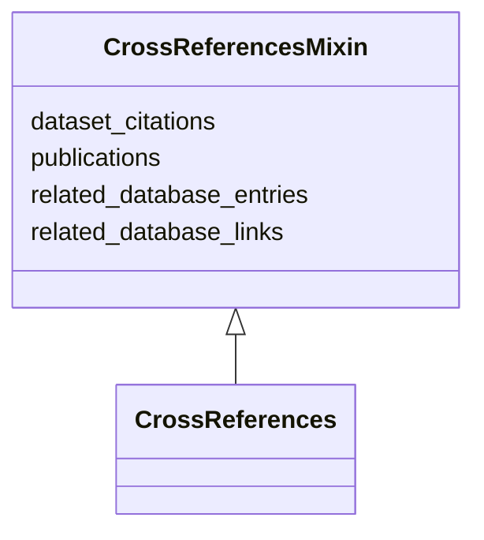

# Class: CrossReferencesMixin


_A set of cross-references to other databases and publications._


URI: [cdp-meta:CrossReferencesMixin](metadataCrossReferencesMixin)





<!-- no inheritance hierarchy -->


## Slots

| Name | Cardinality and Range | Description | Inheritance |
| ---  | --- | --- | --- |
| [publications](publications.md) | 0..1 _recommended_ <br/> [DOILIST](DOILIST.md) | Comma-separated list of DOIs for publications associated with the dataset | direct |
| [related_database_entries](related_database_entries.md) | 0..1 _recommended_ <br/> [EMPIAREMDBPDBLIST](EMPIAREMDBPDBLIST.md) | Comma-separated list of related database entries for the dataset | direct |
| [related_database_links](related_database_links.md) | 0..1 <br/> [String](String.md) | Comma-separated list of related database links for the dataset | direct |
| [dataset_citations](dataset_citations.md) | 0..1 <br/> [String](String.md) | Comma-separated list of DOIs for publications citing the dataset | direct |


## Mixin Usage

| mixed into | description |
| --- | --- |
| [CrossReferences](CrossReferences.md) | A set of cross-references to other databases and publications |


## Identifier and Mapping Information


### Schema Source


* from schema: metadata


## Mappings

| Mapping Type | Mapped Value |
| ---  | ---  |
| self | cdp-meta:CrossReferencesMixin |
| native | cdp-meta:CrossReferencesMixin |


## LinkML Source

<!-- TODO: investigate https://stackoverflow.com/questions/37606292/how-to-create-tabbed-code-blocks-in-mkdocs-or-sphinx -->

### Direct

<details>
```yaml
name: CrossReferencesMixin
description: A set of cross-references to other databases and publications.
from_schema: metadata
mixin: true
attributes:
  publications:
    name: publications
    description: Comma-separated list of DOIs for publications associated with the
      dataset.
    from_schema: metadata
    alias: publications
    owner: CrossReferencesMixin
    domain_of:
    - CrossReferencesMixin
    - CrossReferences
    range: DOI_LIST
    recommended: true
    inlined: true
    inlined_as_list: true
    pattern: (^(doi:)?10\.[0-9]{4,9}/[-._;()/:a-zA-Z0-9]+(\s*,\s*(doi:)?10\.[0-9]{4,9}/[-._;()/:a-zA-Z0-9]+)*$)|(^(doi:)?10\.[0-9]{4,9}/[-._;()/:a-zA-Z0-9]+(\s*,\s*(doi:)?10\.[0-9]{4,9}/[-._;()/:a-zA-Z0-9]+)*$)
  related_database_entries:
    name: related_database_entries
    description: Comma-separated list of related database entries for the dataset.
    from_schema: metadata
    alias: related_database_entries
    owner: CrossReferencesMixin
    domain_of:
    - CrossReferencesMixin
    - CrossReferences
    range: EMPIAR_EMDB_PDB_LIST
    recommended: true
    inlined: true
    inlined_as_list: true
    pattern: (^(EMPIAR-[0-9]{5}|EMD-[0-9]{4,5}|pdb[0-9a-zA-Z]{4,8})(\s*,\s*(EMPIAR-[0-9]{5}|EMD-[0-9]{4,5}|pdb[0-9a-zA-Z]{4,8}))*$)|(^(EMPIAR-[0-9]{5}|EMD-[0-9]{4,5}|pdb[0-9a-zA-Z]{4,8})(\s*,\s*(EMPIAR-[0-9]{5}|EMD-[0-9]{4,5}|pdb[0-9a-zA-Z]{4,8}))*$)
  related_database_links:
    name: related_database_links
    description: Comma-separated list of related database links for the dataset.
    from_schema: metadata
    alias: related_database_links
    owner: CrossReferencesMixin
    domain_of:
    - CrossReferencesMixin
    - CrossReferences
    range: string
    inlined: true
    inlined_as_list: true
  dataset_citations:
    name: dataset_citations
    description: Comma-separated list of DOIs for publications citing the dataset.
    from_schema: metadata
    alias: dataset_citations
    owner: CrossReferencesMixin
    domain_of:
    - CrossReferencesMixin
    - CrossReferences
    range: string
    inlined: true
    inlined_as_list: true

```
</details>

### Induced

<details>
```yaml
name: CrossReferencesMixin
description: A set of cross-references to other databases and publications.
from_schema: metadata
mixin: true
attributes:
  publications:
    name: publications
    description: Comma-separated list of DOIs for publications associated with the
      dataset.
    from_schema: metadata
    alias: publications
    owner: CrossReferencesMixin
    domain_of:
    - CrossReferencesMixin
    - CrossReferences
    range: DOI_LIST
    recommended: true
    inlined: true
    inlined_as_list: true
    pattern: (^(doi:)?10\.[0-9]{4,9}/[-._;()/:a-zA-Z0-9]+(\s*,\s*(doi:)?10\.[0-9]{4,9}/[-._;()/:a-zA-Z0-9]+)*$)|(^(doi:)?10\.[0-9]{4,9}/[-._;()/:a-zA-Z0-9]+(\s*,\s*(doi:)?10\.[0-9]{4,9}/[-._;()/:a-zA-Z0-9]+)*$)
  related_database_entries:
    name: related_database_entries
    description: Comma-separated list of related database entries for the dataset.
    from_schema: metadata
    alias: related_database_entries
    owner: CrossReferencesMixin
    domain_of:
    - CrossReferencesMixin
    - CrossReferences
    range: EMPIAR_EMDB_PDB_LIST
    recommended: true
    inlined: true
    inlined_as_list: true
    pattern: (^(EMPIAR-[0-9]{5}|EMD-[0-9]{4,5}|pdb[0-9a-zA-Z]{4,8})(\s*,\s*(EMPIAR-[0-9]{5}|EMD-[0-9]{4,5}|pdb[0-9a-zA-Z]{4,8}))*$)|(^(EMPIAR-[0-9]{5}|EMD-[0-9]{4,5}|pdb[0-9a-zA-Z]{4,8})(\s*,\s*(EMPIAR-[0-9]{5}|EMD-[0-9]{4,5}|pdb[0-9a-zA-Z]{4,8}))*$)
  related_database_links:
    name: related_database_links
    description: Comma-separated list of related database links for the dataset.
    from_schema: metadata
    alias: related_database_links
    owner: CrossReferencesMixin
    domain_of:
    - CrossReferencesMixin
    - CrossReferences
    range: string
    inlined: true
    inlined_as_list: true
  dataset_citations:
    name: dataset_citations
    description: Comma-separated list of DOIs for publications citing the dataset.
    from_schema: metadata
    alias: dataset_citations
    owner: CrossReferencesMixin
    domain_of:
    - CrossReferencesMixin
    - CrossReferences
    range: string
    inlined: true
    inlined_as_list: true

```
</details>