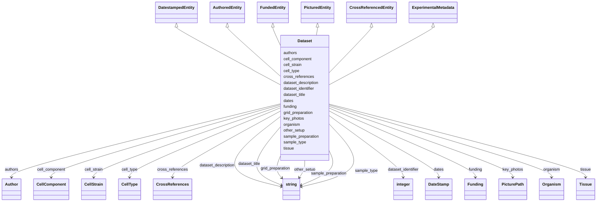

# Class: Dataset


_High-level description of a cryoET dataset._


URI: [cdp-meta:Dataset](https://cryoetdataportal.czscience.com/schema/metadata/Dataset)





## Inheritance
* **Dataset** [ [DatestampedEntity](DatestampedEntity.md) [AuthoredEntity](AuthoredEntity.md) [FundedEntity](FundedEntity.md) [PicturedEntity](PicturedEntity.md) [CrossReferencedEntity](CrossReferencedEntity.md) [ExperimentalMetadata](ExperimentalMetadata.md)]


## Slots

| Name | Cardinality and Range | Description | Inheritance |
| ---  | --- | --- | --- |
| [dataset_identifier](dataset_identifier.md) | 0..1 <br/> [xsd:integer](http://www.w3.org/2001/XMLSchema#integer) | An identifier for a CryoET dataset, assigned by the Data Portal | direct |
| [dataset_title](dataset_title.md) | 0..1 <br/> [xsd:string](http://www.w3.org/2001/XMLSchema#string) | Title of a CryoET dataset | direct |
| [dataset_description](dataset_description.md) | 0..1 <br/> [xsd:string](http://www.w3.org/2001/XMLSchema#string) | A short description of a CryoET dataset, similar to an abstract for a journal... | direct |
| [dates](dates.md) | 1..1 <br/> [DateStamp](DateStamp.md) | A set of dates at which a data item was deposited, published and last modifie... | direct |
| [authors](authors.md) | 1..* <br/> [Author](Author.md) | Author of a scientific data entity | direct |
| [funding](funding.md) | 0..* _recommended_ <br/> [Funding](Funding.md) | A funding source for a scientific data entity (base for JSON and DB represent... | direct |
| [key_photos](key_photos.md) | 1..1 <br/> [PicturePath](PicturePath.md) | A set of paths to representative images of a piece of data | direct |
| [cross_references](cross_references.md) | 0..1 <br/> [CrossReferences](CrossReferences.md) | A set of cross-references to other databases and publications | direct |
| [sample_type](sample_type.md) | 0..1 <br/> [xsd:string](http://www.w3.org/2001/XMLSchema#string) | Type of sample imaged in a CryoET study | direct |
| [sample_preparation](sample_preparation.md) | 0..1 <br/> [xsd:string](http://www.w3.org/2001/XMLSchema#string) | Describes how the sample was prepared | direct |
| [grid_preparation](grid_preparation.md) | 0..1 <br/> [xsd:string](http://www.w3.org/2001/XMLSchema#string) | Describes Cryo-ET grid preparation | direct |
| [other_setup](other_setup.md) | 0..1 <br/> [xsd:string](http://www.w3.org/2001/XMLSchema#string) | Describes other setup not covered by sample preparation or grid preparation t... | direct |
| [organism](organism.md) | 0..1 <br/> [Organism](Organism.md) | The species from which the sample was derived | direct |
| [tissue](tissue.md) | 0..1 <br/> [Tissue](Tissue.md) | The type of tissue from which the sample was derived | direct |
| [cell_type](cell_type.md) | 0..1 <br/> [CellType](CellType.md) | The cell type from which the sample was derived | direct |
| [cell_strain](cell_strain.md) | 0..1 <br/> [CellStrain](CellStrain.md) | The strain or cell line from which the sample was derived | direct |
| [cell_component](cell_component.md) | 0..1 <br/> [CellComponent](CellComponent.md) | The cellular component from which the sample was derived | direct |


## Identifier and Mapping Information


### Schema Source


* from schema: https://cryoetdataportal.czscience.com/schema-docs/metadata


## Mappings

| Mapping Type | Mapped Value |
| ---  | ---  |
| self | cdp-meta:Dataset |
| native | cdp-meta:Dataset |


## LinkML Source

<!-- TODO: investigate https://stackoverflow.com/questions/37606292/how-to-create-tabbed-code-blocks-in-mkdocs-or-sphinx -->

### Direct

<details>
```yaml
name: Dataset
description: High-level description of a cryoET dataset.
from_schema: https://cryoetdataportal.czscience.com/schema-docs/metadata
mixins:
- DatestampedEntity
- AuthoredEntity
- FundedEntity
- PicturedEntity
- CrossReferencedEntity
- ExperimentalMetadata
attributes:
  dataset_identifier:
    name: dataset_identifier
    description: An identifier for a CryoET dataset, assigned by the Data Portal.
      Used to identify the dataset as the directory  name in data tree.
    from_schema: https://cryoetdataportal.czscience.com/schema-docs/metadata
    exact_mappings:
    - cdp-common:dataset_identifier
    rank: 1000
    alias: dataset_identifier
    owner: Dataset
    domain_of:
    - Dataset
    range: integer
    inlined: true
    inlined_as_list: true
  dataset_title:
    name: dataset_title
    description: Title of a CryoET dataset.
    from_schema: https://cryoetdataportal.czscience.com/schema-docs/metadata
    exact_mappings:
    - cdp-common:dataset_title
    rank: 1000
    alias: dataset_title
    owner: Dataset
    domain_of:
    - Dataset
    range: string
    inlined: true
    inlined_as_list: true
  dataset_description:
    name: dataset_description
    description: A short description of a CryoET dataset, similar to an abstract for
      a journal article or dataset.
    from_schema: https://cryoetdataportal.czscience.com/schema-docs/metadata
    exact_mappings:
    - cdp-common:dataset_description
    rank: 1000
    alias: dataset_description
    owner: Dataset
    domain_of:
    - Dataset
    range: string
    inlined: true
    inlined_as_list: true
  dates:
    name: dates
    description: A set of dates at which a data item was deposited, published and
      last modified.
    from_schema: https://cryoetdataportal.czscience.com/schema-docs/metadata
    alias: dates
    owner: Dataset
    domain_of:
    - DatestampedEntity
    - Dataset
    - Annotation
    range: DateStamp
    required: true
    inlined: true
    inlined_as_list: true
  authors:
    name: authors
    description: Author of a scientific data entity.
    from_schema: https://cryoetdataportal.czscience.com/schema-docs/metadata
    multivalued: true
    list_elements_ordered: true
    alias: authors
    owner: Dataset
    domain_of:
    - AuthoredEntity
    - AnnotatoredEntity
    - Dataset
    - Tomogram
    - Annotation
    range: Author
    required: true
    inlined: true
    inlined_as_list: true
  funding:
    name: funding
    description: A funding source for a scientific data entity (base for JSON and
      DB representation).
    from_schema: https://cryoetdataportal.czscience.com/schema-docs/metadata
    multivalued: true
    list_elements_ordered: true
    alias: funding
    owner: Dataset
    domain_of:
    - FundedEntity
    - Dataset
    range: Funding
    recommended: true
    inlined: true
    inlined_as_list: true
  key_photos:
    name: key_photos
    description: A set of paths to representative images of a piece of data.
    from_schema: https://cryoetdataportal.czscience.com/schema-docs/metadata
    alias: key_photos
    owner: Dataset
    domain_of:
    - PicturedEntity
    - Dataset
    - Tomogram
    range: PicturePath
    required: true
    inlined: true
    inlined_as_list: true
  cross_references:
    name: cross_references
    description: A set of cross-references to other databases and publications.
    from_schema: https://cryoetdataportal.czscience.com/schema-docs/metadata
    alias: cross_references
    owner: Dataset
    domain_of:
    - CrossReferencedEntity
    - Dataset
    range: CrossReferences
    inlined: true
    inlined_as_list: true
  sample_type:
    name: sample_type
    description: Type of sample imaged in a CryoET study.
    from_schema: https://cryoetdataportal.czscience.com/schema-docs/metadata
    exact_mappings:
    - cdp-common:preparation_sample_type
    alias: sample_type
    owner: Dataset
    domain_of:
    - ExperimentalMetadata
    - Dataset
    range: string
    inlined: true
    inlined_as_list: true
  sample_preparation:
    name: sample_preparation
    description: Describes how the sample was prepared.
    from_schema: https://cryoetdataportal.czscience.com/schema-docs/metadata
    exact_mappings:
    - cdp-common:sample_preparation
    alias: sample_preparation
    owner: Dataset
    domain_of:
    - ExperimentalMetadata
    - Dataset
    range: string
    inlined: true
    inlined_as_list: true
  grid_preparation:
    name: grid_preparation
    description: Describes Cryo-ET grid preparation.
    from_schema: https://cryoetdataportal.czscience.com/schema-docs/metadata
    exact_mappings:
    - cdp-common:grid_preparation
    alias: grid_preparation
    owner: Dataset
    domain_of:
    - ExperimentalMetadata
    - Dataset
    range: string
    inlined: true
    inlined_as_list: true
  other_setup:
    name: other_setup
    description: Describes other setup not covered by sample preparation or grid preparation
      that may make this dataset unique in   the same publication.
    from_schema: https://cryoetdataportal.czscience.com/schema-docs/metadata
    exact_mappings:
    - cdp-common:preparation_other_setup
    alias: other_setup
    owner: Dataset
    domain_of:
    - ExperimentalMetadata
    - Dataset
    range: string
    inlined: true
    inlined_as_list: true
  organism:
    name: organism
    description: The species from which the sample was derived.
    from_schema: https://cryoetdataportal.czscience.com/schema-docs/metadata
    alias: organism
    owner: Dataset
    domain_of:
    - ExperimentalMetadata
    - Dataset
    range: Organism
    inlined: true
    inlined_as_list: true
  tissue:
    name: tissue
    description: The type of tissue from which the sample was derived.
    from_schema: https://cryoetdataportal.czscience.com/schema-docs/metadata
    alias: tissue
    owner: Dataset
    domain_of:
    - ExperimentalMetadata
    - Dataset
    range: Tissue
    inlined: true
    inlined_as_list: true
  cell_type:
    name: cell_type
    description: The cell type from which the sample was derived.
    from_schema: https://cryoetdataportal.czscience.com/schema-docs/metadata
    alias: cell_type
    owner: Dataset
    domain_of:
    - ExperimentalMetadata
    - Dataset
    range: CellType
    inlined: true
    inlined_as_list: true
  cell_strain:
    name: cell_strain
    description: The strain or cell line from which the sample was derived.
    from_schema: https://cryoetdataportal.czscience.com/schema-docs/metadata
    alias: cell_strain
    owner: Dataset
    domain_of:
    - ExperimentalMetadata
    - Dataset
    range: CellStrain
    inlined: true
    inlined_as_list: true
  cell_component:
    name: cell_component
    description: The cellular component from which the sample was derived.
    from_schema: https://cryoetdataportal.czscience.com/schema-docs/metadata
    alias: cell_component
    owner: Dataset
    domain_of:
    - ExperimentalMetadata
    - Dataset
    range: CellComponent
    inlined: true
    inlined_as_list: true

```
</details>

### Induced

<details>
```yaml
name: Dataset
description: High-level description of a cryoET dataset.
from_schema: https://cryoetdataportal.czscience.com/schema-docs/metadata
mixins:
- DatestampedEntity
- AuthoredEntity
- FundedEntity
- PicturedEntity
- CrossReferencedEntity
- ExperimentalMetadata
attributes:
  dataset_identifier:
    name: dataset_identifier
    description: An identifier for a CryoET dataset, assigned by the Data Portal.
      Used to identify the dataset as the directory  name in data tree.
    from_schema: https://cryoetdataportal.czscience.com/schema-docs/metadata
    exact_mappings:
    - cdp-common:dataset_identifier
    rank: 1000
    alias: dataset_identifier
    owner: Dataset
    domain_of:
    - Dataset
    range: integer
    inlined: true
    inlined_as_list: true
  dataset_title:
    name: dataset_title
    description: Title of a CryoET dataset.
    from_schema: https://cryoetdataportal.czscience.com/schema-docs/metadata
    exact_mappings:
    - cdp-common:dataset_title
    rank: 1000
    alias: dataset_title
    owner: Dataset
    domain_of:
    - Dataset
    range: string
    inlined: true
    inlined_as_list: true
  dataset_description:
    name: dataset_description
    description: A short description of a CryoET dataset, similar to an abstract for
      a journal article or dataset.
    from_schema: https://cryoetdataportal.czscience.com/schema-docs/metadata
    exact_mappings:
    - cdp-common:dataset_description
    rank: 1000
    alias: dataset_description
    owner: Dataset
    domain_of:
    - Dataset
    range: string
    inlined: true
    inlined_as_list: true
  dates:
    name: dates
    description: A set of dates at which a data item was deposited, published and
      last modified.
    from_schema: https://cryoetdataportal.czscience.com/schema-docs/metadata
    alias: dates
    owner: Dataset
    domain_of:
    - DatestampedEntity
    - Dataset
    - Annotation
    range: DateStamp
    required: true
    inlined: true
    inlined_as_list: true
  authors:
    name: authors
    description: Author of a scientific data entity.
    from_schema: https://cryoetdataportal.czscience.com/schema-docs/metadata
    multivalued: true
    list_elements_ordered: true
    alias: authors
    owner: Dataset
    domain_of:
    - AuthoredEntity
    - AnnotatoredEntity
    - Dataset
    - Tomogram
    - Annotation
    range: Author
    required: true
    inlined: true
    inlined_as_list: true
  funding:
    name: funding
    description: A funding source for a scientific data entity (base for JSON and
      DB representation).
    from_schema: https://cryoetdataportal.czscience.com/schema-docs/metadata
    multivalued: true
    list_elements_ordered: true
    alias: funding
    owner: Dataset
    domain_of:
    - FundedEntity
    - Dataset
    range: Funding
    recommended: true
    inlined: true
    inlined_as_list: true
  key_photos:
    name: key_photos
    description: A set of paths to representative images of a piece of data.
    from_schema: https://cryoetdataportal.czscience.com/schema-docs/metadata
    alias: key_photos
    owner: Dataset
    domain_of:
    - PicturedEntity
    - Dataset
    - Tomogram
    range: PicturePath
    required: true
    inlined: true
    inlined_as_list: true
  cross_references:
    name: cross_references
    description: A set of cross-references to other databases and publications.
    from_schema: https://cryoetdataportal.czscience.com/schema-docs/metadata
    alias: cross_references
    owner: Dataset
    domain_of:
    - CrossReferencedEntity
    - Dataset
    range: CrossReferences
    inlined: true
    inlined_as_list: true
  sample_type:
    name: sample_type
    description: Type of sample imaged in a CryoET study.
    from_schema: https://cryoetdataportal.czscience.com/schema-docs/metadata
    exact_mappings:
    - cdp-common:preparation_sample_type
    alias: sample_type
    owner: Dataset
    domain_of:
    - ExperimentalMetadata
    - Dataset
    range: string
    inlined: true
    inlined_as_list: true
  sample_preparation:
    name: sample_preparation
    description: Describes how the sample was prepared.
    from_schema: https://cryoetdataportal.czscience.com/schema-docs/metadata
    exact_mappings:
    - cdp-common:sample_preparation
    alias: sample_preparation
    owner: Dataset
    domain_of:
    - ExperimentalMetadata
    - Dataset
    range: string
    inlined: true
    inlined_as_list: true
  grid_preparation:
    name: grid_preparation
    description: Describes Cryo-ET grid preparation.
    from_schema: https://cryoetdataportal.czscience.com/schema-docs/metadata
    exact_mappings:
    - cdp-common:grid_preparation
    alias: grid_preparation
    owner: Dataset
    domain_of:
    - ExperimentalMetadata
    - Dataset
    range: string
    inlined: true
    inlined_as_list: true
  other_setup:
    name: other_setup
    description: Describes other setup not covered by sample preparation or grid preparation
      that may make this dataset unique in   the same publication.
    from_schema: https://cryoetdataportal.czscience.com/schema-docs/metadata
    exact_mappings:
    - cdp-common:preparation_other_setup
    alias: other_setup
    owner: Dataset
    domain_of:
    - ExperimentalMetadata
    - Dataset
    range: string
    inlined: true
    inlined_as_list: true
  organism:
    name: organism
    description: The species from which the sample was derived.
    from_schema: https://cryoetdataportal.czscience.com/schema-docs/metadata
    alias: organism
    owner: Dataset
    domain_of:
    - ExperimentalMetadata
    - Dataset
    range: Organism
    inlined: true
    inlined_as_list: true
  tissue:
    name: tissue
    description: The type of tissue from which the sample was derived.
    from_schema: https://cryoetdataportal.czscience.com/schema-docs/metadata
    alias: tissue
    owner: Dataset
    domain_of:
    - ExperimentalMetadata
    - Dataset
    range: Tissue
    inlined: true
    inlined_as_list: true
  cell_type:
    name: cell_type
    description: The cell type from which the sample was derived.
    from_schema: https://cryoetdataportal.czscience.com/schema-docs/metadata
    alias: cell_type
    owner: Dataset
    domain_of:
    - ExperimentalMetadata
    - Dataset
    range: CellType
    inlined: true
    inlined_as_list: true
  cell_strain:
    name: cell_strain
    description: The strain or cell line from which the sample was derived.
    from_schema: https://cryoetdataportal.czscience.com/schema-docs/metadata
    alias: cell_strain
    owner: Dataset
    domain_of:
    - ExperimentalMetadata
    - Dataset
    range: CellStrain
    inlined: true
    inlined_as_list: true
  cell_component:
    name: cell_component
    description: The cellular component from which the sample was derived.
    from_schema: https://cryoetdataportal.czscience.com/schema-docs/metadata
    alias: cell_component
    owner: Dataset
    domain_of:
    - ExperimentalMetadata
    - Dataset
    range: CellComponent
    inlined: true
    inlined_as_list: true

```
</details>