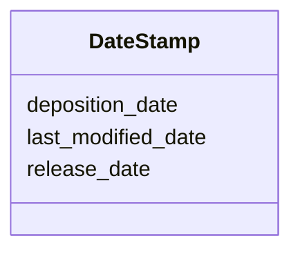

# Class: DateStamp


_A set of dates at which a data item was deposited, published and last modified._


URI: [cdp-meta:DateStamp](metadataDateStamp)





<!-- no inheritance hierarchy -->


## Slots

| Name | Cardinality and Range | Description | Inheritance |
| ---  | --- | --- | --- |
| [deposition_date](deposition_date.md) | 1..1 <br/> [Date](Date.md) | The date a data item was received by the cryoET data portal | direct |
| [release_date](release_date.md) | 1..1 <br/> [Date](Date.md) | The date a data item was received by the cryoET data portal | direct |
| [last_modified_date](last_modified_date.md) | 1..1 <br/> [Date](Date.md) | The date a piece of data was last modified on the cryoET data portal | direct |


## Usages

| used by | used in | type | used |
| ---  | --- | --- | --- |
| [DatestampedEntity](DatestampedEntity.md) | [dates](dates.md) | range | [DateStamp](DateStamp.md) |
| [Dataset](Dataset.md) | [dates](dates.md) | range | [DateStamp](DateStamp.md) |
| [Deposition](Deposition.md) | [dates](dates.md) | range | [DateStamp](DateStamp.md) |
| [Annotation](Annotation.md) | [dates](dates.md) | range | [DateStamp](DateStamp.md) |


## Identifier and Mapping Information


### Schema Source


* from schema: metadata


## Mappings

| Mapping Type | Mapped Value |
| ---  | ---  |
| self | cdp-meta:DateStamp |
| native | cdp-meta:DateStamp |


## LinkML Source

<!-- TODO: investigate https://stackoverflow.com/questions/37606292/how-to-create-tabbed-code-blocks-in-mkdocs-or-sphinx -->

### Direct

<details>
```yaml
name: DateStamp
description: A set of dates at which a data item was deposited, published and last
  modified.
from_schema: metadata
attributes:
  deposition_date:
    name: deposition_date
    description: The date a data item was received by the cryoET data portal.
    from_schema: metadata
    exact_mappings:
    - cdp-common:deposition_date
    rank: 1000
    alias: deposition_date
    owner: DateStamp
    domain_of:
    - DateStamp
    range: date
    required: true
    inlined: true
    inlined_as_list: true
  release_date:
    name: release_date
    description: The date a data item was received by the cryoET data portal.
    from_schema: metadata
    exact_mappings:
    - cdp-common:release_date
    rank: 1000
    alias: release_date
    owner: DateStamp
    domain_of:
    - DateStamp
    range: date
    required: true
    inlined: true
    inlined_as_list: true
  last_modified_date:
    name: last_modified_date
    description: The date a piece of data was last modified on the cryoET data portal.
    from_schema: metadata
    exact_mappings:
    - cdp-common:last_modified_date
    rank: 1000
    alias: last_modified_date
    owner: DateStamp
    domain_of:
    - DateStamp
    range: date
    required: true
    inlined: true
    inlined_as_list: true

```
</details>

### Induced

<details>
```yaml
name: DateStamp
description: A set of dates at which a data item was deposited, published and last
  modified.
from_schema: metadata
attributes:
  deposition_date:
    name: deposition_date
    description: The date a data item was received by the cryoET data portal.
    from_schema: metadata
    exact_mappings:
    - cdp-common:deposition_date
    rank: 1000
    alias: deposition_date
    owner: DateStamp
    domain_of:
    - DateStamp
    range: date
    required: true
    inlined: true
    inlined_as_list: true
  release_date:
    name: release_date
    description: The date a data item was received by the cryoET data portal.
    from_schema: metadata
    exact_mappings:
    - cdp-common:release_date
    rank: 1000
    alias: release_date
    owner: DateStamp
    domain_of:
    - DateStamp
    range: date
    required: true
    inlined: true
    inlined_as_list: true
  last_modified_date:
    name: last_modified_date
    description: The date a piece of data was last modified on the cryoET data portal.
    from_schema: metadata
    exact_mappings:
    - cdp-common:last_modified_date
    rank: 1000
    alias: last_modified_date
    owner: DateStamp
    domain_of:
    - DateStamp
    range: date
    required: true
    inlined: true
    inlined_as_list: true

```
</details>