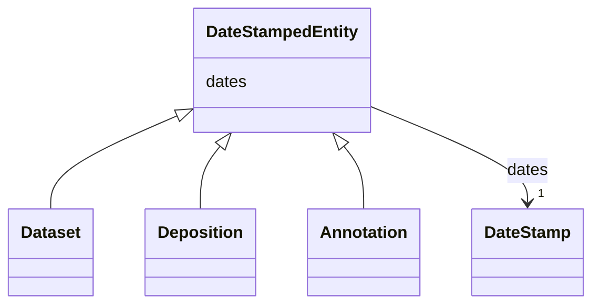

# Class: DateStampedEntity


_An entity with associated deposition, release and last modified dates._


* __NOTE__: this is an abstract class and should not be instantiated directly


URI: [cdp-meta:DateStampedEntity](metadataDateStampedEntity)





<!-- no inheritance hierarchy -->


## Slots

| Name | Cardinality and Range | Description | Inheritance |
| ---  | --- | --- | --- |
| [dates](dates.md) | 1 <br/> [DateStamp](DateStamp.md) | A set of dates at which a data item was deposited, published and last modifie... | direct |


## Identifier and Mapping Information


### Schema Source


* from schema: metadata


## Mappings

| Mapping Type | Mapped Value |
| ---  | ---  |
| self | cdp-meta:DateStampedEntity |
| native | cdp-meta:DateStampedEntity |


## LinkML Source

<!-- TODO: investigate https://stackoverflow.com/questions/37606292/how-to-create-tabbed-code-blocks-in-mkdocs-or-sphinx -->

### Direct

<details>
```yaml
name: DateStampedEntity
description: An entity with associated deposition, release and last modified dates.
from_schema: metadata
abstract: true
attributes:
  dates:
    name: dates
    description: A set of dates at which a data item was deposited, published and
      last modified.
    from_schema: metadata
    rank: 1000
    alias: dates
    owner: DateStampedEntity
    domain_of:
    - DateStampedEntity
    - Dataset
    - Deposition
    - Annotation
    range: DateStamp
    required: true
    inlined: true
    inlined_as_list: true

```
</details>

### Induced

<details>
```yaml
name: DateStampedEntity
description: An entity with associated deposition, release and last modified dates.
from_schema: metadata
abstract: true
attributes:
  dates:
    name: dates
    description: A set of dates at which a data item was deposited, published and
      last modified.
    from_schema: metadata
    rank: 1000
    alias: dates
    owner: DateStampedEntity
    domain_of:
    - DateStampedEntity
    - Dataset
    - Deposition
    - Annotation
    range: DateStamp
    required: true
    inlined: true
    inlined_as_list: true

```
</details>
