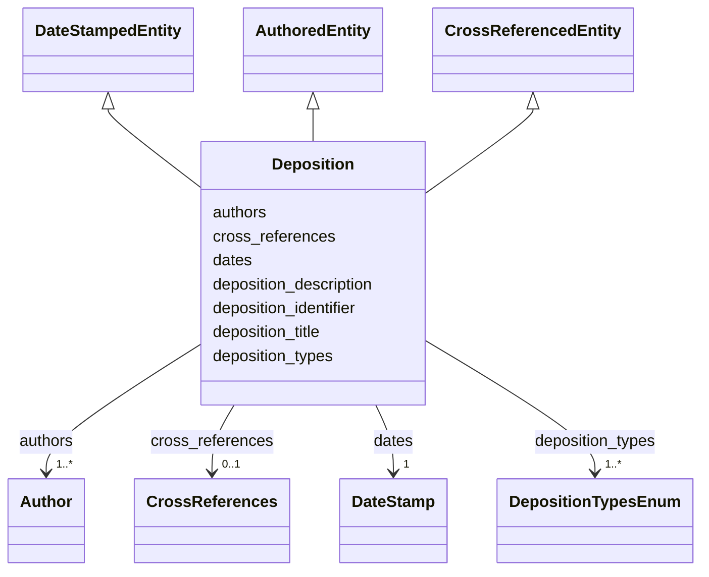

# Class: Deposition


_Metadata describing a deposition._


URI: [cdp-meta:Deposition](metadataDeposition)





## Inheritance
* **Deposition** [ [DateStampedEntity](DateStampedEntity.md) [AuthoredEntity](AuthoredEntity.md) [CrossReferencedEntity](CrossReferencedEntity.md)]


## Slots

| Name | Cardinality and Range | Description | Inheritance |
| ---  | --- | --- | --- |
| [deposition_description](deposition_description.md) | 1 <br/> [String](String.md) | A short description of the deposition, similar to an abstract for a journal a... | direct |
| [deposition_identifier](deposition_identifier.md) | 1 <br/> [Integer](Integer.md) | An identifier for a CryoET deposition, assigned by the Data Portal | direct |
| [deposition_title](deposition_title.md) | 1 <br/> [String](String.md) | Title of a CryoET deposition | direct |
| [deposition_types](deposition_types.md) | 1..* <br/> [DepositionTypesEnum](DepositionTypesEnum.md) | Type of data in the deposition (e | direct |
| [dates](dates.md) | 1 <br/> [DateStamp](DateStamp.md) | A set of dates at which a data item was deposited, published and last modifie... | direct |
| [authors](authors.md) | 1..* <br/> [Author](Author.md) | Author of a scientific data entity | direct |
| [cross_references](cross_references.md) | 0..1 <br/> [CrossReferences](CrossReferences.md) | A set of cross-references to other databases and publications | direct |


## Identifier and Mapping Information


### Schema Source


* from schema: metadata


## Mappings

| Mapping Type | Mapped Value |
| ---  | ---  |
| self | cdp-meta:Deposition |
| native | cdp-meta:Deposition |


## LinkML Source

<!-- TODO: investigate https://stackoverflow.com/questions/37606292/how-to-create-tabbed-code-blocks-in-mkdocs-or-sphinx -->

### Direct

<details>
```yaml
name: Deposition
description: Metadata describing a deposition.
from_schema: metadata
mixins:
- DateStampedEntity
- AuthoredEntity
- CrossReferencedEntity
attributes:
  deposition_description:
    name: deposition_description
    description: A short description of the deposition, similar to an abstract for
      a journal article or dataset.
    from_schema: metadata
    exact_mappings:
    - cdp-common:deposition_description
    rank: 1000
    alias: deposition_description
    owner: Deposition
    domain_of:
    - Deposition
    range: string
    required: true
    inlined: true
    inlined_as_list: true
  deposition_identifier:
    name: deposition_identifier
    description: An identifier for a CryoET deposition, assigned by the Data Portal.
      Used to identify the deposition the entity is a part of.
    from_schema: metadata
    exact_mappings:
    - cdp-common:deposition_identifier
    rank: 1000
    alias: deposition_identifier
    owner: Deposition
    domain_of:
    - Deposition
    range: integer
    required: true
    inlined: true
    inlined_as_list: true
  deposition_title:
    name: deposition_title
    description: Title of a CryoET deposition.
    from_schema: metadata
    exact_mappings:
    - cdp-common:deposition_title
    rank: 1000
    alias: deposition_title
    owner: Deposition
    domain_of:
    - Deposition
    range: string
    required: true
    inlined: true
    inlined_as_list: true
  deposition_types:
    name: deposition_types
    description: Type of data in the deposition (e.g. dataset, annotation, tomogram)
    from_schema: metadata
    exact_mappings:
    - cdp-common:deposition_types
    rank: 1000
    alias: deposition_types
    owner: Deposition
    domain_of:
    - Deposition
    range: deposition_types_enum
    required: true
    multivalued: true
    inlined: true
    inlined_as_list: true
    pattern: (^annotation$)|(^dataset$)|(^tomogram$)
    minimum_cardinality: 1
  dates:
    name: dates
    description: A set of dates at which a data item was deposited, published and
      last modified.
    from_schema: metadata
    alias: dates
    owner: Deposition
    domain_of:
    - DateStampedEntity
    - Dataset
    - Deposition
    - Annotation
    range: DateStamp
    required: true
    inlined: true
    inlined_as_list: true
  authors:
    name: authors
    description: Author of a scientific data entity.
    from_schema: metadata
    list_elements_ordered: true
    alias: authors
    owner: Deposition
    domain_of:
    - AuthoredEntity
    - Dataset
    - Deposition
    - Tomogram
    - Annotation
    range: Author
    required: true
    multivalued: true
    inlined: true
    inlined_as_list: true
    minimum_cardinality: 1
  cross_references:
    name: cross_references
    description: A set of cross-references to other databases and publications.
    from_schema: metadata
    alias: cross_references
    owner: Deposition
    domain_of:
    - CrossReferencedEntity
    - Dataset
    - Deposition
    range: CrossReferences
    inlined: true
    inlined_as_list: true

```
</details>

### Induced

<details>
```yaml
name: Deposition
description: Metadata describing a deposition.
from_schema: metadata
mixins:
- DateStampedEntity
- AuthoredEntity
- CrossReferencedEntity
attributes:
  deposition_description:
    name: deposition_description
    description: A short description of the deposition, similar to an abstract for
      a journal article or dataset.
    from_schema: metadata
    exact_mappings:
    - cdp-common:deposition_description
    rank: 1000
    alias: deposition_description
    owner: Deposition
    domain_of:
    - Deposition
    range: string
    required: true
    inlined: true
    inlined_as_list: true
  deposition_identifier:
    name: deposition_identifier
    description: An identifier for a CryoET deposition, assigned by the Data Portal.
      Used to identify the deposition the entity is a part of.
    from_schema: metadata
    exact_mappings:
    - cdp-common:deposition_identifier
    rank: 1000
    alias: deposition_identifier
    owner: Deposition
    domain_of:
    - Deposition
    range: integer
    required: true
    inlined: true
    inlined_as_list: true
  deposition_title:
    name: deposition_title
    description: Title of a CryoET deposition.
    from_schema: metadata
    exact_mappings:
    - cdp-common:deposition_title
    rank: 1000
    alias: deposition_title
    owner: Deposition
    domain_of:
    - Deposition
    range: string
    required: true
    inlined: true
    inlined_as_list: true
  deposition_types:
    name: deposition_types
    description: Type of data in the deposition (e.g. dataset, annotation, tomogram)
    from_schema: metadata
    exact_mappings:
    - cdp-common:deposition_types
    rank: 1000
    alias: deposition_types
    owner: Deposition
    domain_of:
    - Deposition
    range: deposition_types_enum
    required: true
    multivalued: true
    inlined: true
    inlined_as_list: true
    pattern: (^annotation$)|(^dataset$)|(^tomogram$)
    minimum_cardinality: 1
  dates:
    name: dates
    description: A set of dates at which a data item was deposited, published and
      last modified.
    from_schema: metadata
    alias: dates
    owner: Deposition
    domain_of:
    - DateStampedEntity
    - Dataset
    - Deposition
    - Annotation
    range: DateStamp
    required: true
    inlined: true
    inlined_as_list: true
  authors:
    name: authors
    description: Author of a scientific data entity.
    from_schema: metadata
    list_elements_ordered: true
    alias: authors
    owner: Deposition
    domain_of:
    - AuthoredEntity
    - Dataset
    - Deposition
    - Tomogram
    - Annotation
    range: Author
    required: true
    multivalued: true
    inlined: true
    inlined_as_list: true
    minimum_cardinality: 1
  cross_references:
    name: cross_references
    description: A set of cross-references to other databases and publications.
    from_schema: metadata
    alias: cross_references
    owner: Deposition
    domain_of:
    - CrossReferencedEntity
    - Dataset
    - Deposition
    range: CrossReferences
    inlined: true
    inlined_as_list: true

```
</details>