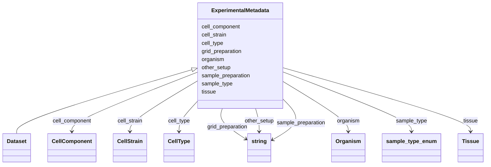

# Class: ExperimentalMetadata


_Metadata describing sample and sample preparation methods used in a cryoET dataset._


* __NOTE__: this is an abstract class and should not be instantiated directly


URI: [cdp-meta:ExperimentalMetadata](https://cryoetdataportal.czscience.com/schema/metadata/ExperimentalMetadata)





<!-- no inheritance hierarchy -->


## Slots

| Name | Cardinality and Range | Description | Inheritance |
| ---  | --- | --- | --- |
| [sample_type](sample_type.md) | 0..1 <br/> [SampleTypeEnum](SampleTypeEnum.md) | Type of sample imaged in a CryoET study | direct |
| [sample_preparation](sample_preparation.md) | 0..1 <br/> [xsd:string](http://www.w3.org/2001/XMLSchema#string) | Describes how the sample was prepared | direct |
| [grid_preparation](grid_preparation.md) | 0..1 <br/> [xsd:string](http://www.w3.org/2001/XMLSchema#string) | Describes Cryo-ET grid preparation | direct |
| [other_setup](other_setup.md) | 0..1 <br/> [xsd:string](http://www.w3.org/2001/XMLSchema#string) | Describes other setup not covered by sample preparation or grid preparation t... | direct |
| [organism](organism.md) | 0..1 <br/> [Organism](Organism.md) | The species from which the sample was derived | direct |
| [tissue](tissue.md) | 0..1 <br/> [Tissue](Tissue.md) | The type of tissue from which the sample was derived | direct |
| [cell_type](cell_type.md) | 0..1 <br/> [CellType](CellType.md) | The cell type from which the sample was derived | direct |
| [cell_strain](cell_strain.md) | 0..1 <br/> [CellStrain](CellStrain.md) | The strain or cell line from which the sample was derived | direct |
| [cell_component](cell_component.md) | 0..1 <br/> [CellComponent](CellComponent.md) | The cellular component from which the sample was derived | direct |


## Identifier and Mapping Information


### Schema Source


* from schema: https://cryoetdataportal.czscience.com/schema-docs/metadata


## Mappings

| Mapping Type | Mapped Value |
| ---  | ---  |
| self | cdp-meta:ExperimentalMetadata |
| native | cdp-meta:ExperimentalMetadata |


## LinkML Source

<!-- TODO: investigate https://stackoverflow.com/questions/37606292/how-to-create-tabbed-code-blocks-in-mkdocs-or-sphinx -->

### Direct

<details>
```yaml
name: ExperimentalMetadata
description: Metadata describing sample and sample preparation methods used in a cryoET
  dataset.
from_schema: https://cryoetdataportal.czscience.com/schema-docs/metadata
abstract: true
attributes:
  sample_type:
    name: sample_type
    description: Type of sample imaged in a CryoET study.
    from_schema: https://cryoetdataportal.czscience.com/schema-docs/metadata
    exact_mappings:
    - cdp-common:preparation_sample_type
    rank: 1000
    alias: sample_type
    owner: ExperimentalMetadata
    domain_of:
    - ExperimentalMetadata
    - Dataset
    range: sample_type_enum
    inlined: true
    inlined_as_list: true
  sample_preparation:
    name: sample_preparation
    description: Describes how the sample was prepared.
    from_schema: https://cryoetdataportal.czscience.com/schema-docs/metadata
    exact_mappings:
    - cdp-common:sample_preparation
    rank: 1000
    alias: sample_preparation
    owner: ExperimentalMetadata
    domain_of:
    - ExperimentalMetadata
    - Dataset
    range: string
    inlined: true
    inlined_as_list: true
  grid_preparation:
    name: grid_preparation
    description: Describes Cryo-ET grid preparation.
    from_schema: https://cryoetdataportal.czscience.com/schema-docs/metadata
    exact_mappings:
    - cdp-common:grid_preparation
    rank: 1000
    alias: grid_preparation
    owner: ExperimentalMetadata
    domain_of:
    - ExperimentalMetadata
    - Dataset
    range: string
    inlined: true
    inlined_as_list: true
  other_setup:
    name: other_setup
    description: Describes other setup not covered by sample preparation or grid preparation
      that may make this dataset unique in   the same publication.
    from_schema: https://cryoetdataportal.czscience.com/schema-docs/metadata
    exact_mappings:
    - cdp-common:preparation_other_setup
    rank: 1000
    alias: other_setup
    owner: ExperimentalMetadata
    domain_of:
    - ExperimentalMetadata
    - Dataset
    range: string
    inlined: true
    inlined_as_list: true
  organism:
    name: organism
    description: The species from which the sample was derived.
    from_schema: https://cryoetdataportal.czscience.com/schema-docs/metadata
    rank: 1000
    alias: organism
    owner: ExperimentalMetadata
    domain_of:
    - ExperimentalMetadata
    - Dataset
    range: Organism
    inlined: true
    inlined_as_list: true
  tissue:
    name: tissue
    description: The type of tissue from which the sample was derived.
    from_schema: https://cryoetdataportal.czscience.com/schema-docs/metadata
    rank: 1000
    alias: tissue
    owner: ExperimentalMetadata
    domain_of:
    - ExperimentalMetadata
    - Dataset
    range: Tissue
    inlined: true
    inlined_as_list: true
  cell_type:
    name: cell_type
    description: The cell type from which the sample was derived.
    from_schema: https://cryoetdataportal.czscience.com/schema-docs/metadata
    rank: 1000
    alias: cell_type
    owner: ExperimentalMetadata
    domain_of:
    - ExperimentalMetadata
    - Dataset
    range: CellType
    inlined: true
    inlined_as_list: true
  cell_strain:
    name: cell_strain
    description: The strain or cell line from which the sample was derived.
    from_schema: https://cryoetdataportal.czscience.com/schema-docs/metadata
    rank: 1000
    alias: cell_strain
    owner: ExperimentalMetadata
    domain_of:
    - ExperimentalMetadata
    - Dataset
    range: CellStrain
    inlined: true
    inlined_as_list: true
  cell_component:
    name: cell_component
    description: The cellular component from which the sample was derived.
    from_schema: https://cryoetdataportal.czscience.com/schema-docs/metadata
    rank: 1000
    alias: cell_component
    owner: ExperimentalMetadata
    domain_of:
    - ExperimentalMetadata
    - Dataset
    range: CellComponent
    inlined: true
    inlined_as_list: true

```
</details>

### Induced

<details>
```yaml
name: ExperimentalMetadata
description: Metadata describing sample and sample preparation methods used in a cryoET
  dataset.
from_schema: https://cryoetdataportal.czscience.com/schema-docs/metadata
abstract: true
attributes:
  sample_type:
    name: sample_type
    description: Type of sample imaged in a CryoET study.
    from_schema: https://cryoetdataportal.czscience.com/schema-docs/metadata
    exact_mappings:
    - cdp-common:preparation_sample_type
    rank: 1000
    alias: sample_type
    owner: ExperimentalMetadata
    domain_of:
    - ExperimentalMetadata
    - Dataset
    range: sample_type_enum
    inlined: true
    inlined_as_list: true
  sample_preparation:
    name: sample_preparation
    description: Describes how the sample was prepared.
    from_schema: https://cryoetdataportal.czscience.com/schema-docs/metadata
    exact_mappings:
    - cdp-common:sample_preparation
    rank: 1000
    alias: sample_preparation
    owner: ExperimentalMetadata
    domain_of:
    - ExperimentalMetadata
    - Dataset
    range: string
    inlined: true
    inlined_as_list: true
  grid_preparation:
    name: grid_preparation
    description: Describes Cryo-ET grid preparation.
    from_schema: https://cryoetdataportal.czscience.com/schema-docs/metadata
    exact_mappings:
    - cdp-common:grid_preparation
    rank: 1000
    alias: grid_preparation
    owner: ExperimentalMetadata
    domain_of:
    - ExperimentalMetadata
    - Dataset
    range: string
    inlined: true
    inlined_as_list: true
  other_setup:
    name: other_setup
    description: Describes other setup not covered by sample preparation or grid preparation
      that may make this dataset unique in   the same publication.
    from_schema: https://cryoetdataportal.czscience.com/schema-docs/metadata
    exact_mappings:
    - cdp-common:preparation_other_setup
    rank: 1000
    alias: other_setup
    owner: ExperimentalMetadata
    domain_of:
    - ExperimentalMetadata
    - Dataset
    range: string
    inlined: true
    inlined_as_list: true
  organism:
    name: organism
    description: The species from which the sample was derived.
    from_schema: https://cryoetdataportal.czscience.com/schema-docs/metadata
    rank: 1000
    alias: organism
    owner: ExperimentalMetadata
    domain_of:
    - ExperimentalMetadata
    - Dataset
    range: Organism
    inlined: true
    inlined_as_list: true
  tissue:
    name: tissue
    description: The type of tissue from which the sample was derived.
    from_schema: https://cryoetdataportal.czscience.com/schema-docs/metadata
    rank: 1000
    alias: tissue
    owner: ExperimentalMetadata
    domain_of:
    - ExperimentalMetadata
    - Dataset
    range: Tissue
    inlined: true
    inlined_as_list: true
  cell_type:
    name: cell_type
    description: The cell type from which the sample was derived.
    from_schema: https://cryoetdataportal.czscience.com/schema-docs/metadata
    rank: 1000
    alias: cell_type
    owner: ExperimentalMetadata
    domain_of:
    - ExperimentalMetadata
    - Dataset
    range: CellType
    inlined: true
    inlined_as_list: true
  cell_strain:
    name: cell_strain
    description: The strain or cell line from which the sample was derived.
    from_schema: https://cryoetdataportal.czscience.com/schema-docs/metadata
    rank: 1000
    alias: cell_strain
    owner: ExperimentalMetadata
    domain_of:
    - ExperimentalMetadata
    - Dataset
    range: CellStrain
    inlined: true
    inlined_as_list: true
  cell_component:
    name: cell_component
    description: The cellular component from which the sample was derived.
    from_schema: https://cryoetdataportal.czscience.com/schema-docs/metadata
    rank: 1000
    alias: cell_component
    owner: ExperimentalMetadata
    domain_of:
    - ExperimentalMetadata
    - Dataset
    range: CellComponent
    inlined: true
    inlined_as_list: true

```
</details>