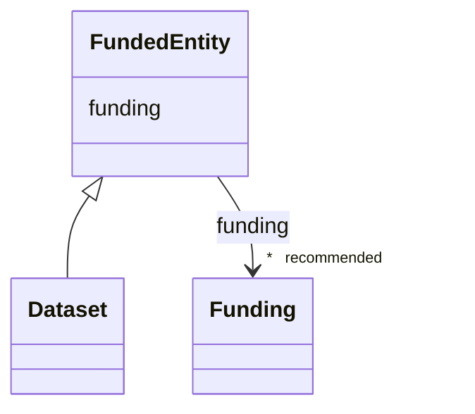

# Class: FundedEntity


_An entity with associated funding sources._


* __NOTE__: this is an abstract class and should not be instantiated directly


URI: [cdp-meta:FundedEntity](metadataFundedEntity)





<!-- no inheritance hierarchy -->


## Slots

| Name | Cardinality and Range | Description | Inheritance |
| ---  | --- | --- | --- |
| [funding](funding.md) | * _recommended_ <br/> [Funding](Funding.md) | A funding source for a scientific data entity (base for JSON and DB represent... | direct |


## Identifier and Mapping Information


### Schema Source


* from schema: metadata


## Mappings

| Mapping Type | Mapped Value |
| ---  | ---  |
| self | cdp-meta:FundedEntity |
| native | cdp-meta:FundedEntity |


## LinkML Source

<!-- TODO: investigate https://stackoverflow.com/questions/37606292/how-to-create-tabbed-code-blocks-in-mkdocs-or-sphinx -->

### Direct

<details>
```yaml
name: FundedEntity
description: An entity with associated funding sources.
from_schema: metadata
abstract: true
attributes:
  funding:
    name: funding
    description: A funding source for a scientific data entity (base for JSON and
      DB representation).
    from_schema: metadata
    rank: 1000
    list_elements_ordered: true
    alias: funding
    owner: FundedEntity
    domain_of:
    - FundedEntity
    - Dataset
    range: Funding
    recommended: true
    multivalued: true
    inlined: true
    inlined_as_list: true

```
</details>

### Induced

<details>
```yaml
name: FundedEntity
description: An entity with associated funding sources.
from_schema: metadata
abstract: true
attributes:
  funding:
    name: funding
    description: A funding source for a scientific data entity (base for JSON and
      DB representation).
    from_schema: metadata
    rank: 1000
    list_elements_ordered: true
    alias: funding
    owner: FundedEntity
    domain_of:
    - FundedEntity
    - Dataset
    range: Funding
    recommended: true
    multivalued: true
    inlined: true
    inlined_as_list: true

```
</details>
