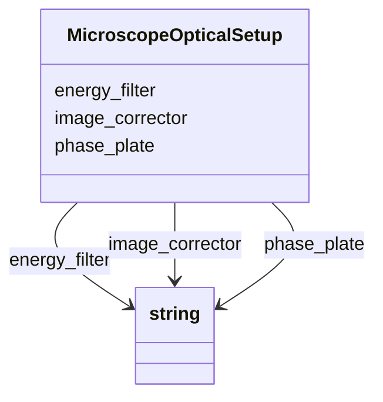

# Class: MicroscopeOpticalSetup


_The optical setup of the microscope used to collect the tilt series._


URI: [cdp-meta:MicroscopeOpticalSetup](metadataMicroscopeOpticalSetup)





<!-- no inheritance hierarchy -->


## Slots

| Name | Cardinality and Range | Description | Inheritance |
| ---  | --- | --- | --- |
| [energy_filter](energy_filter.md) | 0..1 <br/> [xsd:string](http://www.w3.org/2001/XMLSchema#string) | Energy filter setup used | direct |
| [phase_plate](phase_plate.md) | 0..1 <br/> [xsd:string](http://www.w3.org/2001/XMLSchema#string) | Phase plate configuration | direct |
| [image_corrector](image_corrector.md) | 0..1 <br/> [xsd:string](http://www.w3.org/2001/XMLSchema#string) | Image corrector setup | direct |


## Usages

| used by | used in | type | used |
| ---  | --- | --- | --- |
| [TiltSeries](TiltSeries.md) | [microscope_optical_setup](microscope_optical_setup.md) | range | [MicroscopeOpticalSetup](MicroscopeOpticalSetup.md) |


## Identifier and Mapping Information


### Schema Source


* from schema: metadata


## Mappings

| Mapping Type | Mapped Value |
| ---  | ---  |
| self | cdp-meta:MicroscopeOpticalSetup |
| native | cdp-meta:MicroscopeOpticalSetup |


## LinkML Source

<!-- TODO: investigate https://stackoverflow.com/questions/37606292/how-to-create-tabbed-code-blocks-in-mkdocs-or-sphinx -->

### Direct

<details>
```yaml
name: MicroscopeOpticalSetup
description: The optical setup of the microscope used to collect the tilt series.
from_schema: metadata
attributes:
  energy_filter:
    name: energy_filter
    description: Energy filter setup used
    from_schema: metadata
    exact_mappings:
    - cdp-common:tiltseries_microscope_energy_filter
    rank: 1000
    alias: energy_filter
    owner: MicroscopeOpticalSetup
    domain_of:
    - MicroscopeOpticalSetup
    range: string
    inlined: true
    inlined_as_list: true
  phase_plate:
    name: phase_plate
    description: Phase plate configuration
    from_schema: metadata
    exact_mappings:
    - cdp-common:tiltseries_microscope_phase_plate
    rank: 1000
    alias: phase_plate
    owner: MicroscopeOpticalSetup
    domain_of:
    - MicroscopeOpticalSetup
    range: string
    inlined: true
    inlined_as_list: true
  image_corrector:
    name: image_corrector
    description: Image corrector setup
    from_schema: metadata
    exact_mappings:
    - cdp-common:tiltseries_microscope_image_corrector
    rank: 1000
    alias: image_corrector
    owner: MicroscopeOpticalSetup
    domain_of:
    - MicroscopeOpticalSetup
    range: string
    inlined: true
    inlined_as_list: true

```
</details>

### Induced

<details>
```yaml
name: MicroscopeOpticalSetup
description: The optical setup of the microscope used to collect the tilt series.
from_schema: metadata
attributes:
  energy_filter:
    name: energy_filter
    description: Energy filter setup used
    from_schema: metadata
    exact_mappings:
    - cdp-common:tiltseries_microscope_energy_filter
    rank: 1000
    alias: energy_filter
    owner: MicroscopeOpticalSetup
    domain_of:
    - MicroscopeOpticalSetup
    range: string
    inlined: true
    inlined_as_list: true
  phase_plate:
    name: phase_plate
    description: Phase plate configuration
    from_schema: metadata
    exact_mappings:
    - cdp-common:tiltseries_microscope_phase_plate
    rank: 1000
    alias: phase_plate
    owner: MicroscopeOpticalSetup
    domain_of:
    - MicroscopeOpticalSetup
    range: string
    inlined: true
    inlined_as_list: true
  image_corrector:
    name: image_corrector
    description: Image corrector setup
    from_schema: metadata
    exact_mappings:
    - cdp-common:tiltseries_microscope_image_corrector
    rank: 1000
    alias: image_corrector
    owner: MicroscopeOpticalSetup
    domain_of:
    - MicroscopeOpticalSetup
    range: string
    inlined: true
    inlined_as_list: true

```
</details>