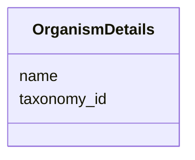

# Class: OrganismDetails


_The species from which the sample was derived._


URI: [cdp-meta:OrganismDetails](metadataOrganismDetails)





<!-- no inheritance hierarchy -->


## Slots

| Name | Cardinality and Range | Description | Inheritance |
| ---  | --- | --- | --- |
| [name](name.md) | 1 <br/> [String](String.md) | Name of the organism from which a biological sample used in a CryoET study is... | direct |
| [taxonomy_id](taxonomy_id.md) | 0..1 _recommended_ <br/> [Integer](Integer.md) | NCBI taxonomy identifier for the organism, e | direct |


## Usages

| used by | used in | type | used |
| ---  | --- | --- | --- |
| [ExperimentalMetadata](ExperimentalMetadata.md) | [organism](organism.md) | range | [OrganismDetails](OrganismDetails.md) |
| [Dataset](Dataset.md) | [organism](organism.md) | range | [OrganismDetails](OrganismDetails.md) |


## Identifier and Mapping Information


### Schema Source


* from schema: metadata


## Mappings

| Mapping Type | Mapped Value |
| ---  | ---  |
| self | cdp-meta:OrganismDetails |
| native | cdp-meta:OrganismDetails |


## LinkML Source

<!-- TODO: investigate https://stackoverflow.com/questions/37606292/how-to-create-tabbed-code-blocks-in-mkdocs-or-sphinx -->

### Direct

<details>
```yaml
name: OrganismDetails
description: The species from which the sample was derived.
from_schema: metadata
attributes:
  name:
    name: name
    description: Name of the organism from which a biological sample used in a CryoET
      study is derived from, e.g. homo sapiens.
    from_schema: metadata
    exact_mappings:
    - cdp-common:organism_name
    alias: name
    owner: OrganismDetails
    domain_of:
    - Author
    - OrganismDetails
    - TissueDetails
    - CellType
    - CellStrain
    - CellComponent
    - AnnotationObject
    - AnnotationMethodLinks
    range: string
    required: true
    inlined: true
    inlined_as_list: true
  taxonomy_id:
    name: taxonomy_id
    description: NCBI taxonomy identifier for the organism, e.g. 9606
    from_schema: metadata
    exact_mappings:
    - cdp-common:organism_taxid
    rank: 1000
    alias: taxonomy_id
    owner: OrganismDetails
    domain_of:
    - OrganismDetails
    range: integer
    recommended: true
    inlined: true
    inlined_as_list: true
    minimum_value: 1

```
</details>

### Induced

<details>
```yaml
name: OrganismDetails
description: The species from which the sample was derived.
from_schema: metadata
attributes:
  name:
    name: name
    description: Name of the organism from which a biological sample used in a CryoET
      study is derived from, e.g. homo sapiens.
    from_schema: metadata
    exact_mappings:
    - cdp-common:organism_name
    alias: name
    owner: OrganismDetails
    domain_of:
    - Author
    - OrganismDetails
    - TissueDetails
    - CellType
    - CellStrain
    - CellComponent
    - AnnotationObject
    - AnnotationMethodLinks
    range: string
    required: true
    inlined: true
    inlined_as_list: true
  taxonomy_id:
    name: taxonomy_id
    description: NCBI taxonomy identifier for the organism, e.g. 9606
    from_schema: metadata
    exact_mappings:
    - cdp-common:organism_taxid
    rank: 1000
    alias: taxonomy_id
    owner: OrganismDetails
    domain_of:
    - OrganismDetails
    range: integer
    recommended: true
    inlined: true
    inlined_as_list: true
    minimum_value: 1

```
</details>