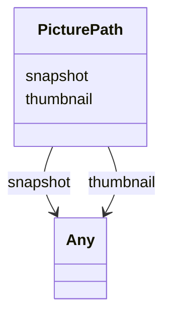

# Class: PicturePath


_A set of paths to representative images of a piece of data._


URI: [cdp-meta:PicturePath](metadataPicturePath)





<!-- no inheritance hierarchy -->


## Slots

| Name | Cardinality and Range | Description | Inheritance |
| ---  | --- | --- | --- |
| [snapshot](snapshot.md) | 1..1 <br/> [Any](Any.md) | A placeholder for any type of data | direct |
| [thumbnail](thumbnail.md) | 1..1 <br/> [Any](Any.md) | A placeholder for any type of data | direct |


## Usages

| used by | used in | type | used |
| ---  | --- | --- | --- |
| [PicturedEntity](PicturedEntity.md) | [key_photos](key_photos.md) | range | [PicturePath](PicturePath.md) |


## Identifier and Mapping Information


### Schema Source


* from schema: metadata


## Mappings

| Mapping Type | Mapped Value |
| ---  | ---  |
| self | cdp-meta:PicturePath |
| native | cdp-meta:PicturePath |


## LinkML Source

<!-- TODO: investigate https://stackoverflow.com/questions/37606292/how-to-create-tabbed-code-blocks-in-mkdocs-or-sphinx -->

### Direct

<details>
```yaml
name: PicturePath
description: A set of paths to representative images of a piece of data.
from_schema: metadata
attributes:
  snapshot:
    name: snapshot
    description: A placeholder for any type of data.
    from_schema: metadata
    exact_mappings:
    - cdp-common:snapshot
    rank: 1000
    alias: snapshot
    owner: PicturePath
    domain_of:
    - PicturePath
    range: Any
    required: true
    inlined: true
    inlined_as_list: true
  thumbnail:
    name: thumbnail
    description: A placeholder for any type of data.
    from_schema: metadata
    exact_mappings:
    - cdp-common:thumbnail
    rank: 1000
    alias: thumbnail
    owner: PicturePath
    domain_of:
    - PicturePath
    range: Any
    required: true
    inlined: true
    inlined_as_list: true

```
</details>

### Induced

<details>
```yaml
name: PicturePath
description: A set of paths to representative images of a piece of data.
from_schema: metadata
attributes:
  snapshot:
    name: snapshot
    description: A placeholder for any type of data.
    from_schema: metadata
    exact_mappings:
    - cdp-common:snapshot
    rank: 1000
    alias: snapshot
    owner: PicturePath
    domain_of:
    - PicturePath
    range: Any
    required: true
    inlined: true
    inlined_as_list: true
  thumbnail:
    name: thumbnail
    description: A placeholder for any type of data.
    from_schema: metadata
    exact_mappings:
    - cdp-common:thumbnail
    rank: 1000
    alias: thumbnail
    owner: PicturePath
    domain_of:
    - PicturePath
    range: Any
    required: true
    inlined: true
    inlined_as_list: true

```
</details>
