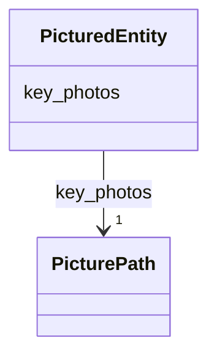

# Class: PicturedEntity


_An entity with associated preview images._


* __NOTE__: this is an abstract class and should not be instantiated directly


URI: [cdp-meta:PicturedEntity](metadataPicturedEntity)





<!-- no inheritance hierarchy -->


## Slots

| Name | Cardinality and Range | Description | Inheritance |
| ---  | --- | --- | --- |
| [key_photos](key_photos.md) | 1 <br/> [PicturePath](PicturePath.md) | A set of paths to representative images of a piece of data | direct |


## Identifier and Mapping Information


### Schema Source


* from schema: metadata


## Mappings

| Mapping Type | Mapped Value |
| ---  | ---  |
| self | cdp-meta:PicturedEntity |
| native | cdp-meta:PicturedEntity |


## LinkML Source

<!-- TODO: investigate https://stackoverflow.com/questions/37606292/how-to-create-tabbed-code-blocks-in-mkdocs-or-sphinx -->

### Direct

<details>
```yaml
name: PicturedEntity
description: An entity with associated preview images.
from_schema: metadata
abstract: true
attributes:
  key_photos:
    name: key_photos
    description: A set of paths to representative images of a piece of data.
    from_schema: metadata
    rank: 1000
    alias: key_photos
    owner: PicturedEntity
    domain_of:
    - PicturedEntity
    range: PicturePath
    required: true
    inlined: true
    inlined_as_list: true

```
</details>

### Induced

<details>
```yaml
name: PicturedEntity
description: An entity with associated preview images.
from_schema: metadata
abstract: true
attributes:
  key_photos:
    name: key_photos
    description: A set of paths to representative images of a piece of data.
    from_schema: metadata
    rank: 1000
    alias: key_photos
    owner: PicturedEntity
    domain_of:
    - PicturedEntity
    range: PicturePath
    required: true
    inlined: true
    inlined_as_list: true

```
</details>