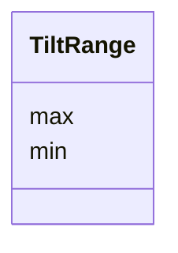

# Class: TiltRange


_The range of tilt angles in the tilt series._


URI: [cdp-meta:TiltRange](metadataTiltRange)





<!-- no inheritance hierarchy -->


## Slots

| Name | Cardinality and Range | Description | Inheritance |
| ---  | --- | --- | --- |
| [min](min.md) | 1 <br/> [String](String.md)&nbsp;or&nbsp;<br />[Float](Float.md)&nbsp;or&nbsp;<br />[FloatFormattedString](FloatFormattedString.md) | Minimal tilt angle in degrees | direct |
| [max](max.md) | 1 <br/> [String](String.md)&nbsp;or&nbsp;<br />[Float](Float.md)&nbsp;or&nbsp;<br />[FloatFormattedString](FloatFormattedString.md) | Maximal tilt angle in degrees | direct |


## Usages

| used by | used in | type | used |
| ---  | --- | --- | --- |
| [TiltSeries](TiltSeries.md) | [tilt_range](tilt_range.md) | range | [TiltRange](TiltRange.md) |


## Identifier and Mapping Information


### Schema Source


* from schema: metadata


## Mappings

| Mapping Type | Mapped Value |
| ---  | ---  |
| self | cdp-meta:TiltRange |
| native | cdp-meta:TiltRange |


## LinkML Source

<!-- TODO: investigate https://stackoverflow.com/questions/37606292/how-to-create-tabbed-code-blocks-in-mkdocs-or-sphinx -->

### Direct

<details>
```yaml
name: TiltRange
description: The range of tilt angles in the tilt series.
from_schema: metadata
attributes:
  min:
    name: min
    description: Minimal tilt angle in degrees
    from_schema: metadata
    exact_mappings:
    - cdp-common:tiltseries_tilt_min
    rank: 1000
    alias: min
    owner: TiltRange
    domain_of:
    - TiltRange
    required: true
    inlined: true
    inlined_as_list: true
    minimum_value: -90
    maximum_value: 90
    pattern: ^float[ ]*\{[a-zA-Z0-9_-]+\}[ ]*$
    unit:
      symbol: °
      descriptive_name: degrees
    any_of:
    - range: float
      minimum_value: -90
      maximum_value: 90
    - range: FloatFormattedString
  max:
    name: max
    description: Maximal tilt angle in degrees
    from_schema: metadata
    exact_mappings:
    - cdp-common:tiltseries_tilt_max
    rank: 1000
    alias: max
    owner: TiltRange
    domain_of:
    - TiltRange
    required: true
    inlined: true
    inlined_as_list: true
    minimum_value: -90
    maximum_value: 90
    pattern: ^float[ ]*\{[a-zA-Z0-9_-]+\}[ ]*$
    unit:
      symbol: °
      descriptive_name: degrees
    any_of:
    - range: float
      minimum_value: -90
      maximum_value: 90
    - range: FloatFormattedString

```
</details>

### Induced

<details>
```yaml
name: TiltRange
description: The range of tilt angles in the tilt series.
from_schema: metadata
attributes:
  min:
    name: min
    description: Minimal tilt angle in degrees
    from_schema: metadata
    exact_mappings:
    - cdp-common:tiltseries_tilt_min
    rank: 1000
    alias: min
    owner: TiltRange
    domain_of:
    - TiltRange
    range: string
    required: true
    inlined: true
    inlined_as_list: true
    minimum_value: -90
    maximum_value: 90
    pattern: ^float[ ]*\{[a-zA-Z0-9_-]+\}[ ]*$
    unit:
      symbol: °
      descriptive_name: degrees
    any_of:
    - range: float
      minimum_value: -90
      maximum_value: 90
    - range: FloatFormattedString
  max:
    name: max
    description: Maximal tilt angle in degrees
    from_schema: metadata
    exact_mappings:
    - cdp-common:tiltseries_tilt_max
    rank: 1000
    alias: max
    owner: TiltRange
    domain_of:
    - TiltRange
    range: string
    required: true
    inlined: true
    inlined_as_list: true
    minimum_value: -90
    maximum_value: 90
    pattern: ^float[ ]*\{[a-zA-Z0-9_-]+\}[ ]*$
    unit:
      symbol: °
      descriptive_name: degrees
    any_of:
    - range: float
      minimum_value: -90
      maximum_value: 90
    - range: FloatFormattedString

```
</details>
