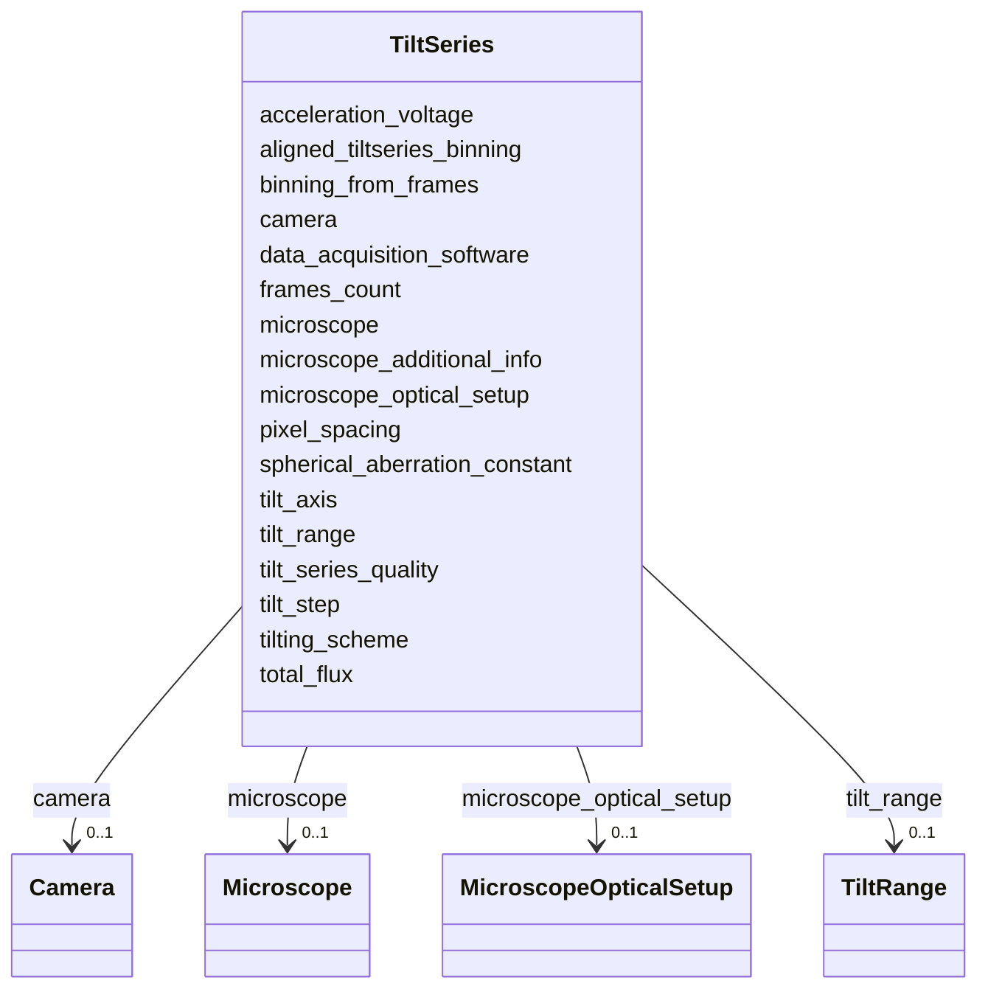

# Class: TiltSeries


_Metadata describing a tilt series._


URI: [cdp-meta:TiltSeries](metadataTiltSeries)





<!-- no inheritance hierarchy -->


## Slots

| Name | Cardinality and Range | Description | Inheritance |
| ---  | --- | --- | --- |
| [acceleration_voltage](acceleration_voltage.md) | 0..1 <br/> [Integer](Integer.md) | Electron Microscope Accelerator voltage in volts | direct |
| [spherical_aberration_constant](spherical_aberration_constant.md) | 0..1 <br/> [Float](Float.md) | Spherical Aberration Constant of the objective lens in millimeters | direct |
| [microscope_additional_info](microscope_additional_info.md) | 0..1 <br/> [String](String.md) | Other microscope optical setup information, in addition to energy filter, pha... | direct |
| [tilt_axis](tilt_axis.md) | 0..1 <br/> [Float](Float.md) | Rotation angle in degrees | direct |
| [tilt_step](tilt_step.md) | 0..1 <br/> [Float](Float.md) | Tilt step in degrees | direct |
| [tilting_scheme](tilting_scheme.md) | 0..1 <br/> [String](String.md) | The order of stage tilting during acquisition of the data | direct |
| [total_flux](total_flux.md) | 0..1 <br/> [Float](Float.md) | Number of Electrons reaching the specimen in a square Angstrom area for the e... | direct |
| [data_acquisition_software](data_acquisition_software.md) | 0..1 <br/> [String](String.md) | Software used to collect data | direct |
| [binning_from_frames](binning_from_frames.md) | 0..1 <br/> [Float](Float.md) | Describes the binning factor from frames to tilt series file | direct |
| [tilt_series_quality](tilt_series_quality.md) | 0..1 <br/> [Integer](Integer.md) | Author assessment of tilt series quality within the dataset (1-5, 5 is best) | direct |
| [pixel_spacing](pixel_spacing.md) | 0..1 <br/> [Float](Float.md) | Pixel spacing for the tilt series | direct |
| [aligned_tiltseries_binning](aligned_tiltseries_binning.md) | 0..1 <br/> [Integer](Integer.md) | Binning factor of the aligned tilt series | direct |
| [frames_count](frames_count.md) | 0..1 <br/> [Integer](Integer.md) | Number of frames associated with this tiltseries | direct |
| [camera](camera.md) | 0..1 <br/> [Camera](Camera.md) | The camera used to collect the tilt series | direct |
| [microscope](microscope.md) | 0..1 <br/> [Microscope](Microscope.md) | The microscope used to collect the tilt series | direct |
| [microscope_optical_setup](microscope_optical_setup.md) | 0..1 <br/> [MicroscopeOpticalSetup](MicroscopeOpticalSetup.md) | The optical setup of the microscope used to collect the tilt series | direct |
| [tilt_range](tilt_range.md) | 0..1 <br/> [TiltRange](TiltRange.md) | The range of tilt angles in the tilt series | direct |


## Identifier and Mapping Information


### Schema Source


* from schema: metadata


## Mappings

| Mapping Type | Mapped Value |
| ---  | ---  |
| self | cdp-meta:TiltSeries |
| native | cdp-meta:TiltSeries |


## LinkML Source

<!-- TODO: investigate https://stackoverflow.com/questions/37606292/how-to-create-tabbed-code-blocks-in-mkdocs-or-sphinx -->

### Direct

<details>
```yaml
name: TiltSeries
description: Metadata describing a tilt series.
from_schema: metadata
attributes:
  acceleration_voltage:
    name: acceleration_voltage
    description: Electron Microscope Accelerator voltage in volts
    from_schema: metadata
    exact_mappings:
    - cdp-common:tiltseries_acceleration_voltage
    rank: 1000
    alias: acceleration_voltage
    owner: TiltSeries
    domain_of:
    - TiltSeries
    range: integer
    inlined: true
    inlined_as_list: true
  spherical_aberration_constant:
    name: spherical_aberration_constant
    description: Spherical Aberration Constant of the objective lens in millimeters
    from_schema: metadata
    exact_mappings:
    - cdp-common:tiltseries_spherical_aberration_constant
    rank: 1000
    alias: spherical_aberration_constant
    owner: TiltSeries
    domain_of:
    - TiltSeries
    range: float
    inlined: true
    inlined_as_list: true
  microscope_additional_info:
    name: microscope_additional_info
    description: Other microscope optical setup information, in addition to energy
      filter, phase plate and image corrector
    from_schema: metadata
    exact_mappings:
    - cdp-common:tiltseries_microscope_additional_info
    rank: 1000
    alias: microscope_additional_info
    owner: TiltSeries
    domain_of:
    - TiltSeries
    range: string
    inlined: true
    inlined_as_list: true
  tilt_axis:
    name: tilt_axis
    description: Rotation angle in degrees
    from_schema: metadata
    exact_mappings:
    - cdp-common:tiltseries_tilt_axis
    rank: 1000
    alias: tilt_axis
    owner: TiltSeries
    domain_of:
    - TiltSeries
    range: float
    inlined: true
    inlined_as_list: true
  tilt_step:
    name: tilt_step
    description: Tilt step in degrees
    from_schema: metadata
    exact_mappings:
    - cdp-common:tiltseries_tilt_step
    rank: 1000
    alias: tilt_step
    owner: TiltSeries
    domain_of:
    - TiltSeries
    range: float
    inlined: true
    inlined_as_list: true
  tilting_scheme:
    name: tilting_scheme
    description: The order of stage tilting during acquisition of the data
    from_schema: metadata
    exact_mappings:
    - cdp-common:tiltseries_tilting_scheme
    rank: 1000
    alias: tilting_scheme
    owner: TiltSeries
    domain_of:
    - TiltSeries
    range: string
    inlined: true
    inlined_as_list: true
  total_flux:
    name: total_flux
    description: Number of Electrons reaching the specimen in a square Angstrom area
      for the entire tilt series
    from_schema: metadata
    exact_mappings:
    - cdp-common:tiltseries_total_flux
    rank: 1000
    alias: total_flux
    owner: TiltSeries
    domain_of:
    - TiltSeries
    range: float
    inlined: true
    inlined_as_list: true
  data_acquisition_software:
    name: data_acquisition_software
    description: Software used to collect data
    from_schema: metadata
    exact_mappings:
    - cdp-common:tiltseries_data_acquisition_software
    rank: 1000
    alias: data_acquisition_software
    owner: TiltSeries
    domain_of:
    - TiltSeries
    range: string
    inlined: true
    inlined_as_list: true
  binning_from_frames:
    name: binning_from_frames
    description: Describes the binning factor from frames to tilt series file
    from_schema: metadata
    exact_mappings:
    - cdp-common:tiltseries_binning_from_frames
    rank: 1000
    alias: binning_from_frames
    owner: TiltSeries
    domain_of:
    - TiltSeries
    range: float
    inlined: true
    inlined_as_list: true
  tilt_series_quality:
    name: tilt_series_quality
    description: Author assessment of tilt series quality within the dataset (1-5,
      5 is best)
    from_schema: metadata
    exact_mappings:
    - cdp-common:tiltseries_tilt_series_quality
    rank: 1000
    alias: tilt_series_quality
    owner: TiltSeries
    domain_of:
    - TiltSeries
    range: integer
    inlined: true
    inlined_as_list: true
  pixel_spacing:
    name: pixel_spacing
    description: Pixel spacing for the tilt series
    from_schema: metadata
    exact_mappings:
    - cdp-common:tiltseries_pixel_spacing
    rank: 1000
    alias: pixel_spacing
    owner: TiltSeries
    domain_of:
    - TiltSeries
    range: float
    inlined: true
    inlined_as_list: true
  aligned_tiltseries_binning:
    name: aligned_tiltseries_binning
    description: Binning factor of the aligned tilt series
    from_schema: metadata
    exact_mappings:
    - cdp-common:tiltseries_aligned_tiltseries_binning
    rank: 1000
    alias: aligned_tiltseries_binning
    owner: TiltSeries
    domain_of:
    - TiltSeries
    range: integer
    inlined: true
    inlined_as_list: true
  frames_count:
    name: frames_count
    description: Number of frames associated with this tiltseries
    from_schema: metadata
    exact_mappings:
    - cdp-common:tiltseries_frames_count
    rank: 1000
    alias: frames_count
    owner: TiltSeries
    domain_of:
    - TiltSeries
    range: integer
    inlined: true
    inlined_as_list: true
  camera:
    name: camera
    description: The camera used to collect the tilt series.
    from_schema: metadata
    rank: 1000
    alias: camera
    owner: TiltSeries
    domain_of:
    - TiltSeries
    range: Camera
    inlined: true
    inlined_as_list: true
  microscope:
    name: microscope
    description: The microscope used to collect the tilt series.
    from_schema: metadata
    rank: 1000
    alias: microscope
    owner: TiltSeries
    domain_of:
    - TiltSeries
    range: Microscope
    inlined: true
    inlined_as_list: true
  microscope_optical_setup:
    name: microscope_optical_setup
    description: The optical setup of the microscope used to collect the tilt series.
    from_schema: metadata
    rank: 1000
    alias: microscope_optical_setup
    owner: TiltSeries
    domain_of:
    - TiltSeries
    range: MicroscopeOpticalSetup
    inlined: true
    inlined_as_list: true
  tilt_range:
    name: tilt_range
    description: The range of tilt angles in the tilt series.
    from_schema: metadata
    rank: 1000
    alias: tilt_range
    owner: TiltSeries
    domain_of:
    - TiltSeries
    range: TiltRange
    inlined: true
    inlined_as_list: true

```
</details>

### Induced

<details>
```yaml
name: TiltSeries
description: Metadata describing a tilt series.
from_schema: metadata
attributes:
  acceleration_voltage:
    name: acceleration_voltage
    description: Electron Microscope Accelerator voltage in volts
    from_schema: metadata
    exact_mappings:
    - cdp-common:tiltseries_acceleration_voltage
    rank: 1000
    alias: acceleration_voltage
    owner: TiltSeries
    domain_of:
    - TiltSeries
    range: integer
    inlined: true
    inlined_as_list: true
  spherical_aberration_constant:
    name: spherical_aberration_constant
    description: Spherical Aberration Constant of the objective lens in millimeters
    from_schema: metadata
    exact_mappings:
    - cdp-common:tiltseries_spherical_aberration_constant
    rank: 1000
    alias: spherical_aberration_constant
    owner: TiltSeries
    domain_of:
    - TiltSeries
    range: float
    inlined: true
    inlined_as_list: true
  microscope_additional_info:
    name: microscope_additional_info
    description: Other microscope optical setup information, in addition to energy
      filter, phase plate and image corrector
    from_schema: metadata
    exact_mappings:
    - cdp-common:tiltseries_microscope_additional_info
    rank: 1000
    alias: microscope_additional_info
    owner: TiltSeries
    domain_of:
    - TiltSeries
    range: string
    inlined: true
    inlined_as_list: true
  tilt_axis:
    name: tilt_axis
    description: Rotation angle in degrees
    from_schema: metadata
    exact_mappings:
    - cdp-common:tiltseries_tilt_axis
    rank: 1000
    alias: tilt_axis
    owner: TiltSeries
    domain_of:
    - TiltSeries
    range: float
    inlined: true
    inlined_as_list: true
  tilt_step:
    name: tilt_step
    description: Tilt step in degrees
    from_schema: metadata
    exact_mappings:
    - cdp-common:tiltseries_tilt_step
    rank: 1000
    alias: tilt_step
    owner: TiltSeries
    domain_of:
    - TiltSeries
    range: float
    inlined: true
    inlined_as_list: true
  tilting_scheme:
    name: tilting_scheme
    description: The order of stage tilting during acquisition of the data
    from_schema: metadata
    exact_mappings:
    - cdp-common:tiltseries_tilting_scheme
    rank: 1000
    alias: tilting_scheme
    owner: TiltSeries
    domain_of:
    - TiltSeries
    range: string
    inlined: true
    inlined_as_list: true
  total_flux:
    name: total_flux
    description: Number of Electrons reaching the specimen in a square Angstrom area
      for the entire tilt series
    from_schema: metadata
    exact_mappings:
    - cdp-common:tiltseries_total_flux
    rank: 1000
    alias: total_flux
    owner: TiltSeries
    domain_of:
    - TiltSeries
    range: float
    inlined: true
    inlined_as_list: true
  data_acquisition_software:
    name: data_acquisition_software
    description: Software used to collect data
    from_schema: metadata
    exact_mappings:
    - cdp-common:tiltseries_data_acquisition_software
    rank: 1000
    alias: data_acquisition_software
    owner: TiltSeries
    domain_of:
    - TiltSeries
    range: string
    inlined: true
    inlined_as_list: true
  binning_from_frames:
    name: binning_from_frames
    description: Describes the binning factor from frames to tilt series file
    from_schema: metadata
    exact_mappings:
    - cdp-common:tiltseries_binning_from_frames
    rank: 1000
    alias: binning_from_frames
    owner: TiltSeries
    domain_of:
    - TiltSeries
    range: float
    inlined: true
    inlined_as_list: true
  tilt_series_quality:
    name: tilt_series_quality
    description: Author assessment of tilt series quality within the dataset (1-5,
      5 is best)
    from_schema: metadata
    exact_mappings:
    - cdp-common:tiltseries_tilt_series_quality
    rank: 1000
    alias: tilt_series_quality
    owner: TiltSeries
    domain_of:
    - TiltSeries
    range: integer
    inlined: true
    inlined_as_list: true
  pixel_spacing:
    name: pixel_spacing
    description: Pixel spacing for the tilt series
    from_schema: metadata
    exact_mappings:
    - cdp-common:tiltseries_pixel_spacing
    rank: 1000
    alias: pixel_spacing
    owner: TiltSeries
    domain_of:
    - TiltSeries
    range: float
    inlined: true
    inlined_as_list: true
  aligned_tiltseries_binning:
    name: aligned_tiltseries_binning
    description: Binning factor of the aligned tilt series
    from_schema: metadata
    exact_mappings:
    - cdp-common:tiltseries_aligned_tiltseries_binning
    rank: 1000
    alias: aligned_tiltseries_binning
    owner: TiltSeries
    domain_of:
    - TiltSeries
    range: integer
    inlined: true
    inlined_as_list: true
  frames_count:
    name: frames_count
    description: Number of frames associated with this tiltseries
    from_schema: metadata
    exact_mappings:
    - cdp-common:tiltseries_frames_count
    rank: 1000
    alias: frames_count
    owner: TiltSeries
    domain_of:
    - TiltSeries
    range: integer
    inlined: true
    inlined_as_list: true
  camera:
    name: camera
    description: The camera used to collect the tilt series.
    from_schema: metadata
    rank: 1000
    alias: camera
    owner: TiltSeries
    domain_of:
    - TiltSeries
    range: Camera
    inlined: true
    inlined_as_list: true
  microscope:
    name: microscope
    description: The microscope used to collect the tilt series.
    from_schema: metadata
    rank: 1000
    alias: microscope
    owner: TiltSeries
    domain_of:
    - TiltSeries
    range: Microscope
    inlined: true
    inlined_as_list: true
  microscope_optical_setup:
    name: microscope_optical_setup
    description: The optical setup of the microscope used to collect the tilt series.
    from_schema: metadata
    rank: 1000
    alias: microscope_optical_setup
    owner: TiltSeries
    domain_of:
    - TiltSeries
    range: MicroscopeOpticalSetup
    inlined: true
    inlined_as_list: true
  tilt_range:
    name: tilt_range
    description: The range of tilt angles in the tilt series.
    from_schema: metadata
    rank: 1000
    alias: tilt_range
    owner: TiltSeries
    domain_of:
    - TiltSeries
    range: TiltRange
    inlined: true
    inlined_as_list: true

```
</details>