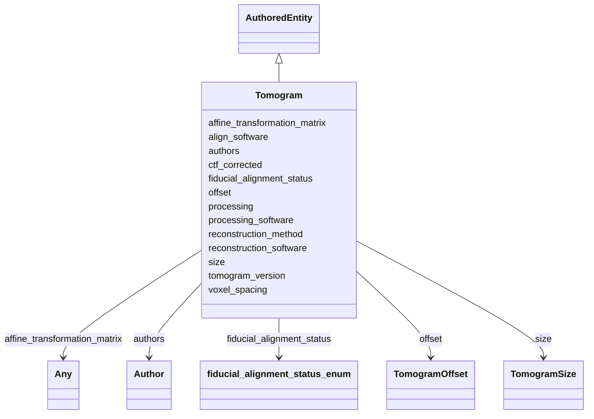

# Class: Tomogram


_Metadata describing a tomogram._


URI: [cdp-meta:Tomogram](metadataTomogram)





## Inheritance
* **Tomogram** [ [AuthoredEntity](AuthoredEntity.md)]


## Slots

| Name | Cardinality and Range | Description | Inheritance |
| ---  | --- | --- | --- |
| [voxel_spacing](voxel_spacing.md) | 1..1 <br/> [Float](Float.md) | Voxel spacing equal in all three axes in angstroms | direct |
| [fiducial_alignment_status](fiducial_alignment_status.md) | 1..1 <br/> [FiducialAlignmentStatusEnum](FiducialAlignmentStatusEnum.md) | Whether the tomographic alignment was computed based on fiducial markers | direct |
| [ctf_corrected](ctf_corrected.md) | 0..1 _recommended_ <br/> [Boolean](Boolean.md) | Whether this tomogram is CTF corrected | direct |
| [align_software](align_software.md) | 0..1 <br/> [String](String.md) | Software used for alignment | direct |
| [reconstruction_method](reconstruction_method.md) | 1..1 <br/> [String](String.md) | Describe reconstruction method (Weighted back-projection, SART, SIRT) | direct |
| [reconstruction_software](reconstruction_software.md) | 1..1 <br/> [String](String.md) | Name of software used for reconstruction | direct |
| [processing](processing.md) | 1..1 <br/> [String](String.md) | Describe additional processing used to derive the tomogram | direct |
| [processing_software](processing_software.md) | 0..1 _recommended_ <br/> [String](String.md) | Processing software used to derive the tomogram | direct |
| [tomogram_version](tomogram_version.md) | 1..1 <br/> [VersionString](VersionString.md) | Version of tomogram | direct |
| [affine_transformation_matrix](affine_transformation_matrix.md) | 0..1 <br/> [Any](Any.md) | A placeholder for any type of data | direct |
| [size](size.md) | 0..1 <br/> [TomogramSize](TomogramSize.md) | The size of a tomogram in voxels in each dimension | direct |
| [offset](offset.md) | 1..1 <br/> [TomogramOffset](TomogramOffset.md) | The offset of a tomogram in voxels in each dimension relative to the canonica... | direct |
| [authors](authors.md) | 1..* <br/> [Author](Author.md) | Author of a scientific data entity | direct |


## Identifier and Mapping Information


### Schema Source


* from schema: metadata


## Mappings

| Mapping Type | Mapped Value |
| ---  | ---  |
| self | cdp-meta:Tomogram |
| native | cdp-meta:Tomogram |


## LinkML Source

<!-- TODO: investigate https://stackoverflow.com/questions/37606292/how-to-create-tabbed-code-blocks-in-mkdocs-or-sphinx -->

### Direct

<details>
```yaml
name: Tomogram
description: Metadata describing a tomogram.
from_schema: metadata
mixins:
- AuthoredEntity
attributes:
  voxel_spacing:
    name: voxel_spacing
    description: Voxel spacing equal in all three axes in angstroms
    from_schema: metadata
    exact_mappings:
    - cdp-common:tomogram_voxel_spacing
    rank: 1000
    alias: voxel_spacing
    owner: Tomogram
    domain_of:
    - Tomogram
    range: float
    required: true
    inlined: true
    inlined_as_list: true
    unit:
      symbol: Å/voxel
      descriptive_name: Angstroms per voxel
  fiducial_alignment_status:
    name: fiducial_alignment_status
    description: Whether the tomographic alignment was computed based on fiducial
      markers.
    from_schema: metadata
    exact_mappings:
    - cdp-common:tomogram_fiducial_alignment_status
    rank: 1000
    alias: fiducial_alignment_status
    owner: Tomogram
    domain_of:
    - Tomogram
    range: fiducial_alignment_status_enum
    required: true
    inlined: true
    inlined_as_list: true
  ctf_corrected:
    name: ctf_corrected
    description: Whether this tomogram is CTF corrected
    from_schema: metadata
    exact_mappings:
    - cdp-common:tomogram_ctf_corrected
    rank: 1000
    alias: ctf_corrected
    owner: Tomogram
    domain_of:
    - Tomogram
    range: boolean
    recommended: true
    inlined: true
    inlined_as_list: true
  align_software:
    name: align_software
    description: Software used for alignment
    from_schema: metadata
    exact_mappings:
    - cdp-common:tomogram_align_software
    rank: 1000
    alias: align_software
    owner: Tomogram
    domain_of:
    - Tomogram
    range: string
    inlined: true
    inlined_as_list: true
  reconstruction_method:
    name: reconstruction_method
    description: Describe reconstruction method (Weighted back-projection, SART, SIRT)
    from_schema: metadata
    exact_mappings:
    - cdp-common:tomogram_reconstruction_method
    rank: 1000
    alias: reconstruction_method
    owner: Tomogram
    domain_of:
    - Tomogram
    range: string
    required: true
    inlined: true
    inlined_as_list: true
  reconstruction_software:
    name: reconstruction_software
    description: Name of software used for reconstruction
    from_schema: metadata
    exact_mappings:
    - cdp-common:tomogram_reconstruction_software
    rank: 1000
    alias: reconstruction_software
    owner: Tomogram
    domain_of:
    - Tomogram
    range: string
    required: true
    inlined: true
    inlined_as_list: true
  processing:
    name: processing
    description: Describe additional processing used to derive the tomogram
    from_schema: metadata
    exact_mappings:
    - cdp-common:tomogram_processing
    rank: 1000
    alias: processing
    owner: Tomogram
    domain_of:
    - Tomogram
    range: string
    required: true
    inlined: true
    inlined_as_list: true
  processing_software:
    name: processing_software
    description: Processing software used to derive the tomogram
    from_schema: metadata
    exact_mappings:
    - cdp-common:tomogram_processing_software
    rank: 1000
    alias: processing_software
    owner: Tomogram
    domain_of:
    - Tomogram
    range: string
    recommended: true
    inlined: true
    inlined_as_list: true
  tomogram_version:
    name: tomogram_version
    description: Version of tomogram
    from_schema: metadata
    exact_mappings:
    - cdp-common:tomogram_version
    rank: 1000
    alias: tomogram_version
    owner: Tomogram
    domain_of:
    - Tomogram
    range: VersionString
    required: true
    inlined: true
    inlined_as_list: true
  affine_transformation_matrix:
    name: affine_transformation_matrix
    description: A placeholder for any type of data.
    from_schema: metadata
    rank: 1000
    array:
      exact_number_dimensions: 2
      dimensions:
      - exact_cardinality: 4
      - exact_cardinality: 4
    alias: affine_transformation_matrix
    owner: Tomogram
    domain_of:
    - Tomogram
    range: Any
    inlined: true
    inlined_as_list: true
  size:
    name: size
    description: The size of a tomogram in voxels in each dimension.
    from_schema: metadata
    rank: 1000
    alias: size
    owner: Tomogram
    domain_of:
    - Tomogram
    range: TomogramSize
    inlined: true
    inlined_as_list: true
  offset:
    name: offset
    description: The offset of a tomogram in voxels in each dimension relative to
      the canonical tomogram.
    from_schema: metadata
    rank: 1000
    alias: offset
    owner: Tomogram
    domain_of:
    - Tomogram
    range: TomogramOffset
    required: true
    inlined: true
    inlined_as_list: true
  authors:
    name: authors
    description: Author of a scientific data entity.
    from_schema: metadata
    multivalued: true
    list_elements_ordered: true
    alias: authors
    owner: Tomogram
    domain_of:
    - AuthoredEntity
    - Dataset
    - Tomogram
    - Annotation
    range: Author
    required: true
    inlined: true
    inlined_as_list: true

```
</details>

### Induced

<details>
```yaml
name: Tomogram
description: Metadata describing a tomogram.
from_schema: metadata
mixins:
- AuthoredEntity
attributes:
  voxel_spacing:
    name: voxel_spacing
    description: Voxel spacing equal in all three axes in angstroms
    from_schema: metadata
    exact_mappings:
    - cdp-common:tomogram_voxel_spacing
    rank: 1000
    alias: voxel_spacing
    owner: Tomogram
    domain_of:
    - Tomogram
    range: float
    required: true
    inlined: true
    inlined_as_list: true
    unit:
      symbol: Å/voxel
      descriptive_name: Angstroms per voxel
  fiducial_alignment_status:
    name: fiducial_alignment_status
    description: Whether the tomographic alignment was computed based on fiducial
      markers.
    from_schema: metadata
    exact_mappings:
    - cdp-common:tomogram_fiducial_alignment_status
    rank: 1000
    alias: fiducial_alignment_status
    owner: Tomogram
    domain_of:
    - Tomogram
    range: fiducial_alignment_status_enum
    required: true
    inlined: true
    inlined_as_list: true
  ctf_corrected:
    name: ctf_corrected
    description: Whether this tomogram is CTF corrected
    from_schema: metadata
    exact_mappings:
    - cdp-common:tomogram_ctf_corrected
    rank: 1000
    alias: ctf_corrected
    owner: Tomogram
    domain_of:
    - Tomogram
    range: boolean
    recommended: true
    inlined: true
    inlined_as_list: true
  align_software:
    name: align_software
    description: Software used for alignment
    from_schema: metadata
    exact_mappings:
    - cdp-common:tomogram_align_software
    rank: 1000
    alias: align_software
    owner: Tomogram
    domain_of:
    - Tomogram
    range: string
    inlined: true
    inlined_as_list: true
  reconstruction_method:
    name: reconstruction_method
    description: Describe reconstruction method (Weighted back-projection, SART, SIRT)
    from_schema: metadata
    exact_mappings:
    - cdp-common:tomogram_reconstruction_method
    rank: 1000
    alias: reconstruction_method
    owner: Tomogram
    domain_of:
    - Tomogram
    range: string
    required: true
    inlined: true
    inlined_as_list: true
  reconstruction_software:
    name: reconstruction_software
    description: Name of software used for reconstruction
    from_schema: metadata
    exact_mappings:
    - cdp-common:tomogram_reconstruction_software
    rank: 1000
    alias: reconstruction_software
    owner: Tomogram
    domain_of:
    - Tomogram
    range: string
    required: true
    inlined: true
    inlined_as_list: true
  processing:
    name: processing
    description: Describe additional processing used to derive the tomogram
    from_schema: metadata
    exact_mappings:
    - cdp-common:tomogram_processing
    rank: 1000
    alias: processing
    owner: Tomogram
    domain_of:
    - Tomogram
    range: string
    required: true
    inlined: true
    inlined_as_list: true
  processing_software:
    name: processing_software
    description: Processing software used to derive the tomogram
    from_schema: metadata
    exact_mappings:
    - cdp-common:tomogram_processing_software
    rank: 1000
    alias: processing_software
    owner: Tomogram
    domain_of:
    - Tomogram
    range: string
    recommended: true
    inlined: true
    inlined_as_list: true
  tomogram_version:
    name: tomogram_version
    description: Version of tomogram
    from_schema: metadata
    exact_mappings:
    - cdp-common:tomogram_version
    rank: 1000
    alias: tomogram_version
    owner: Tomogram
    domain_of:
    - Tomogram
    range: VersionString
    required: true
    inlined: true
    inlined_as_list: true
  affine_transformation_matrix:
    name: affine_transformation_matrix
    description: A placeholder for any type of data.
    from_schema: metadata
    rank: 1000
    array:
      exact_number_dimensions: 2
      dimensions:
      - exact_cardinality: 4
      - exact_cardinality: 4
    alias: affine_transformation_matrix
    owner: Tomogram
    domain_of:
    - Tomogram
    range: Any
    inlined: true
    inlined_as_list: true
  size:
    name: size
    description: The size of a tomogram in voxels in each dimension.
    from_schema: metadata
    rank: 1000
    alias: size
    owner: Tomogram
    domain_of:
    - Tomogram
    range: TomogramSize
    inlined: true
    inlined_as_list: true
  offset:
    name: offset
    description: The offset of a tomogram in voxels in each dimension relative to
      the canonical tomogram.
    from_schema: metadata
    rank: 1000
    alias: offset
    owner: Tomogram
    domain_of:
    - Tomogram
    range: TomogramOffset
    required: true
    inlined: true
    inlined_as_list: true
  authors:
    name: authors
    description: Author of a scientific data entity.
    from_schema: metadata
    multivalued: true
    list_elements_ordered: true
    alias: authors
    owner: Tomogram
    domain_of:
    - AuthoredEntity
    - Dataset
    - Tomogram
    - Annotation
    range: Author
    required: true
    inlined: true
    inlined_as_list: true

```
</details>
