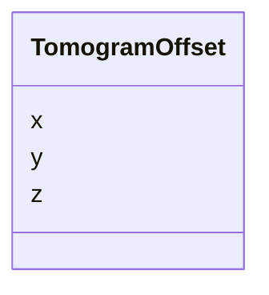

# Class: TomogramOffset


_The offset of a tomogram in voxels in each dimension relative to the canonical tomogram._


URI: [cdp-meta:TomogramOffset](metadataTomogramOffset)





<!-- no inheritance hierarchy -->


## Slots

| Name | Cardinality and Range | Description | Inheritance |
| ---  | --- | --- | --- |
| [x](x.md) | 1..1 <br/> [Integer](Integer.md) | x offset data relative to the canonical tomogram in pixels | direct |
| [y](y.md) | 1..1 <br/> [Integer](Integer.md) | y offset data relative to the canonical tomogram in pixels | direct |
| [z](z.md) | 1..1 <br/> [Integer](Integer.md) | z offset data relative to the canonical tomogram in pixels | direct |


## Usages

| used by | used in | type | used |
| ---  | --- | --- | --- |
| [Tomogram](Tomogram.md) | [offset](offset.md) | range | [TomogramOffset](TomogramOffset.md) |


## Identifier and Mapping Information


### Schema Source


* from schema: metadata


## Mappings

| Mapping Type | Mapped Value |
| ---  | ---  |
| self | cdp-meta:TomogramOffset |
| native | cdp-meta:TomogramOffset |


## LinkML Source

<!-- TODO: investigate https://stackoverflow.com/questions/37606292/how-to-create-tabbed-code-blocks-in-mkdocs-or-sphinx -->

### Direct

<details>
```yaml
name: TomogramOffset
description: The offset of a tomogram in voxels in each dimension relative to the
  canonical tomogram.
from_schema: metadata
attributes:
  x:
    name: x
    description: x offset data relative to the canonical tomogram in pixels
    from_schema: metadata
    alias: x
    owner: TomogramOffset
    domain_of:
    - TomogramSize
    - TomogramOffset
    range: integer
    required: true
    inlined: true
    inlined_as_list: true
    unit:
      symbol: px
      descriptive_name: pixels
  y:
    name: y
    description: y offset data relative to the canonical tomogram in pixels
    from_schema: metadata
    alias: y
    owner: TomogramOffset
    domain_of:
    - TomogramSize
    - TomogramOffset
    range: integer
    required: true
    inlined: true
    inlined_as_list: true
    unit:
      symbol: px
      descriptive_name: pixels
  z:
    name: z
    description: z offset data relative to the canonical tomogram in pixels
    from_schema: metadata
    alias: z
    owner: TomogramOffset
    domain_of:
    - TomogramSize
    - TomogramOffset
    range: integer
    required: true
    inlined: true
    inlined_as_list: true
    unit:
      symbol: px
      descriptive_name: pixels

```
</details>

### Induced

<details>
```yaml
name: TomogramOffset
description: The offset of a tomogram in voxels in each dimension relative to the
  canonical tomogram.
from_schema: metadata
attributes:
  x:
    name: x
    description: x offset data relative to the canonical tomogram in pixels
    from_schema: metadata
    alias: x
    owner: TomogramOffset
    domain_of:
    - TomogramSize
    - TomogramOffset
    range: integer
    required: true
    inlined: true
    inlined_as_list: true
    unit:
      symbol: px
      descriptive_name: pixels
  y:
    name: y
    description: y offset data relative to the canonical tomogram in pixels
    from_schema: metadata
    alias: y
    owner: TomogramOffset
    domain_of:
    - TomogramSize
    - TomogramOffset
    range: integer
    required: true
    inlined: true
    inlined_as_list: true
    unit:
      symbol: px
      descriptive_name: pixels
  z:
    name: z
    description: z offset data relative to the canonical tomogram in pixels
    from_schema: metadata
    alias: z
    owner: TomogramOffset
    domain_of:
    - TomogramSize
    - TomogramOffset
    range: integer
    required: true
    inlined: true
    inlined_as_list: true
    unit:
      symbol: px
      descriptive_name: pixels

```
</details>
